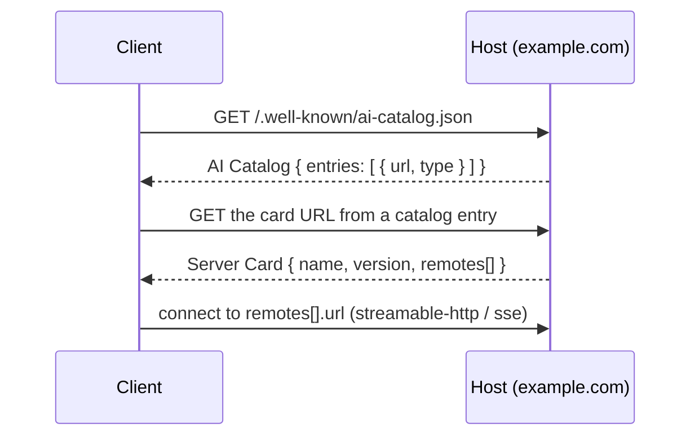

# Server Cards & discovery

A **Server Card** is a small static JSON document that describes a remote MCP
server — its identity, where it can be reached, and which protocol versions it
speaks — so a client can learn all of that *before* it connects. An **AI
Catalog** is the index that lists a host's cards at a well-known URL, so a client
that knows only a domain can discover the servers behind it.

This is the SDK's implementation of [SEP-2127](https://github.com/modelcontextprotocol/modelcontextprotocol/pull/2127)
and the companion AI Catalog discovery extension.

!!! warning "Experimental"

    Server Cards and AI Catalogs are **experimental**. Everything on this page
    lives under `mcp.server.experimental`, `mcp.client.experimental`, and
    `mcp.shared.experimental`, and may change — or be removed — in any release,
    without a deprecation cycle. Opt in deliberately, and pin your SDK version if
    you ship on top of it.

A card describes *connectivity*, not capability: it never lists tools, resources,
or prompts. Those stay subject to the normal runtime `list` calls after you
connect. The card only tells a client **how** to reach a server, not what it can
do once connected.

## How discovery works



The client fetches the catalog, reads the entry for each MCP server, fetches that
server's card, and connects to one of the `remotes` the card advertises.

## What's in a card

| Field | Meaning |
| --- | --- |
| `name` | Reverse-DNS `namespace/name` identifier, e.g. `com.example/dice-roller`. |
| `version` | Exact server version (SHOULD be semver; ranges/wildcards are rejected). |
| `description` | One-line human summary (≤ 100 chars). |
| `title` | Optional display name. |
| `website_url` | Optional homepage / documentation link. |
| `repository` | Optional source-repository metadata. |
| `icons` | Optional sized icons for a UI. |
| `remotes` | The HTTP endpoints (`streamable-http` or `sse`) the server is reachable at. |
| `meta` | Optional `_meta` extension metadata, reverse-DNS namespaced. |

`name`, `version`, and `description` are the only required fields.

## Building and serving a card

Build a card from a server's identity with `build_server_card`, then attach it to
the server's ASGI app with `mount_server_card` and advertise it in an AI Catalog
with `mount_ai_catalog`. `build_server_card` takes any object exposing the
standard identity attributes — the low-level `Server` here, but a high-level
`MCPServer` works too:

```python title="server.py"
--8<-- "docs_src/server_cards/tutorial001.py"
```

`build_server_card` reads `version`, `title`, `description`, `website_url`, and
`icons` off the server, and raises `ValueError` if `version` or `description` is
unset — a card cannot exist without them. The `name` you pass is the reverse-DNS
identifier and is validated against the `namespace/name` pattern.

Because discovery happens *before* authentication, mount both routes **outside**
any auth middleware — a client must be able to read them unauthenticated. If you
mount the MCP endpoint at a non-default path, pass a matching `path` to
`mount_server_card` (the convention is `<streamable-http-url>/server-card`); the
catalog entry carries the real URL, so any reachable path works.

For mounting the MCP app itself into a larger Starlette/FastAPI application, see
[Add to an existing app](../run/asgi.md).

## Hosting a card as a static file

Nothing requires a running server. A card and catalog are plain Pydantic models,
so you can serialize them and serve the JSON from any web server or CDN:

```python title="publish.py"
--8<-- "docs_src/server_cards/tutorial002.py"
```

Serialize with `by_alias=True` so the wire names (`$schema`, `_meta`, `type`) are
emitted, and `exclude_none=True` so unset optional fields are dropped.

## Discovery HTTP semantics

The routes `mount_server_card` and `mount_ai_catalog` install serve their payload
with a fixed set of discovery headers (`DISCOVERY_HEADERS`):

| Header | Value | Why |
| --- | --- | --- |
| `Access-Control-Allow-Origin` | `*` | Browser clients fetch cards cross-origin. |
| `Access-Control-Allow-Methods` | `GET` | Discovery is read-only. |
| `Access-Control-Allow-Headers` | `Content-Type` | Allows the negotiated `Accept`/content type. |
| `Cache-Control` | `public, max-age=3600` | Cards change rarely; let clients and CDNs cache. |

The card route responds with `application/mcp-server-card+json`; the catalog route
with `application/ai-catalog+json`.

Each response also carries a **strong `ETag`** — the SHA-256 of the serialized
body. A client that sends `If-None-Match` with the stored ETag gets a `304 Not
Modified` when the document is unchanged, so an unchanged card costs no payload:

```text
GET /.well-known/ai-catalog.json
If-None-Match: "6b86b273ff34fce19d6b804eff5a3f57…"

304 Not Modified
```

The catalog is served from the well-known path
`/.well-known/ai-catalog.json`.

## Discovering servers from a client

The one-call flow takes a host URL and returns validated `ServerCard` objects for
every MCP server the host advertises:

```python title="client.py"
--8<-- "docs_src/server_cards/tutorial003.py"
```

`discover_server_cards` resolves the well-known catalog, then fetches and
validates each referenced card. Malformed documents raise
`pydantic.ValidationError`; a card that omits `$schema` is tolerated and
defaulted to the current v1 schema URL.

If you want to inspect the catalog before fetching cards, compose the lower-level
helpers — `well_known_ai_catalog_url`, `fetch_ai_catalog`, and
`fetch_server_card`:

```python title="client_lowlevel.py"
--8<-- "docs_src/server_cards/tutorial004.py"
```

!!! warning "Discovery fetches untrusted URLs"

    A catalog is remote input, and its entries can point a client at **any**
    `http(s)` URL, including other domains. The SDK validates the scheme but
    imposes no other network policy — loopback and intranet servers are
    legitimate discovery targets. When discovering hosts you do not fully trust,
    pass an `http_client` that enforces your own policy (timeouts, capped
    redirects, blocked private address ranges). To read a card straight from disk
    instead of over the network, use `load_server_card`.

## Catalog identifiers

Each MCP entry in a catalog is identified by a `urn:air:` URN derived from the
card's `name`. The reverse-DNS namespace is flipped to forward-DNS and the name
suffix appended:

| Card `name` | Catalog identifier |
| --- | --- |
| `com.example/weather` | `urn:air:example.com:mcp:weather` |
| `example/dice` | `urn:air:example:mcp:dice` |

`server_card_entry` computes this for you and emits only the identifier, type,
and card URL. Human-readable fields remain on the card so the catalog cannot
drift from it.
