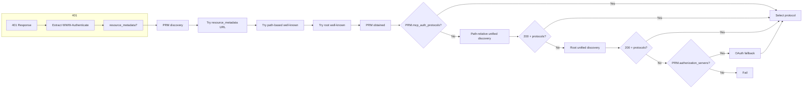
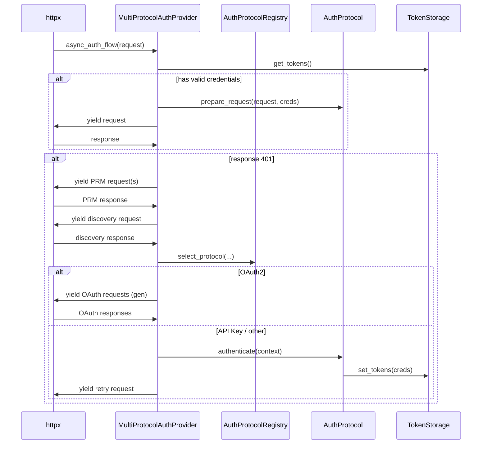
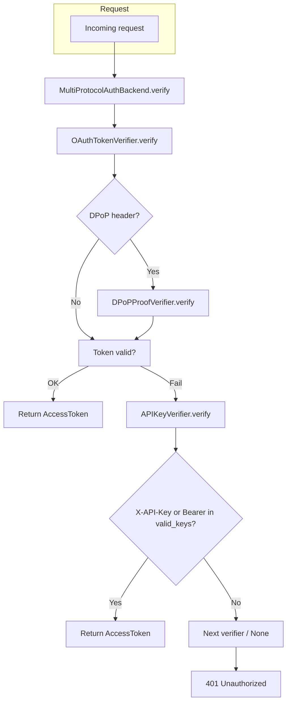

# Authorization: Multi-Protocol Extension

This document extends the [Authorization](authorization.md) topic with design purpose, implementation logic, usage and integration, test examples, and limitations for multi-protocol auth in the MCP Python SDK.

**References (RFCs and specs):**

- [RFC 6749](https://datatracker.ietf.org/doc/html/rfc6749) — OAuth 2.0 Authorization Framework
- [RFC 6750](https://datatracker.ietf.org/doc/html/rfc6750) — Bearer Token Usage
- [RFC 8414](https://datatracker.ietf.org/doc/html/rfc8414) — OAuth 2.0 Authorization Server Metadata
- [RFC 9728](https://datatracker.ietf.org/doc/html/rfc9728) — OAuth 2.0 Protected Resource Metadata
- [RFC 9449](https://datatracker.ietf.org/doc/html/rfc9449) — DPoP (Demonstrating Proof-of-Possession)
- [MCP Specification](https://spec.modelcontextprotocol.io/) — Model Context Protocol (authorization and transports)

---

## 1. Design purpose

### 1.1 Goals

The multi-protocol authorization extension aims to:

1. **Support multiple auth schemes** — Allow a single MCP resource server to accept OAuth 2.0, API Key, and (optionally) Mutual TLS or other protocols, so different clients can use the most appropriate method (e.g. API Key for automation, OAuth for user-delegated access).
2. **Preserve backward compatibility** — Existing OAuth-only clients and servers (e.g. `OAuthClientProvider`, `simple-auth` / `simple-auth-client`) continue to work without change; multi-protocol is additive.
3. **Unify discovery and selection** — The server declares supported protocols and optional default/preferences; the client discovers them via standard metadata (PRM, WWW-Authenticate) and selects one without hard-coding a single scheme.
4. **Enable optional DPoP** — When using OAuth, the client can bind the access token to a proof-of-possession key (DPoP, RFC 9449) to reduce token theft and replay risk.

### 1.2 Non-goals

- **Replacing OAuth** — OAuth remains the primary protocol for user-delegated access; API Key and mTLS are alternatives for machine or certificate-based auth.
- **Implementing full mTLS in examples** — The current examples use an mTLS *placeholder* (protocol declared, no real client certificate validation) to show protocol selection only.
- **Defining new HTTP auth schemes** — We use existing schemes (Bearer, DPoP, X-API-Key) and extend 401/403 response parameters (e.g. `auth_protocols`, `resource_metadata`) as in RFC 9728 and MCP conventions.

---

## 2. Code implementation logic

### 2.1 Authorization service discovery

Discovery answers: *Which auth protocols does this resource support, and where is their metadata?*

**Sources (in order of use):**

1. **WWW-Authenticate on 401** — The resource server may include `resource_metadata` (PRM URL), `auth_protocols`, `default_protocol`, `protocol_preferences` (MCP extensions). See RFC 6750 (Bearer) and RFC 9728 (resource metadata).
2. **Protected Resource Metadata (PRM)** — RFC 9728 defines `/.well-known/oauth-protected-resource` (optionally with path). PRM JSON includes `authorization_servers`, and the SDK extends it with `mcp_auth_protocols`, `mcp_default_auth_protocol`, `mcp_auth_protocol_preferences`.
3. **Unified discovery endpoint** — `/.well-known/authorization_servers` returns a list of protocol metadata (MCP-style). The client tries path-relative first, then root (see protocol discovery order below).

**Protocol discovery order (priority):**

1. **Priority 1: PRM `mcp_auth_protocols`** — If PRM was obtained and contains `mcp_auth_protocols`, use that list.
2. **Priority 2: Path-relative unified discovery** — `{origin}/.well-known/authorization_servers{resource_path}` (e.g. `http://localhost:8002/.well-known/authorization_servers/mcp`).
3. **Priority 3: Root unified discovery** — `{origin}/.well-known/authorization_servers`.
4. **Priority 4: OAuth fallback** — If unified discovery failed and PRM has `authorization_servers`, attempt OAuth protocol discovery.

**Client-side logic (high level):**

- On 401, extract `resource_metadata` from WWW-Authenticate.
- Build PRM URLs: (1) `resource_metadata` if present, (2) path-based `/.well-known/oauth-protected-resource{path}`, (3) root `/.well-known/oauth-protected-resource`. Request each until PRM is obtained.
- For protocol list: if PRM has `mcp_auth_protocols`, use it (priority 1). Else try path-relative `/.well-known/authorization_servers{path}`, then root `/.well-known/authorization_servers`. If both fail and PRM has `authorization_servers`, use OAuth fallback.
- Combine protocol list with WWW-Authenticate `auth_protocols` if present, then select one via `AuthProtocolRegistry.select_protocol(available, default_protocol, preferences)`.

**Relationship between authorization URL endpoints**

There are three distinct URL trees involved:

| Host | Endpoint | Owner | Purpose |
|------|----------|-------|---------|
| **Authorization Server (AS)** | `/.well-known/oauth-authorization-server` | AS | OAuth 2.0 metadata (RFC 8414): `authorization_endpoint`, `token_endpoint`, `registration_endpoint`, etc. |
| **Authorization Server (AS)** | `/authorize`, `/token`, `/register`, `/introspect` | AS | OAuth flows and token introspection |
| **MCP Resource Server (RS)** | `/.well-known/oauth-protected-resource{path}` | RS | Protected Resource Metadata (RFC 9728): `resource`, `authorization_servers`, MCP extensions |
| **MCP Resource Server (RS)** | `/.well-known/authorization_servers` | RS | Unified protocol discovery (MCP extension): `protocols`, `default_protocol`, `protocol_preferences` |
| **MCP Resource Server (RS)** | `/{resource_path}` (e.g. `/mcp`) | RS | Protected MCP endpoint |

**URL tree (example: AS on 9000, RS on 8002)**

```
OAuth Authorization Server (http://localhost:9000)
├── /.well-known/oauth-authorization-server   ← OAuth AS metadata
├── /authorize
├── /token
├── /register
├── /introspect
└── /login, /login/callback                  ← (example-specific)

MCP Resource Server (http://localhost:8002)
├── /.well-known/oauth-protected-resource/mcp  ← PRM (path derived from resource_url)
├── /.well-known/authorization_servers         ← Unified discovery (mounted at root)
└── /mcp                                      ← Protected MCP endpoint
```

**Client discovery order**

1. On 401, read `resource_metadata` from WWW-Authenticate (e.g. `http://localhost:8002/.well-known/oauth-protected-resource/mcp`).
2. If absent, try path-based: `{origin}/.well-known/oauth-protected-resource{resource_path}` (e.g. `http://localhost:8002/.well-known/oauth-protected-resource/mcp`).
3. If absent, try root: `{origin}/.well-known/oauth-protected-resource`.
4. PRM includes `authorization_servers` (AS URL) and `mcp_auth_protocols`; for OAuth, the client then fetches `{AS}/.well-known/oauth-authorization-server`.
5. For protocol list (in order): (1) If PRM has `mcp_auth_protocols`, use it. (2) Else try path-relative `{origin}/.well-known/authorization_servers{resource_path}` (e.g. `http://localhost:8002/.well-known/authorization_servers/mcp`). (3) Else try root `{origin}/.well-known/authorization_servers`. (4) If all fail and PRM has `authorization_servers`, use OAuth fallback.

**Auth discovery logging:** When discovery runs, the SDK emits debug-level logs (English, `[Auth discovery]` prefix) for each PRM and unified-discovery request: URL, status code, and (on 200) pretty-printed response body. Set `LOG_LEVEL=DEBUG` on the client to see them. Implemented in `mcp.client.auth.utils` (`format_json_for_logging`, `handle_protected_resource_response`, `discover_authorization_servers`) and `mcp.client.auth.multi_protocol` (`_parse_protocols_from_discovery_response`, `async_auth_flow`).

**References:** RFC 9728 (PRM), RFC 8414 (OAuth AS metadata), SDK `mcp.client.auth.utils` (`build_protected_resource_metadata_discovery_urls`, `discover_authorization_servers`).



### 2.2 MCP client logic

The client uses **MultiProtocolAuthProvider** (httpx.Auth) so that every HTTP request is prepared and 401/403 are handled in one place.

**Main flow:**

1. **Initialization** — On first use, `_initialize()` runs (e.g. register protocol classes). No network call yet.
2. **Before first request** — Read credentials from `TokenStorage` (`get_tokens` → `AuthCredentials | OAuthToken`). If present and valid (`protocol.validate_credentials`), call `protocol.prepare_request(request, credentials)` and, if DPoP is enabled and the protocol supports it, attach a DPoP proof. Then yield the request.
3. **On 401** — (See discovery above.) After obtaining protocols and selecting one:
   - **If OAuth2:** Build an `OAuthClientProvider` from config and drive the shared **oauth_401_flow_generator** (all OAuth steps — AS discovery, registration, authorization, token exchange — are done by yielding requests; httpx sends them and injects responses back). No extra HTTP client; avoids lock deadlock.
   - **If API Key / other:** Build `AuthContext`, call `protocol.authenticate(context)`, then store credentials and retry the original request with `prepare_request`.
4. **On 403** — Parse `error` / `scope` from WWW-Authenticate for logging; current implementation does not auto-retry.
5. **TokenStorage contract** — Storage may return `OAuthToken` or `AuthCredentials`. The provider converts OAuthToken → OAuthCredentials when reading and OAuthCredentials → OAuthToken when writing so that OAuth-only storage remains usable.

**Protocol selection** — `AuthProtocolRegistry.select_protocol(available_protocols, default_protocol, protocol_preferences)` filters to registered protocols, then applies default and then preference order (lower number = higher priority).

**References:** `mcp.client.auth.multi_protocol` (MultiProtocolAuthProvider, async_auth_flow), `mcp.client.auth._oauth_401_flow` (oauth_401_flow_generator), `mcp.client.auth.registry` (AuthProtocolRegistry), `mcp.client.auth.protocol` (AuthProtocol, DPoPEnabledProtocol).



### 2.3 MCP server logic

The server exposes protected MCP endpoints and declares supported auth methods via PRM and (optionally) unified discovery; it then verifies credentials on each request.

**Routes and metadata:**

1. **Protected Resource Metadata (PRM)** — `create_protected_resource_routes(resource_url, authorization_servers, ..., auth_protocols, default_protocol, protocol_preferences)` registers `/.well-known/oauth-protected-resource{path}` (RFC 9728). The handler returns JSON including `resource`, `authorization_servers`, and MCP extensions `mcp_auth_protocols`, `mcp_default_auth_protocol`, `mcp_auth_protocol_preferences`.
2. **Unified discovery** — `create_authorization_servers_discovery_routes(protocols, default_protocol, protocol_preferences)` registers `/.well-known/authorization_servers`. The handler returns `{ "protocols": [ AuthProtocolMetadata, ... ] }` plus optional default and preferences.
3. **401 responses** — Middleware (e.g. RequireAuthMiddleware) returns 401 with WWW-Authenticate including at least Bearer (and optionally `resource_metadata`, `auth_protocols`, `default_protocol`, `protocol_preferences`).

**Configuration and URL tree — what each server must provide**

**Authorization Server (AS) — required configuration /改造:**

| Item | Description |
|------|-------------|
| `/.well-known/oauth-authorization-server` | **Must expose** (RFC 8414). Returns JSON with `authorization_endpoint`, `token_endpoint`, optionally `registration_endpoint`, `scopes_supported`. |
| `/authorize`, `/token` | **Must implement** — OAuth authorization code + PKCE flow. |
| `/register` | Optional — dynamic client registration. |
| `/introspect` | **Required if RS uses introspection** — RS calls this to validate Bearer/DPoP tokens. |
| **DPoP** | If DPoP is used: tokens must include `cnf` (e.g. `jkt`) so the RS can verify the DPoP proof. |

**No change** to the AS is needed for *multi-protocol* itself. The AS only needs to support standard OAuth 2.0 and (optionally) DPoP-bound tokens.

**MCP Resource Server (RS) — required configuration /改造:**

| Item | Description |
|------|-------------|
| `resource_url` | Base URL of the protected resource (e.g. `http://localhost:8002/mcp`). Used to build PRM path: `/.well-known/oauth-protected-resource{path}`. |
| `authorization_servers` | List of AS URLs (e.g. `["http://localhost:9000"]`). PRM references these so clients know where to get tokens. |
| `auth_protocols` | List of `AuthProtocolMetadata` (protocol_id, protocol_version, metadata_url for OAuth, etc.). |
| `default_protocol` | Optional default protocol ID (e.g. `"oauth2"`). |
| `protocol_preferences` | Optional priority map (e.g. `{"oauth2": 1, "api_key": 2}`). |
| PRM route | Mount `create_protected_resource_routes(...)` so `/.well-known/oauth-protected-resource{path}` is served. Path is derived from `resource_url` (e.g. `/mcp` → `/.well-known/oauth-protected-resource/mcp`). |
| Unified discovery route | Mount `create_authorization_servers_discovery_routes(...)` so `/.well-known/authorization_servers` is served. Recommended at **origin root** (e.g. `http://localhost:8002/.well-known/authorization_servers`) so clients using path-relative discovery can fall back to PRM when 404. |
| WWW-Authenticate on 401 | Include `resource_metadata` (PRM URL), `auth_protocols`, `default_protocol`, `protocol_preferences` so MCP clients can discover without extra requests. |

**Example config (simple-auth-multiprotocol):**

```python
# Resource server settings
server_url = "http://localhost:8002/mcp"
auth_server_url = "http://localhost:9000"
auth_protocols = [
    AuthProtocolMetadata(protocol_id="oauth2", protocol_version="2.0",
                        metadata_url=f"{auth_server_url}/.well-known/oauth-authorization-server",
                        scopes_supported=["user"]),
    AuthProtocolMetadata(protocol_id="api_key", protocol_version="1.0"),
    AuthProtocolMetadata(protocol_id="mutual_tls", protocol_version="1.0"),
]
default_protocol = "oauth2"
protocol_preferences = {"oauth2": 1, "api_key": 2, "mutual_tls": 3}

# PRM URL: http://localhost:8002/.well-known/oauth-protected-resource/mcp
# Discovery URL: http://localhost:8002/.well-known/authorization_servers
```

**Environment / config (simple-auth-multiprotocol example):**

| Env / CLI | Description |
|-----------|-------------|
| `--port` | RS port (default 8002). |
| `--auth-server` | AS base URL (e.g. `http://localhost:9000`). Used for `authorization_servers` and OAuth `metadata_url`. |
| `--api-keys` | Comma-separated API keys for `APIKeyVerifier`. |
| `--dpop-enabled` | Enable DPoP proof verification. |
| `server_url` | Derived as `http://{host}:{port}/mcp`; used for PRM path and 401 `resource_metadata`. |

**Verification:**

1. **MultiProtocolAuthBackend** — Holds a list of `CredentialVerifier` instances. For each request it calls `verifier.verify(request, dpop_verifier)` in order; the first non-None result wins.
2. **OAuthTokenVerifier** — Reads `Authorization: Bearer <token>` or `Authorization: DPoP <token>`. Verifies the token (e.g. introspection); if DPoP-bound and `dpop_verifier` is set, validates the DPoP proof (method, URI, `ath`, jti replay). See RFC 9449.
3. **APIKeyVerifier** — Reads `X-API-Key` first, then falls back to `Authorization: Bearer <key>` and checks the value in `valid_keys`. Does not parse an `ApiKey` scheme.
4. **DPoP** — When enabled, the backend is constructed with a `DPoPProofVerifier` and passes it into each verifier. The verifier uses it only when the token is DPoP-bound (e.g. `Authorization: DPoP` and valid proof).

**References:** `mcp.server.auth.routes` (create_protected_resource_routes, create_authorization_servers_discovery_routes), `mcp.server.auth.verifiers` (MultiProtocolAuthBackend, OAuthTokenVerifier, APIKeyVerifier), `mcp.server.auth.dpop` (DPoPProofVerifier).



---

## 3. How to use and integrate

### 3.1 Authorization Server (AS) responsibilities

When the resource server uses **OAuth 2.0** as one of the protocols:

1. **Expose OAuth 2.0 metadata** — RFC 8414: `/.well-known/oauth-authorization-server` (or `/.well-known/openid-configuration` if applicable). Must include `authorization_endpoint`, `token_endpoint`, and optionally `registration_endpoint`, `scopes_supported`.
2. **Support authorization code + PKCE** — Authorization endpoint, token endpoint, and (optional) dynamic client registration. MCP clients use authorization code with PKCE and optionally DPoP-bound tokens.
3. **Token introspection (if used)** — Resource server may call the AS introspection endpoint to validate Bearer/DPoP tokens. DPoP-bound tokens require the AS to include `cnf` (e.g. `jkt`) in the token or introspection response so the RS can verify the DPoP proof (RFC 9449).

No change is required to the AS for *multi-protocol* itself; the AS only needs to support the OAuth flows and (if DPoP is used) token binding.

### 3.2 MCP client responsibilities

1. **Choose auth model** — Use a single protocol (e.g. only OAuth via `OAuthClientProvider`) or multi-protocol via `MultiProtocolAuthProvider`.
2. **Register protocols** — Call `AuthProtocolRegistry.register(protocol_id, ProtocolClass)` for each supported protocol (e.g. `oauth2`, `api_key`) before creating the provider.
3. **Storage** — Provide a `TokenStorage` that implements `get_tokens()` → `AuthCredentials | OAuthToken | None` and `set_tokens(AuthCredentials | OAuthToken)`. For OAuth-only storage, the provider converts to/from OAuthToken internally; or use an adapter.
4. **Provider configuration** — Construct `MultiProtocolAuthProvider` with storage, optional `dpop_enabled`, optional `dpop_storage`, and (for 401 flows) an `http_client` that will be used to send yielded requests. Attach the provider as `httpx.Client(auth=provider)`.
5. **Environment / config** — For the example client: `MCP_SERVER_URL`, `MCP_API_KEY` (API Key), `MCP_USE_OAUTH=1`, `MCP_DPOP_ENABLED=1` (OAuth + DPoP). Protocol selection is driven by server discovery and registry.

### 3.3 MCP server (resource server) responsibilities

1. **Define protocols** — Build a list of `AuthProtocolMetadata` (protocol_id, protocol_version, metadata_url for OAuth, etc.) and optionally `default_protocol` and `protocol_preferences`.
2. **Mount PRM** — Call `create_protected_resource_routes(resource_url, authorization_servers, ..., auth_protocols=auth_protocols, default_protocol=..., protocol_preferences=...)` and mount the returned routes so that `/.well-known/oauth-protected-resource{path}` serves PRM JSON (RFC 9728 + MCP extensions).
3. **Mount unified discovery (optional)** — Call `create_authorization_servers_discovery_routes(protocols, default_protocol, protocol_preferences)` and mount so that `/.well-known/authorization_servers` returns the protocol list.
4. **Build backend** — Instantiate `OAuthTokenVerifier`, `APIKeyVerifier`, and (if needed) other verifiers; pass them into `MultiProtocolAuthBackend`. If DPoP is used, create a `DPoPProofVerifier` and pass it into `backend.verify(request, dpop_verifier=...)`.
5. **401/403 responses** — Use middleware that returns 401 with WWW-Authenticate (Bearer at minimum; add `resource_metadata`, `auth_protocols`, `default_protocol`, `protocol_preferences` for MCP clients). Optionally return 403 with `error` and `scope` when appropriate.

### 3.4 API reference (AuthProtocol, CredentialVerifier)

#### AuthProtocol (`mcp.client.auth.protocol`)

Client-side protocol interface. All auth protocols (OAuth2, API Key, etc.) must implement it.

| Member | Type | Description |
|--------|------|-------------|
| `protocol_id` | `str` | Protocol identifier (e.g. `"oauth2"`, `"api_key"`). |
| `protocol_version` | `str` | Protocol version (e.g. `"2.0"`, `"1.0"`). |
| `authenticate(context)` | `async def` | Perform auth; return `AuthCredentials`. |
| `prepare_request(request, credentials)` | `def` | Add auth headers (e.g. `X-API-Key`, `Authorization: Bearer ...`). |
| `validate_credentials(credentials)` | `def` | Return `True` if credentials are still valid. |
| `discover_metadata(metadata_url, prm, http_client)` | `async def` | Optional; return protocol metadata from server. |

**AuthContext** — Input to `authenticate`; includes `server_url`, `storage`, `protocol_id`, `protocol_metadata`, `current_credentials`, `dpop_storage`, `dpop_enabled`, `http_client`, `resource_metadata_url`, `protected_resource_metadata`, `scope_from_www_auth`.

**DPoPEnabledProtocol** — Extends `AuthProtocol`; adds `supports_dpop()`, `get_dpop_proof_generator()`, `initialize_dpop()` for DPoP-bound tokens.

#### CredentialVerifier (`mcp.server.auth.verifiers`)

Server-side verifier interface. Each verifier checks one auth scheme.

| Member | Type | Description |
|--------|------|-------------|
| `verify(request, dpop_verifier)` | `async def` | Inspect request; return `AccessToken` on success, `None` on failure. |

**Implementations:**

- **OAuthTokenVerifier** — Reads `Authorization: Bearer <token>` or `Authorization: DPoP <token>`. Verifies token (e.g. introspection); if DPoP-bound and `dpop_verifier` is set, validates DPoP proof.
- **APIKeyVerifier** — Reads `X-API-Key` first, then `Authorization: Bearer <key>` if value is in `valid_keys`. Constructor: `APIKeyVerifier(valid_keys: set[str], scopes: list[str] | None = None)`.

**MultiProtocolAuthBackend** — Holds a list of `CredentialVerifier`; calls them in order; first non-None result wins.

#### TokenStorage (multi-protocol contract)

| Method | Signature | Description |
|--------|-----------|-------------|
| `get_tokens()` | `async def` → `AuthCredentials \| OAuthToken \| None` | Return stored credentials. |
| `set_tokens(tokens)` | `async def` | Store `AuthCredentials` or `OAuthToken`. |

For OAuth-only storage, the provider converts between `OAuthToken` and `OAuthCredentials` internally; no adapter required.

### 3.5 Migration from OAuth-only: step-by-step guide

If you currently use `OAuthClientProvider` / `simple-auth-client` and want to add multi-protocol (e.g. API Key or OAuth + DPoP):

#### Step 1: Keep OAuth-only path (no change)

- `OAuthClientProvider`, `simple-auth`, `simple-auth-client` remain as-is.
- No code changes if you only use OAuth.

#### Step 2: Client — switch to MultiProtocolAuthProvider

**Before (OAuth only):**
```python
from mcp.client.auth.oauth2 import OAuthClientProvider
provider = OAuthClientProvider(...)
client = httpx.AsyncClient(auth=provider)
```

**After (multi-protocol):**
```python
from mcp.client.auth.multi_protocol import MultiProtocolAuthProvider, TokenStorage
from mcp.client.auth.registry import AuthProtocolRegistry
from mcp.client.auth.protocols.oauth2 import OAuth2Protocol

# Register protocols before creating the provider
AuthProtocolRegistry.register("oauth2", OAuth2Protocol)
# If using API Key: AuthProtocolRegistry.register("api_key", ApiKeyProtocol)

provider = MultiProtocolAuthProvider(
    storage=your_storage,  # must support AuthCredentials | OAuthToken
    dpop_enabled=False,   # set True for DPoP
)
client = httpx.AsyncClient(auth=provider)
# Pass http_client to provider if needed for 401 flows:
provider._http_client = client
```

#### Step 3: Storage — support both OAuthToken and AuthCredentials

**If your storage only handles OAuthToken:**

- No change required; the provider converts internally.
- Or use `OAuthTokenStorageAdapter` to wrap an OAuth-only storage.

**If you add API Key:**
```python
async def get_tokens(self) -> AuthCredentials | OAuthToken | None:
    return self._creds  # may be OAuthToken or APIKeyCredentials

async def set_tokens(self, tokens: AuthCredentials | OAuthToken) -> None:
    self._creds = tokens
```

#### Step 4: Server — add MultiProtocolAuthBackend and PRM extensions

**Before (OAuth only):**
```python
# Single OAuth verifier
token_verifier = TokenVerifier(...)
oauth_verifier = OAuthTokenVerifier(token_verifier)
# BearerAuthBackend or equivalent
```

**After (multi-protocol):**
```python
from mcp.server.auth.verifiers import (
    MultiProtocolAuthBackend,
    OAuthTokenVerifier,
    APIKeyVerifier,
)
from mcp.server.auth.routes import (
    create_protected_resource_routes,
    create_authorization_servers_discovery_routes,
)
from mcp.shared.auth import AuthProtocolMetadata

# Build protocol list
auth_protocols = [
    AuthProtocolMetadata(protocol_id="oauth2", protocol_version="2.0", metadata_url=as_url, ...),
    AuthProtocolMetadata(protocol_id="api_key", protocol_version="1.0"),
]

# Verifiers
oauth_verifier = OAuthTokenVerifier(token_verifier)
api_key_verifier = APIKeyVerifier(valid_keys={"demo-api-key-12345"})
backend = MultiProtocolAuthBackend([oauth_verifier, api_key_verifier])

# PRM with MCP extensions
prm_routes = create_protected_resource_routes(
    resource_url=resource_url,
    authorization_servers=[as_url],
    auth_protocols=auth_protocols,
    default_protocol="oauth2",
)
# Optional: unified discovery
discovery_routes = create_authorization_servers_discovery_routes(
    protocols=auth_protocols,
    default_protocol="oauth2",
)
# Mount prm_routes and discovery_routes
```

#### Step 5: 401 responses — add MCP extension parameters

Ensure 401 WWW-Authenticate includes (when using multi-protocol):

- `resource_metadata` — URL of PRM (e.g. `/.well-known/oauth-protected-resource/mcp`)
- `auth_protocols` — Space-separated protocol IDs (e.g. `oauth2 api_key`)
- `default_protocol` — Optional default (e.g. `oauth2`)
- `protocol_preferences` — Optional priorities (e.g. `oauth2:1,api_key:2`)

See `RequireAuthMiddleware` and PRM handler in `mcp.server.auth` for how these are set.

---

## 4. Integration test examples

### 4.1 Phase 2: Multi-protocol (API Key, OAuth, mTLS placeholder)

**Script:** `./scripts/run_phase2_multiprotocol_integration_test.sh` (from repo root).

**Behavior:**

- Starts the multi-protocol resource server (`simple-auth-multiprotocol-rs`) on port 8002 with `--api-keys=demo-api-key-12345`. For OAuth, also starts the AS (`simple-auth-as`) on port 9000.
- Waits for PRM: `GET http://localhost:8002/.well-known/oauth-protected-resource/mcp`.
- Runs the client according to `MCP_AUTH_PROTOCOL`:
  - **api_key** (default): `simple-auth-multiprotocol-client` with `MCP_SERVER_URL=http://localhost:8002/mcp` and `MCP_API_KEY=demo-api-key-12345`. No AS required.
  - **oauth**: `simple-auth-client` against the same RS; user completes OAuth in the browser, then runs `list`, `call get_time {}`, `quit`.
  - **mutual_tls**: same multiprotocol client without API key; mTLS is a placeholder (no real client cert).

**What it demonstrates:** PRM and optional unified discovery, protocol selection (API Key vs OAuth), and that API Key works without an AS.

### 4.2 Phase 4: DPoP integration

**Script:** `./scripts/run_phase4_dpop_integration_test.sh` (from repo root).

**Behavior:**

- Starts AS on 9000 and RS on 8002 with `--dpop-enabled` and an API key.
- Runs **automated** curl tests:
  - **B2:** API Key request → 200 (DPoP does not affect API Key).
  - **A2:** Bearer token without DPoP proof → 401 (RS requires DPoP when token is DPoP-bound).
  - Negative: fake token, wrong htm/htu, DPoP without Authorization → 401.
- Optionally runs **manual** OAuth+DPoP client test: `MCP_USE_OAUTH=1 MCP_DPOP_ENABLED=1` with the multiprotocol client; user completes OAuth in the browser, then runs `list`, `call get_time {}`, `quit`. Server logs should show "Authentication successful with DPoP".

**Env:** `MCP_SKIP_OAUTH=1` skips the manual client step and only runs the automated curl tests.

**What it demonstrates:** DPoP proof verification on the server, rejection of Bearer without proof when DPoP is required, and successful OAuth+DPoP flow with the example client.

### 4.3 Test matrix (reference)

| Case | Auth type        | Expected result |
|------|------------------|-----------------|
| B2   | API Key          | 200 (DPoP irrelevant) |
| A2   | Bearer, no DPoP  | 401 when RS expects DPoP |
| A1   | OAuth + DPoP     | 200 after browser OAuth |
| —    | No auth          | 401 |
| —    | DPoP proof, fake token / wrong htm or htu | 401 |

---

## 5. Current limitations and future evolution

### 5.1 Limitations

1. **Mutual TLS** — Only a placeholder: the protocol is advertised and selectable, but the example server does not perform client certificate validation. A full mTLS implementation would require TLS client cert handling and a verifier that checks the certificate.
2. **Unified discovery URL** — Discovery uses `/.well-known/authorization_servers` path-relative to the *resource* URL (e.g. `http://host:8002/mcp` → `http://host:8002/mcp/.well-known/authorization_servers`). Some servers may instead serve this at the origin (e.g. `http://host:8002/.well-known/authorization_servers`); fallback to PRM’s `mcp_auth_protocols` covers that.
3. **403 handling** — The client parses 403 WWW-Authenticate for logging but does not automatically retry with a new scope or token; that could be extended for specific error/scope values.
4. **DPoP nonce** — Server-side DPoP nonce (RFC 9449) is not yet used in the example; only jti replay protection is in place. Adding nonce would improve robustness against pre-replay.
5. **TokenStorage** — The dual contract (OAuthToken vs AuthCredentials) and in-memory conversion are documented; a formal adapter type or storage interface versioning could simplify integration for new backends.

### 5.2 Possible evolution

- **Full mTLS example** — Implement client certificate validation and a verifier that maps the client cert to an identity/scope.
- **Discovery flexibility** — Support configurable discovery URL templates or multiple well-known paths so both path-relative and origin-relative discovery work without relying only on PRM fallback.
- **403 retry policy** — Define retry rules for 403 (e.g. `insufficient_scope`) and integrate with OAuth scope refresh or re-authorization.
- **DPoP nonce** — Implement server-initiated nonce and client nonce handling per RFC 9449.

---

**Related documentation:** [Authorization](authorization.md) (overview), [API Reference](api.md).  
**Examples:** [simple-auth-multiprotocol](../examples/servers/simple-auth-multiprotocol/), [simple-auth-multiprotocol-client](../examples/clients/simple-auth-multiprotocol-client/), [examples/README.md](../examples/README.md).
