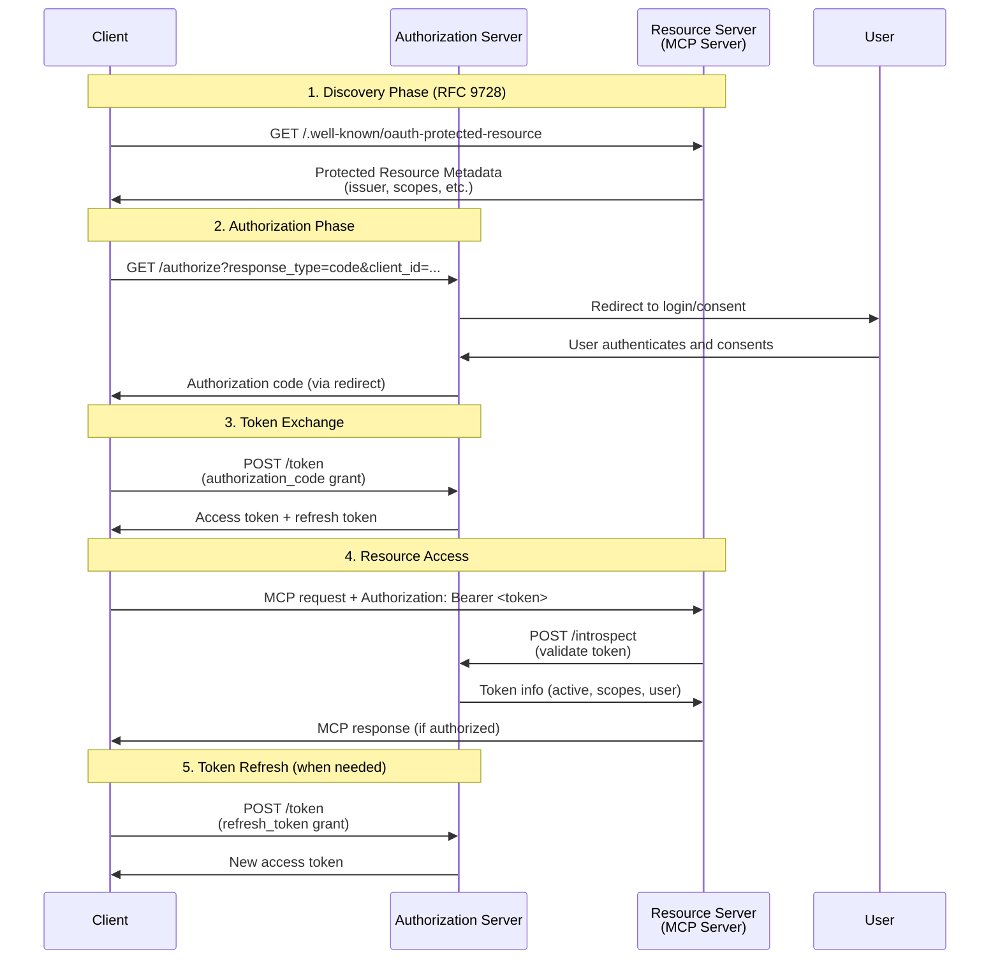

# Authentication examples

MCP supports OAuth 2.1 authentication for protecting server resources. This section demonstrates both server-side token verification and client-side authentication flows.

## OAuth server implementation

FastMCP server with OAuth token verification:

```python
--8<-- "examples/snippets/servers/oauth_server.py"
```

This example shows:

- Implementing the `TokenVerifier` protocol for token validation
- Using `AuthSettings` for RFC 9728 Protected Resource Metadata
- Resource server configuration with authorization server discovery
- Protected tools that require authentication

## Complete authentication server

Full Authorization Server implementation with token introspection:

```python
--8<-- "examples/servers/simple-auth/mcp_simple_auth/auth_server.py"
```

This comprehensive example includes:

- OAuth 2.1 authorization flows (authorization code, refresh token)
- Token introspection endpoint for resource servers
- Client registration and metadata management
- RFC 9728 protected resource metadata endpoint

## Resource server with introspection

MCP Resource Server that validates tokens via Authorization Server introspection:

```python
--8<-- "examples/servers/simple-auth/mcp_simple_auth/server.py"
```

This demonstrates:

- Token introspection for validation instead of local token verification
- Separation of Authorization Server (AS) and Resource Server (RS)
- Protected MCP tools and resources
- Production-ready server patterns

## Token verification implementation

Custom token verification logic:

```python
--8<-- "examples/servers/simple-auth/mcp_simple_auth/token_verifier.py"
```

This component handles:

- HTTP token introspection requests
- Token validation with scope checking
- RFC 8707 resource parameter validation
- Error handling and logging

## Simple authentication provider

Authentication provider for development and testing:

```python
--8<-- "examples/servers/simple-auth/mcp_simple_auth/simple_auth_provider.py"
```

This utility provides:

- Simplified token generation for testing
- Development authentication flows
- Testing utilities for protected resources

## Legacy Authorization Server

Backward compatibility with older OAuth implementations:

```python
--8<-- "examples/servers/simple-auth/mcp_simple_auth/legacy_as_server.py"
```

This example shows:

- Support for non-RFC 9728 compliant clients
- Legacy endpoint compatibility
- Migration patterns for existing systems

## OAuth architecture

The MCP OAuth implementation follows the OAuth 2.1 authorization code flow with token introspection:



**Components:**

- **Authorization Server (AS)**: Handles OAuth flows, issues and validates tokens
- **Resource Server (RS)**: Your MCP server that validates tokens and serves protected resources  
- **Client**: Discovers AS through RFC 9728, obtains tokens, and uses them with MCP server
- **User**: Resource owner who authorizes access

## Security considerations

When implementing authentication:

1. **Use HTTPS**: All OAuth flows must use HTTPS in production
2. **Token validation**: Always validate tokens on the resource server side
3. **Scope checking**: Verify that tokens have required scopes
4. **Introspection**: Use token introspection for distributed validation
5. **RFC compliance**: Follow RFC 9728 for proper AS discovery

These examples provide a complete OAuth 2.1 implementation suitable for production use with proper security practices.