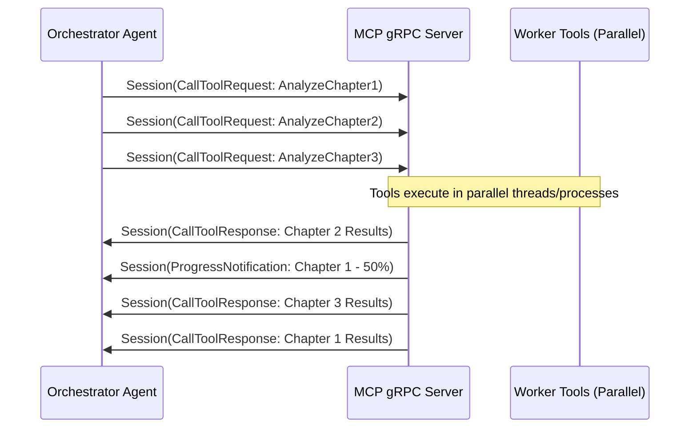
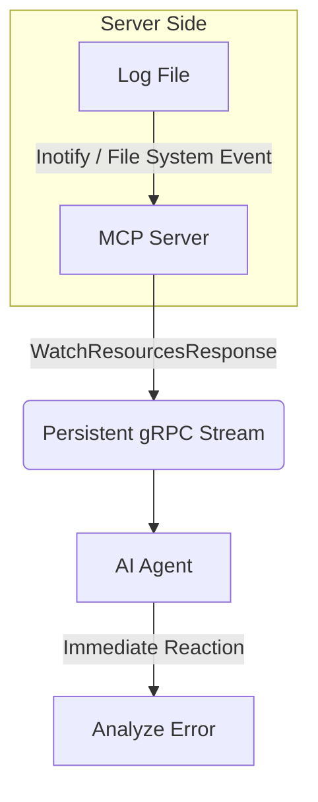

# Advanced gRPC Streaming & Multiplexing in MCP

The gRPC transport for the Model Context Protocol (MCP) unlocks high-performance patterns that are difficult or inefficient to achieve with standard JSON-RPC over HTTP/1.1 or Stdio. This document explores advanced architectural patterns enabled by native bidirectional streaming and binary Protobuf serialization.

## 1. The "Worker-Orchestrator" Pattern (Parallel Analysis)

In complex agentic workflows, an orchestrator agent often needs to delegate sub-tasks to multiple workers. With gRPC's multiplexed `Session` stream, a single connection can handle dozens of concurrent tool calls, streaming results back as they are completed.

### Scenario: Large Document Analysis
Imagine analyzing a 500-page technical specification. Instead of sequential processing, the orchestrator "chunks" the document and sends parallel requests to worker tools.



### The Advantage
*   **Interleaved Responses**: Results are returned in the order they complete, not the order they were requested.
*   **Low Latency**: No waiting for the TCP handshake or HTTP overhead for each sub-task.

---

## 2. Binary Streaming (Large Files & Media)

Legacy MCP transports must Base64 encode binary data, adding ~33% overhead to every transfer. gRPC uses raw `bytes`, making it the ideal choice for media-rich or data-intensive applications.

### Scenario: Video Frame Analysis
An agent monitoring a security feed can stream raw video chunks. By using `ReadResourceChunked`, the agent can begin processing the first few seconds of video while the rest is still being transmitted.

### Key Benefits:
*   **Zero-Base64**: Transfer 10MB of video as 10MB of binary data, not 13.5MB of text.
*   **Memory Efficiency**: Use `ReadResourceChunked` to process files that are larger than the available RAM by handling one 4MB chunk at a time.

```python
# Example: Streaming a large resource in chunks
from mcp.client.grpc import GrpcClientTransport

async def main():
    async with GrpcClientTransport("localhost:50051") as transport:
        # Under the hood, this uses the ReadResourceChunked streaming RPC
        result = await transport.read_resource("file://large_video_dump.bin")
        # Process chunks as they arrive (internal implementation handles aggregation)
```

---

## 3. Real-Time "Push" Notifications (Watchers)

Instead of polling a server every few seconds to see if a file has changed ("Are we there yet?"), gRPC enables the server to "push" updates immediately using the `WatchResources` RPC.

### Scenario: Live Log Tailing
An agent can "watch" a server log. As soon as an error is written to the disk, the MCP server pushes a notification over the persistent gRPC stream.



---

## 4. Progressive Tool Results

For long-running tools (e.g., "Run Integration Tests"), gRPC allows the server to stream progress updates and partial results.

### Example: Test Runner
1.  **Agent** calls `RunTests`.
2.  **Server** streams `ProgressNotification` for each test case: "Test 1/50 Passed", "Test 2/50 Passed".
3.  **Agent** sees "Test 3/50 FAILED" and decides to **Cancel** the remaining tests immediately via `CancelRequest` to save compute resources.

---

## Performance Comparison: JSON-RPC vs. gRPC

| Feature | JSON-RPC (HTTP/1.1) | gRPC (HTTP/2) | Benefit |
| :--- | :--- | :--- | :--- |
| **Serialization** | Text (JSON) | Binary (Protobuf) | 10x faster, smaller payloads |
| **Binary Data** | Base64 (Slow) | Raw `bytes` (Native) | 33% less bandwidth, lower CPU |
| **Concurrency** | Sequential / Multiple Conns | Multiplexed (1 Conn) | Lower resource usage |
| **Streaming** | Simulated (SSE/Long-poll) | Native Bidirectional | True real-time interaction |

## Best Practices
1.  **Use `Session` for Multiplexing**: If you are performing many small operations, use the `Session` stream to avoid the overhead of multiple unary calls.
2.  **Set Chunk Sizes**: When using `ReadResourceChunked`, balance chunk size (default 4MB) with your network's MTU and memory constraints.
3.  **Implement Cancellation**: Always handle `CancelRequest` on the server side to stop expensive operations if the agent loses interest.
