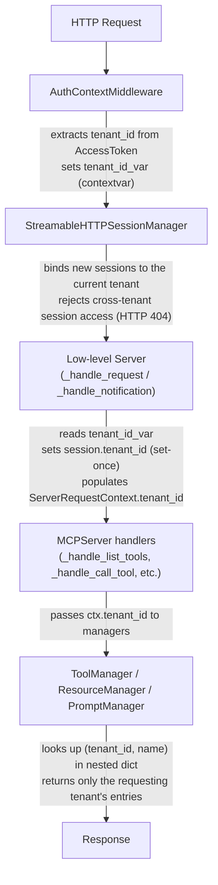

# Multi-Tenancy Guide

This guide explains how to build MCP servers that safely isolate multiple tenants sharing a single server instance. Multi-tenancy ensures that tools, resources, prompts, and sessions belonging to one tenant are invisible and inaccessible to others.

> For a complete working example, see [`examples/servers/simple-multi-tenant/`](../examples/servers/simple-multi-tenant/).

## Overview

In a multi-tenant deployment, a single MCP server process serves requests from multiple organizations, teams, or users (tenants). Without proper isolation, Tenant A could list or invoke Tenant B's tools, read their resources, or hijack their sessions.

The MCP Python SDK provides built-in tenant isolation across all layers:

- **Authentication tokens** carry a `tenant_id` field
- **Sessions** are bound to a single tenant on first authenticated request
- **Request context** propagates `tenant_id` to every handler
- **Managers** (tools, resources, prompts) use tenant-scoped storage
- **Session manager** validates tenant identity on every request

## How It Works

### Tenant Identification Flow



### Key Components

| Component | File | Role |
|---|---|---|
| `AccessToken.tenant_id` | `server/auth/provider.py` | Carries tenant identity in OAuth tokens |
| `tenant_id_var` | `shared/_context.py` | Transport-agnostic contextvar for tenant propagation |
| `AuthContextMiddleware` | `server/auth/middleware/auth_context.py` | Extracts tenant from auth and sets contextvar |
| `ServerSession.tenant_id` | `server/session.py` | Binds session to tenant (set-once semantics) |
| `ServerRequestContext.tenant_id` | `shared/_context.py` | Per-request tenant context for handlers |
| `Context.tenant_id` | `server/mcpserver/context.py` | High-level property for tool/resource/prompt handlers |
| `ToolManager` | `server/mcpserver/tools/tool_manager.py` | Tenant-scoped tool storage |
| `ResourceManager` | `server/mcpserver/resources/resource_manager.py` | Tenant-scoped resource storage |
| `PromptManager` | `server/mcpserver/prompts/manager.py` | Tenant-scoped prompt storage |
| `StreamableHTTPSessionManager` | `server/streamable_http_manager.py` | Validates tenant on session access |

## Usage

### Simple Registering Tenant-Scoped Tools, Resources, and Prompts

Use the `tenant_id` parameter when adding tools, resources, or prompts:

```python
from mcp.server.mcpserver import MCPServer

server = MCPServer("my-server")

# Register a tool for a specific tenant
def analyze_data(query: str) -> str:
    return f"Results for: {query}"

server.add_tool(analyze_data, tenant_id="acme-corp")

# Register a resource for a specific tenant
from mcp.server.mcpserver.resources.types import FunctionResource

server.add_resource(
    FunctionResource(uri="data://config", name="config", fn=lambda: "tenant config"),
    tenant_id="acme-corp",
)

# Register a prompt for a specific tenant
from mcp.server.mcpserver.prompts.base import Prompt

async def onboarding_prompt() -> str:
    return "Welcome to Acme Corp!"

server.add_prompt(
    Prompt.from_function(onboarding_prompt, name="onboarding"),
    tenant_id="acme-corp",
)
```

The same name can be registered under different tenants without conflict:

```python
server.add_tool(acme_tool, name="analyze", tenant_id="acme-corp")
server.add_tool(globex_tool, name="analyze", tenant_id="globex-inc")
```

### Dynamic Tenant Provisioning

Multi-tenancy enables MCP servers to operate as SaaS platforms where tenants are
provisioned and deprovisioned at runtime. Tools, resources, and prompts can be
added or removed dynamically — for example, when a tenant signs up, changes
their subscription tier, or installs a plugin.

#### Tenant Onboarding and Offboarding

Register a tenant's capabilities when they sign up and remove them when they leave:

```python
def onboard_tenant(server: MCPServer, tenant_id: str, plan: str) -> None:
    """Provision tools for a new tenant based on their plan."""

    # Base tools available to all tenants
    server.add_tool(search_docs, tenant_id=tenant_id)
    server.add_tool(get_status, tenant_id=tenant_id)

    # Premium tools gated by plan
    if plan in ("pro", "enterprise"):
        server.add_tool(run_analytics, tenant_id=tenant_id)
        server.add_tool(export_data, tenant_id=tenant_id)


def offboard_tenant(server: MCPServer, tenant_id: str) -> None:
    """Remove all tools when a tenant is deprovisioned."""
    server.remove_tool("search_docs", tenant_id=tenant_id)
    server.remove_tool("get_status", tenant_id=tenant_id)
    server.remove_tool("run_analytics", tenant_id=tenant_id)
    server.remove_tool("export_data", tenant_id=tenant_id)
```

#### Plugin Systems

Let tenants install or uninstall integrations that map to MCP tools:

```python
def install_plugin(server: MCPServer, tenant_id: str, plugin: str) -> None:
    """Install a plugin's tools for a specific tenant."""
    plugin_tools = load_plugin_tools(plugin)  # Your plugin registry
    for tool_fn in plugin_tools:
        server.add_tool(tool_fn, tenant_id=tenant_id)


def uninstall_plugin(server: MCPServer, tenant_id: str, plugin: str) -> None:
    """Remove a plugin's tools for a specific tenant."""
    plugin_tool_names = get_plugin_tool_names(plugin)
    for name in plugin_tool_names:
        server.remove_tool(name, tenant_id=tenant_id)
```

All dynamic changes take effect immediately — the next `list_tools` request from that tenant will reflect the updated set. Other tenants are unaffected.

### Accessing Tenant ID in Handlers

Inside tool, resource, or prompt handlers, access the current tenant through `Context.tenant_id`:

```python
from mcp.server.mcpserver.context import Context

@server.tool()
async def get_data(ctx: Context) -> str:
    tenant = ctx.tenant_id  # e.g., "acme-corp" or None
    return f"Data for tenant: {tenant}"
```

### Setting Up Authentication with Tenant ID

The `tenant_id` field on `AccessToken` is populated by your token verifier or OAuth provider. The `AuthContextMiddleware` automatically extracts `tenant_id` from the authenticated user's access token and sets the `tenant_id_var` contextvar for downstream use.

Implement the `TokenVerifier` protocol to bridge your external identity provider with the MCP auth stack. Your `verify_token` method decodes or introspects the bearer token and returns an `AccessToken` with `tenant_id` populated.

**Configuring your identity provider to include tenant identity in tokens:**

Most identity providers allow you to add custom claims to access tokens. The claim name varies by provider, but common conventions include `org_id`, `tenant_id`, or a namespaced claim like `https://myapp.com/tenant_id`. Here are some examples:

- **Duo Security**: Define a [custom user attribute](https://duo.com/docs/user-attributes) (e.g., `tenant_id`) and assign it to users via Duo Directory sync or the Admin Panel. Include this attribute as a claim in the access token issued by Duo as your IdP.
- **Auth0**: Use [Organizations](https://auth0.com/docs/manage-users/organizations) to model tenants. When a user authenticates through an organization, Auth0 automatically includes an `org_id` claim in the access token. Alternatively, use an [Action](https://auth0.com/docs/customize/actions) on the "Machine to Machine" or "Login" flow to add a custom claim based on app metadata or connection context.
- **Okta**: Add a [custom claim](https://developer.okta.com/docs/guides/customize-tokens-returned-from-okta/) to your authorization server. Map the claim value from the user's profile (e.g., `user.profile.orgId`) or from a group membership.
- **Microsoft Entra ID (Azure AD)**: Use the `tid` (tenant ID) claim that is included by default in tokens, or configure [optional claims](https://learn.microsoft.com/en-us/entra/identity-platform/optional-claims) to add organization-specific attributes.
- **Custom JWT issuer**: Include a `tenant_id` (or equivalent) claim in the JWT payload when minting tokens. For example: `{"sub": "user-123", "tenant_id": "acme-corp", "scope": "read write"}`.

Once your provider includes the tenant claim, extract it in your `TokenVerifier`:

```python
from mcp.server.auth.provider import AccessToken, TokenVerifier


class JWTTokenVerifier(TokenVerifier):
    """Verify JWTs and extract tenant_id from claims."""

    async def verify_token(self, token: str) -> AccessToken | None:
        # Decode and validate the JWT (e.g., using PyJWT or authlib)
        claims = decode_and_verify_jwt(token)
        if claims is None:
            return None

        return AccessToken(
            token=token,
            client_id=claims["sub"],
            scopes=claims.get("scope", "").split(),
            expires_at=claims.get("exp"),
            tenant_id=claims["org_id"],  # Extract tenant from your JWT claims
        )
```

Then pass the verifier when creating your `MCPServer`:

```python
from mcp.server.auth.settings import AuthSettings
from mcp.server.mcpserver.server import MCPServer

server = MCPServer(
    "my-server",
    token_verifier=JWTTokenVerifier(),
    auth=AuthSettings(
        issuer_url="https://auth.example.com",
        resource_server_url="https://mcp.example.com",
        required_scopes=["read"],
    ),
)
```

Once the `AccessToken` reaches the middleware stack, the flow is automatic: `BearerAuthBackend` validates the token → `AuthContextMiddleware` extracts `tenant_id` → `tenant_id_var` contextvar is set → all downstream handlers and managers receive the correct tenant scope.

### Session Isolation

Sessions are automatically bound to their tenant on first authenticated request (set-once semantics). The `StreamableHTTPSessionManager` enforces this:

- New sessions record the creating tenant's ID
- Subsequent requests must come from the same tenant
- Cross-tenant session access returns HTTP 404
- Session tenant binding cannot be changed after initial assignment

## Backward Compatibility

All tenant-scoped APIs default to `tenant_id=None`, preserving single-tenant behavior:

```python
# These all work exactly as before — no tenant scoping
server.add_tool(my_tool)
server.add_resource(my_resource)
await server.list_tools()  # Returns tools in global (None) scope
```

Tools registered without a `tenant_id` live in the global scope and are only visible when no tenant context is active (i.e., `tenant_id_var` is not set or is `None`).

## Architecture Notes

### Storage Model

Managers use a nested dictionary `{tenant_id: {name: item}}` for O(1) lookups per tenant. When the last item in a tenant scope is removed, the scope dictionary is cleaned up automatically.

### Set-Once Session Binding

`ServerSession.tenant_id` uses set-once semantics: once a session is bound to a tenant (on the first request with a non-None tenant_id), it cannot be changed. This prevents session fixation attacks where a session created by one tenant could be reused by another.

### Security Considerations

- **Cross-tenant tool invocation**: A tenant can only call tools registered under their own tenant_id. Attempting to call a tool from another tenant's scope raises a `ToolError`.
- **Resource access**: Resources are tenant-scoped. Reading a resource registered under a different tenant raises a `ResourceError`.
- **Session hijacking**: The session manager validates the requesting tenant against the session's bound tenant on every request. Mismatches return HTTP 404 with an opaque "Session not found" error (no tenant information is leaked).
- **Log levels**: Tenant mismatch events are logged at WARNING level (session ID only). Sensitive tenant identifiers are logged at DEBUG level only.
