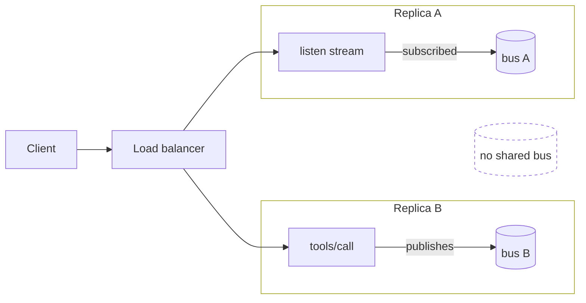

---
translation:
  sections: [60a9de8a0bdaa531, 6693607ea56d8bd6, a61d660c8029e04a, 8f7e82fcb88df8a9, b165db51249ff8ed, b8bc624a627ead9b, 2139e68e36d9e621, 7c0e57030b622139, 34ab1af2b9ab5b45]
  tool: 1
---
# الاشتراكات {#subscriptions}

فهرس الخادم ليس ثابتًا. تظهر أدوات أثناء التشغيل ويتغير المحتوى وراء URI المورد.

**الاشتراكات** وسيلة العميل لمعرفة ذلك. يرسل العميل طلب `subscriptions/listen` واحدًا، وتكون استجابة ذلك الطلب *هي* التدفّق: يبقى مفتوحًا ويحمل إشعارات التغيير التي طلبها العميل.

## انشر التغيير من الأداة {#publish-it-from-the-tool}

ما تفعله سطر واحد: انشر التغيير.

```python title="server.py" hl_lines="20 32"
--8<-- "docs_src/subscriptions/tutorial001.py"
```

* تصل `await ctx.notify_resource_updated("board://sprint")` إلى كل تدفّق مفتوح اشترك في ذلك URI، ولا تصل إلى غيره.
* تصل `await ctx.notify_tools_changed()` إلى كل تدفّق طلب تغييرات قائمة الأدوات. يعيد العميل الذي يتلقاها استدعاء `tools/list` ويرى `sprint_report` الآن.
* الطريقتان المقابلتان هما `notify_prompts_changed()` و`notify_resources_changed()`.
* لا مشتركون، لا عمل. النشر إلى خادم دون مستمعين لا يفعل شيئًا، فلا تفحص وجودهم. أعلن ما تغيّر فقط.

تخدم `MCPServer` طلبات `subscriptions/listen` نيابة عنك، ما لم [تعطّلها](#turning-it-off). التزامات النقل (الإقرار كأول إطار، والترشيح لكل تدفّق، ومعرّف الاشتراك على كل إطار) مسؤولية SDK.

!!! check
    أثناء النقل، يبدو التدفّق الذي سمّى مرشّحه `board://sprint` هكذا بعد تشغيل `complete_task`:

    ```json
    {"method": "notifications/subscriptions/acknowledged",
     "params": {"notifications": {"resourceSubscriptions": ["board://sprint"]}, "_meta": {"io.modelcontextprotocol/subscriptionId": "listen-1"}}}

    {"method": "notifications/resources/updated",
     "params": {"uri": "board://sprint", "_meta": {"io.modelcontextprotocol/subscriptionId": "listen-1"}}}
    ```

    لاحظ ما *لا* يحمله التحديث: اللوحة. يحمل كل إطار معرّف JSON-RPC لطلب الاستماع تحت `_meta`، وهذا هو معرّف الاشتراك. يصدره العميل: تستخدم `Client` في Python سلاسل مثل `"listen-1"`؛ وقد تستخدم عملاء أخرى أعدادًا صحيحة.

## ما طُلب فقط {#only-what-was-asked-for}

المرشّح عقد. يتلقى تدفّق طلب تغييرات قائمة الأدوات وURI مورد واحد هذين النوعين فقط. انشر تغيير قالب توجيه، فيبقى ذلك التدفّق صامتًا.

تطابق `MCPServer` عناوين URI للموارد كسلاسل متطابقة تمامًا، لذا لا يسمع تدفّق سمّى `board://sprint` شيئًا عن `board://sprint/tasks/1`. تسمح المواصفة للخادم بالإبلاغ عن تغيّر مورد فرعي لعنوان URI مُشترَك فيه؛ لا تفعل `MCPServer` ذلك أبدًا، لكن العملاء مصممون لتوقعه.

أمران *لا* يمثلهما التدفّق:

* **ليس سجلًا لإعادة تشغيل الأحداث.** يزول التدفّق المنقطع، ولا تُصف الأحداث المنشورة حين لا يتصل أحد. يعيد العملاء الاستماع وجلب البيانات.
* **ليس مسار 2025.** تخدم `ctx.session.send_resource_updated(uri)` العملاء الذين استدعوا `resources/subscribe`. تصل طرق `notify_*` إلى تدفّقات `subscriptions/listen` فقط.

## تحديد من يجوز له المشاهدة {#deciding-who-may-watch}

افتراضيًا، تُقبَل كل الأنواع وعناوين URI المطلوبة: يستطيع أي مستدعٍ مراقبة أي URI تنشره. لا تُستشار دالة معالجة القراءة لأن أحدًا لا يقرأ؛ فمستدعٍ ترفضه دالة `files://{name}` يستطيع فتح تدفّق على `files://payroll.csv` ومعرفة أنه تغيّر ومتى. لا يعرف المحتوى، ولا يستطيع استكشاف الموجود لأن URI غير المعروف يُقبَل أيضًا ولا يصدر أحداثًا. التسريب محدود لكنه فعلي، فضَع تحققًا قبل نشر عناوين URI خاصة بالمستخدمين من خادم متعدد المستأجرين.

بوابة التحقق مكوّن وسيط. يرى طلب `subscriptions/listen` قبل إقرار SDK له، ويرفض عندما يطلب المستدعي شيئًا لا يجوز له قراءته:

```python title="server.py" hl_lines="19-26 29"
--8<-- "docs_src/subscriptions/tutorial006.py"
```

* `ctx.params` هو الطلب الخام، لذا يتحقق منه المكوّن الوسيط بنفسه بتحويله إلى `SubscriptionsListenRequestParams` ويقرأ المرشّح الذي طلبه العميل.
* يكون الرفض عبر إثارة `MCPError` قبل `call_next(ctx)`: يتلقى العميل الخطأ دون تدفّق ويستمر الاتصال. اجعل الرسالة موحّدة دون تسمية URI، كي لا يؤكد الرفض أي عناوين محمية.
* تجيب `can_access(user, uri)` واحدة عن السؤالين. تستدعيها دالة المورد على `resources/read`؛ ويستدعيها المكوّن الوسيط على `subscriptions/listen`. استبدل الجدول بقاعدة بيانات أو نظام RBAC لديك، فيبقيان متوافقين.
* يسري القرار طوال حياة التدفّق. لا يُعاد التحقق لكل حدث، لذلك إذا كان وصول المستدعي قد ينتهي أثناء التدفّق (رمز تنتهي صلاحيته)، فأنه اتصاله عند حدوث ذلك.

العقد الكامل للبرمجيات الوسيطة، بما فيه ما تغلّفه أيضًا ولماذا وُصف بالمؤقت، في **[البرمجيات الوسيطة](../advanced/middleware.md)**.

## طرف العميل {#the-client-end}

إليك عميلًا على الطرف الآخر من ذلك التدفّق يتابع اللوحة:

```python title="client.py" hl_lines="15"
--8<-- "docs_src/subscriptions/tutorial003.py"
```

يرسل الدخول إلى `client.listen(...)` الطلب وينتظر إقرارك، لذلك يكون التدفّق نشطًا عند بدء الكتلة، ويكون كل حدث محدد النوع إشارة لإعادة الجلب، وليس حمولة بيانات. هذا هو العقد كاملًا في شاشة واحدة. بقية جانب العميل لها صفحة خاصة: المراقبة بجانب تدفق رئيسي، ونهايات التدفّقات، وإعادة الاستماع. راجع **[الاشتراكات](../client/subscriptions.md)** ضمن *العملاء*.

## التوسع إلى أكثر من عملية {#scaling-past-one-process}

تنتقل المنشورات من دالة المعالجة إلى التدفّقات المفتوحة عبر `SubscriptionBus`. الافتراضي داخل الذاكرة: عملية واحدة وكل التدفّقات فيها. هذا مناسب حتى تشغّل نسخًا خلف موازن حمل، لأن تدفّق العميل عندها مثبت على نسخة واحدة ويجب أن يصله نشر من نسخة أخرى.

لا يمكن ذلك مع الناقل الافتراضي، لأن لكل نسخة ناقلها الخاص:



لا يفشل شيء: ينجح الاستدعاء ويبقى التدفّق صامتًا. لذا اختر خلف موازن حمل:

* **تحتاج إلى إشعارات تغيير.** أعطِ كل نسخة الناقل نفسه، كما أدناه.
* **لا تحتاج إليها.** [عطّلها](#turning-it-off)، كي لا يُوعَد عميل بأحداث ستفوته أو يبقي تدفّقًا مفتوحًا لها.

أنت تنفّذ الناقل المشترك: طريقتان فوق نظام النشر والاشتراك لديك.

```python
from collections.abc import Callable

from redis.asyncio import Redis

from mcp.server.mcpserver import MCPServer
from mcp.server.subscriptions import ServerEvent  # SubscriptionBus is a Protocol: no base class


class RedisSubscriptionBus:
    def __init__(self, redis: Redis) -> None:
        self._redis = redis
        self._listeners: dict[object, Callable[[ServerEvent], None]] = {}

    async def publish(self, event: ServerEvent) -> None:
        await self._redis.publish("mcp-events", encode(event))  # to every replica

    def subscribe(self, listener: Callable[[ServerEvent], None]) -> Callable[[], None]:
        token = object()
        self._listeners[token] = listener

        def unsubscribe() -> None:
            self._listeners.pop(token, None)

        return unsubscribe


mcp = MCPServer("Sprint Board", subscriptions=RedisSubscriptionBus(redis))
```

`encode` مسؤوليتك، وكذلك مهمة القراءة على كل نسخة التي تفك الرسائل الواردة وتستدعي كل مستمع مسجّل. المستمعون متزامنون، ويجب ألّا يثيروا استثناءات، ويعملون على حلقة أحداث الخادم.

يحمل الناقل قيم `ServerEvent` محددة النوع، وهي أربع فئات بيانات صغيرة، وليس JSON-RPC أبدًا. تبقى إضافة المعرّفات والترشيح ودورات حياة التدفّقات في SDK، فلا يستطيع تنفيذ الناقل كسر البروتوكول. يستطيع فقط نقل الأحداث بين العمليات.

للنشر من خارج طلب، أنشئ الناقل بنفسك كي تحتفظ بالمرجع. تبني `MCPServer` واحدًا داخليًا عندما لا تمرّر شيئًا، ولا تتيحه.

```python
from mcp.server.subscriptions import InMemorySubscriptionBus, ToolsListChanged

bus = InMemorySubscriptionBus()
mcp = MCPServer("Sprint Board", subscriptions=bus)


async def tools_reloaded() -> None:
    await bus.publish(ToolsListChanged())  # from a lifespan task, a webhook, anywhere
```

## تعطيل الاشتراكات {#turning-it-off}

الخادم الذي لا يتغير فهرسه ليس لديه شيء لنشره. صرّح بذلك عند بنائه:

```python title="server.py" hl_lines="3"
--8<-- "docs_src/subscriptions/tutorial007.py"
```

* لا يرى عميل `2026-07-28` إعلانًا عن إشعارات تغيير، ويحصل طلب `subscriptions/listen` على *الطريقة غير موجودة* بدلًا من تدفّق مفتوح.
* تبقى `ctx.notify_*` تعمل دون أن تصل إلى أحد، فلا تتغير دوال المعالجة.
* لا يرى عملاء إصدارات البروتوكول الأقدم فرقًا.

التدفّق المفتوح طلب لا ينتهي، لذلك يهم هذا أيضًا على مضيف يحاسب بحسب مدة الطلب.

## التركيب منخفض المستوى {#the-low-level-composition}

لا شيء مربوط مسبقًا على `Server` منخفض المستوى، وتُجمع الأجزاء نفسها في ثلاثة أسطر:

```python title="server.py" hl_lines="8-9 47"
--8<-- "docs_src/subscriptions/tutorial002.py"
```

* أنت تملك الناقل فتنشر إليه مباشرة: `await bus.publish(ResourceUpdated(uri=...))`. ضعه حيث تستطيع دوال المعالجة الوصول إليه: على مستوى الوحدة هنا، وفي دورة الحياة لتطبيق أكبر.
* `ListenHandler(bus)` هي دالة المعالجة نفسها التي تسجّلها `MCPServer`، و`on_subscriptions_listen=` موضع دالة معالجة عادي. ضع فيه دالتك لسلوك مختلف، وتنتقل إليك التزامات المواصفة: الإقرار أولًا، وإضافة معرّف الاشتراك لكل إطار، وعدم إرسال شيء خارج المرشّح.
* تنهي `ListenHandler.close()` كل التدفّقات المفتوحة بسلاسة. يتلقى كل منها نتيجة طلب الاستماع كإطار أخير، وهي طريقة المواصفة لإعلان إنهاء الخادم للاشتراك عمدًا. تعود قبل اكتمال تفريغ تلك التدفّقات، فامنحها وقتًا قبل إغلاق وسيلة النقل. وبدونها تنتهي التدفّقات عندما يقطع العميل الاتصال.

## مراجعة {#recap}

* يختار العميل الاشتراك بطلب `subscriptions/listen` واحد، وتكون الاستجابة هي التدفّق. خدمته مدمجة.
* تنشر باستخدام `ctx.notify_*`، وتتولى SDK إضافة المعرّفات والترشيح ودورة الحياة.
* الأحداث إشارات، وليست حمولات محتوى. يعيد الطرفان جلب البيانات.
* جانب العميل هو `async with client.listen(...)`: تشرحه **[الاشتراكات](../client/subscriptions.md)** ضمن *العملاء*.
* على `Server` منخفض المستوى، تجمع الأجزاء نفسها بنفسك: ناقل و`ListenHandler(bus)` وموضع `on_subscriptions_listen`.
* يعني التوسع تنفيذ `SubscriptionBus` بطريقتين، وتمريره باسم `MCPServer(subscriptions=...)`.
* إذا لم يوجد شيء للنشر، أو كانت النسخ دون ناقل مشترك، فلا تعلن `MCPServer(subscriptions=False)` إشعارات تغيير ولا تُبقي تدفّقًا.

تشغيل الخادم الذي يتيح كل هذا، سواء بنسخة واحدة أو عشرين، موضوع **[النشر والتوسع](../run/deploy.md)**.
