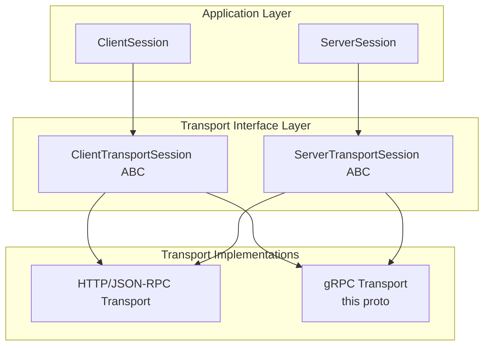

# MCP gRPC Protocol Definitions

This directory contains Protocol Buffer definitions for MCP (Model Context Protocol) as a native gRPC service.

## Motivation

The MCP specification uses JSON-RPC over HTTP, which has limitations:

- **No native streaming**: Long-polling or SSE workarounds are inefficient
- **Text-based encoding**: JSON serialization overhead vs binary protobufs
- **Connection overhead**: HTTP/1.1 doesn't support multiplexing

gRPC addresses these with:

- **HTTP/2 bidirectional streaming**: True streaming without polling
- **Protocol Buffers**: 10x smaller messages, faster serialization
- **Multiplexing**: Multiple concurrent RPCs over one connection
- **Native flow control**: Backpressure handling built-in

## Design Principles

1. **Direct mapping to MCP concepts**: Tools, Resources, Prompts map 1:1
2. **Streaming where beneficial**: Large resources, progress updates, watches
3. **Compatibility**: Semantically equivalent to JSON-RPC MCP
4. **Pragmatic**: Unary RPCs for simple operations, streaming only where needed
5. **Compliant**: Passes gRPC style linting and best practices

## Service Overview

```protobuf
service McpService {
  // Lifecycle
  rpc Initialize(InitializeRequest) returns (InitializeResponse);
  rpc Ping(PingRequest) returns (PingResponse);

  // Tools - with streaming variants for progress and parallel execution
  rpc ListTools(ListToolsRequest) returns (ListToolsResponse);
  rpc CallTool(CallToolRequest) returns (CallToolResponse);
  rpc CallToolWithProgress(CallToolWithProgressRequest) returns (stream CallToolWithProgressResponse);
  rpc StreamToolCalls(stream StreamToolCallsRequest) returns (stream StreamToolCallsResponse);

  // Resources - with chunked reads and watch subscriptions
  rpc ListResources(ListResourcesRequest) returns (ListResourcesResponse);
  rpc ReadResource(ReadResourceRequest) returns (ReadResourceResponse);
  rpc ReadResourceChunked(ReadResourceChunkedRequest) returns (stream ReadResourceChunkedResponse);
  rpc WatchResources(WatchResourcesRequest) returns (stream WatchResourcesResponse);

  // Prompts - with streaming completion
  rpc ListPrompts(ListPromptsRequest) returns (ListPromptsResponse);
  rpc GetPrompt(GetPromptRequest) returns (GetPromptResponse);
  rpc StreamPromptCompletion(StreamPromptCompletionRequest) returns (stream StreamPromptCompletionResponse);

  // Full bidirectional session for complex interactions
  rpc Session(stream SessionRequest) returns (stream SessionResponse);
}
```

## Streaming Use Cases

### 1. Tool Execution with Progress

```protobuf
rpc CallToolWithProgress(CallToolWithProgressRequest) returns (stream CallToolWithProgressResponse);
```

Server streams progress notifications during long-running tool execution, with the final message containing the result.

### 2. Parallel Tool Execution

```protobuf
rpc StreamToolCalls(stream StreamToolCallsRequest) returns (stream StreamToolCallsResponse);
```

Client streams multiple tool call requests, server streams results as they complete. Enables parallel execution without multiple connections.

### 3. Large Resource Streaming

```protobuf
rpc ReadResourceChunked(ReadResourceChunkedRequest) returns (stream ReadResourceChunkedResponse);
```

Stream large files in chunks without loading entire content into memory.

### 4. Resource Change Notifications

```protobuf
rpc WatchResources(WatchResourcesRequest) returns (stream WatchResourcesResponse);
```

Subscribe to resource changes with glob patterns. Replaces polling with push-based updates.

### 5. Bidirectional Session

```protobuf
rpc Session(stream SessionRequest) returns (stream SessionResponse);
```

Full MCP functionality over a single persistent bidirectional stream. Useful for complex agent interactions requiring interleaved requests/responses.

## Relationship to Pluggable Transports

This proto definition complements the pluggable transport interfaces in the Python SDK:



A gRPC transport implementation would:

1. Implement `ClientTransportSession` interface
2. Use generated gRPC stubs from this proto
3. Map Python method calls to gRPC RPCs
4. Handle streaming RPCs for progress/watch operations

## Building

Generate Python stubs:

```bash
python -m grpc_tools.protoc \
  -I proto \
  --python_out=src/mcp/grpc \
  --grpc_python_out=src/mcp/grpc \
  proto/mcp/v1/mcp.proto
```

Generate for other languages:

```bash
# Go
protoc -I proto --go_out=. --go-grpc_out=. proto/mcp/v1/mcp.proto

# Java
protoc -I proto --java_out=. --grpc-java_out=. proto/mcp/v1/mcp.proto
```

## Status

**Experimental** - This is a proposal for discussion. The proto definition aims to be semantically equivalent to the MCP JSON-RPC specification while leveraging gRPC's native capabilities.

## References

- [MCP Specification](https://modelcontextprotocol.io)
- [gRPC as a Native Transport for MCP](https://cloud.google.com/blog/products/networking/grpc-as-a-native-transport-for-mcp)
- [Issue #966: Add gRPC as a Standard Transport](https://github.com/modelcontextprotocol/modelcontextprotocol/issues/966)
