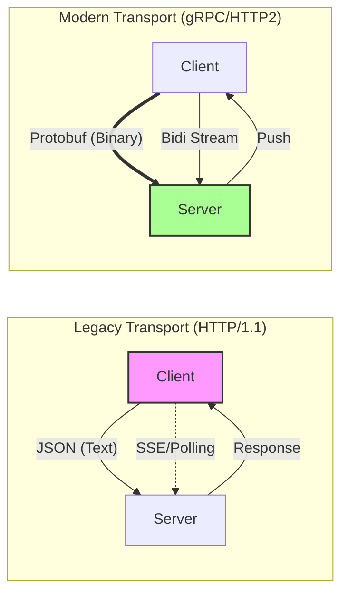
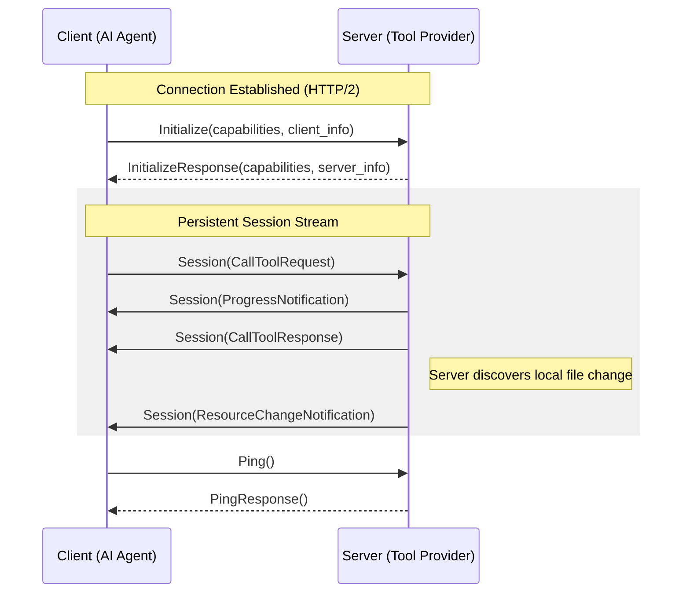

# MCP gRPC: High-Performance Transport

This directory contains the Protocol Buffer definitions for the Model Context Protocol (MCP) as a native gRPC service. This implementation modernizes the MCP transport layer, moving beyond the limitations of HTTP/1.1 (lacks streaming) and JSON (type safety, memory footprint, processing speed) to provide a better foundation for AI agents.

## Why gRPC for MCP?

The traditional MCP over HTTP/1.1 uses JSON-RPC, which served as a great starting point but introduced friction as agentic workflows scaled. Our native gRPC implementation addresses these "friction points" to performance and efficiency:



### Key Improvements

*   **Native Bidirectional Streaming**: Replaces fragile SSE and long-polling with a single, persistent HTTP/2 stream for interleaved requests, progress updates, and server notifications.
*   **Binary Efficiency**: Protobuf serialization is typically 10x smaller and significantly faster than JSON, especially when handling large blobs or many small tool calls.
*   **Zero-Copy Intent**: By using native `bytes` for resource data, we avoid the overhead of Base64 encoding required by JSON-RPC.
*   **Native Backpressure**: Leverages HTTP/2 flow control to ensure servers aren't overwhelmed by fast clients (and vice versa).

---

## Architecture & Lifecycle

The gRPC transport is designed to be a drop-in replacement for the standard MCP session, fitting seamlessly into the pluggable transport architecture of the SDK.

### The Session Flow

Unlike traditional unary calls, a gRPC MCP session often starts with an initialization handshake and then moves into a long-lived bidirectional stream.



---

## Service Definition

The `McpService` provides a comprehensive interface for all MCP operations. While it supports unary calls for simple operations, it excels in its streaming variants. For a deep dive into advanced patterns like document chunking and parallel worker analysis, see our [Streaming & Multiplexing Guide](../docs/experimental/grpc-streaming.md).

```protobuf
service McpService {
  // Lifecycle & Health
  rpc Initialize(InitializeRequest) returns (InitializeResponse);
  rpc Ping(PingRequest) returns (PingResponse);

  // Tools: Supports parallel execution and progress streaming
  rpc CallTool(CallToolRequest) returns (CallToolResponse);
  rpc CallToolWithProgress(...) returns (stream CallToolWithProgressResponse);

  // Resources: Efficient handling of large datasets
  rpc ReadResourceChunked(...) returns (stream ReadResourceChunkedResponse);
  rpc WatchResources(...) returns (stream WatchResourcesResponse);

  // The "Power User" Interface
  rpc Session(stream SessionRequest) returns (stream SessionResponse);
}
```

### Discoveries from Implementation

1.  **Implicit Chunking**: In our Python implementation, `read_resource` now defaults to the chunked streaming RPC under the hood. This ensures that even massive resources (like large logs or database exports) don't cause memory spikes.
2.  **Background Watchers**: Resource subscriptions are handled by background stream observers, allowing the client to receive push notifications without blocking the main event loop.
3.  **Unified Session**: The `Session` RPC acts as a multiplexer. This allows a single TCP connection to handle dozens of concurrent tool calls while simultaneously receiving resource updates.

---

## Development & Tooling

### Building the Stubs

To use this protocol in Python, you need to generate the gRPC stubs. **Note:** Due to the internal import structure of generated Protobuf files, we generate stubs into `src` which creates the appropriate package hierarchy.

```bash
# Generate Python stubs
python -m grpc_tools.protoc \
  -I proto \
  --python_out=src \
  --grpc_python_out=src \
  proto/mcp/v1/mcp.proto

# This creates:
# src/mcp/v1/mcp_pb2.py        (Standard messages)
# src/mcp/v1/mcp_pb2_grpc.py   (gRPC client/server stubs)
```

### Dependencies

Ensure your environment has the necessary gRPC libraries:

```bash
uv add grpcio grpcio-tools
```

---

## Status

**Current Status:** `Alpha / Experiemental / RFC`

The core protocol is stable and implemented in the Python SDK's `GrpcClientTransport`. We are actively seeking feedback on the `Session` stream multiplexing patterns before finalizing the V1 specification.

## References

- [Official MCP Website](https://modelcontextprotocol.io)
- [Original gRPC Proposal](https://cloud.google.com/blog/products/networking/grpc-as-a-native-transport-for-mcp)
- [gRPC Documentation](https://grpc.io/docs/)
