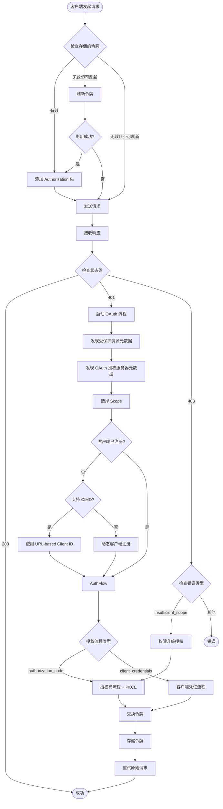

# MCP 客户端鉴权流程分析

本文档详细说明 MCP Python SDK 支持的 OAuth 2.0 鉴权协议、授权流程类型、客户端认证方法以及完整的鉴权流程。

## 一、支持的鉴权协议

MCP Python SDK 基于 **OAuth 2.0** 实现鉴权，支持以下协议和标准：

### 1. 核心协议

- **OAuth 2.0** (RFC 6749) - 主要鉴权协议框架
- **PKCE** (RFC 7636) - 授权码流程的安全扩展，使用 S256 方法
- **RFC 8414** - OAuth 2.0 授权服务器元数据发现
- **RFC 9728** - OAuth 2.0 受保护资源元数据（PRM）
- **RFC 8707** - 资源参数扩展，用于多资源场景
- **RFC 7523** - JWT Bearer Token 授权（部分支持，主要用于客户端认证）
- **RFC 7591** - OAuth 2.0 动态客户端注册（DCR）

### 2. 元数据发现机制

SDK 实现了完整的元数据发现流程，支持以下发现机制：

- **受保护资源元数据发现** (RFC 9728)
  - 从 `WWW-Authenticate` 头提取 `resource_metadata` 参数
  - 回退到路径感知的 well-known URI: `/.well-known/oauth-protected-resource/{path}`
  - 回退到根路径的 well-known URI: `/.well-known/oauth-protected-resource`

- **授权服务器元数据发现** (RFC 8414)
  - 路径感知的 OAuth 发现: `/.well-known/oauth-authorization-server{path}`
  - OIDC 发现端点回退: `/.well-known/openid-configuration{path}` 或 `{path}/.well-known/openid-configuration`
  - 根路径回退: `/.well-known/oauth-authorization-server` 或 `/.well-known/openid-configuration`

## 二、支持的授权流程（Grant Types）

### 2.1 Authorization Code Flow（授权码流程）

**实现位置**: [`src/mcp/client/auth/oauth2.py`](src/mcp/client/auth/oauth2.py)

**特点**:
- ✅ 使用 PKCE (S256) 增强安全性，防止授权码拦截攻击
- ✅ 支持动态客户端注册（DCR）
- ✅ 支持 URL-based Client ID (CIMD)
- ✅ 自动令牌刷新
- ✅ 支持权限升级（insufficient_scope 错误处理）

**流程步骤**:
1. 生成 PKCE 参数（code_verifier 和 code_challenge）
2. 构建授权请求 URL，包含 state 参数用于防 CSRF
3. 通过 `redirect_handler` 重定向用户到授权端点
4. 通过 `callback_handler` 接收授权码和 state
5. 使用授权码和 code_verifier 交换访问令牌

**代码示例**:
```python
from mcp.client.auth import OAuthClientProvider
from mcp.shared.auth import OAuthClientMetadata
from pydantic import AnyUrl

client_metadata = OAuthClientMetadata(
    redirect_uris=[AnyUrl("http://localhost:8080/callback")],
    grant_types=["authorization_code"],
    scope="read write"
)

provider = OAuthClientProvider(
    server_url="https://api.example.com",
    client_metadata=client_metadata,
    storage=token_storage,
    redirect_handler=handle_redirect,
    callback_handler=handle_callback
)
```

### 2.2 Client Credentials Flow（客户端凭证流程）

**实现位置**: [`src/mcp/client/auth/extensions/client_credentials.py`](src/mcp/client/auth/extensions/client_credentials.py)

**提供者类**:

#### ClientCredentialsOAuthProvider
使用传统的 `client_id` + `client_secret` 进行认证。

**支持的认证方法**:
- `client_secret_basic` - HTTP Basic Authentication（默认）
- `client_secret_post` - POST 表单认证

**代码示例**:
```python
from mcp.client.auth.extensions import ClientCredentialsOAuthProvider

provider = ClientCredentialsOAuthProvider(
    server_url="https://api.example.com",
    storage=token_storage,
    client_id="my-client-id",
    client_secret="my-client-secret",
    token_endpoint_auth_method="client_secret_basic",
    scopes="read write"
)
```

#### PrivateKeyJWTOAuthProvider
使用 `private_key_jwt` 认证方法，通过 JWT 断言进行客户端认证（RFC 7523 Section 2.2）。

**使用场景**:
1. **预构建 JWT**（如 workload identity federation）
   ```python
   from mcp.client.auth.extensions import PrivateKeyJWTOAuthProvider, static_assertion_provider

   provider = PrivateKeyJWTOAuthProvider(
       server_url="https://api.example.com",
       storage=token_storage,
       client_id="my-client-id",
       assertion_provider=static_assertion_provider(prebuilt_jwt)
   )
   ```

2. **SDK 签名 JWT**（用于测试或简单部署）
   ```python
   from mcp.client.auth.extensions import PrivateKeyJWTOAuthProvider, SignedJWTParameters

   jwt_params = SignedJWTParameters(
       issuer="my-client-id",
       subject="my-client-id",
       signing_key=private_key_pem,
       signing_algorithm="RS256"
   )

   provider = PrivateKeyJWTOAuthProvider(
       server_url="https://api.example.com",
       storage=token_storage,
       client_id="my-client-id",
       assertion_provider=jwt_params.create_assertion_provider()
   )
   ```

3. **Workload Identity Federation**
   ```python
   async def get_workload_identity_token(audience: str) -> str:
       # 从身份提供者获取 JWT
       return await fetch_token_from_identity_provider(audience=audience)

   provider = PrivateKeyJWTOAuthProvider(
       server_url="https://api.example.com",
       storage=token_storage,
       client_id="my-client-id",
       assertion_provider=get_workload_identity_token
   )
   ```

### 2.3 Refresh Token Flow（刷新令牌流程）

**实现位置**: [`src/mcp/client/auth/oauth2.py`](src/mcp/client/auth/oauth2.py) 的 `_refresh_token()` 方法

**特点**:
- ✅ 自动检测令牌过期
- ✅ 在令牌过期前自动刷新
- ✅ 刷新失败时自动触发完整授权流程
- ✅ 支持 RFC 8707 资源参数

**刷新条件**:
- 当前令牌无效或已过期
- 存在有效的 refresh_token
- 存在客户端信息（client_info）

### 2.4 JWT Bearer Grant（已弃用）

**实现位置**: [`src/mcp/client/auth/extensions/client_credentials.py`](src/mcp/client/auth/extensions/client_credentials.py) 的 `RFC7523OAuthClientProvider`

**状态**: ⚠️ 已标记为 deprecated

**建议**: 使用 `ClientCredentialsOAuthProvider` 或 `PrivateKeyJWTOAuthProvider` 替代

## 三、支持的客户端认证方法（Token Endpoint Auth Methods）

### 3.1 client_secret_basic

**实现位置**: [`src/mcp/client/auth/oauth2.py`](src/mcp/client/auth/oauth2.py) 的 `prepare_token_auth()` 方法

**认证方式**: HTTP Basic Authentication

**实现细节**:
- 将 `client_id:client_secret` 进行 URL 编码
- 使用 Base64 编码后放入 `Authorization` 头
- 格式: `Authorization: Basic {base64(client_id:client_secret)}`
- 不在请求体中包含 `client_secret`

**适用场景**: 标准的客户端凭证认证，安全性较高

### 3.2 client_secret_post

**实现位置**: 同上

**认证方式**: POST 表单认证

**实现细节**:
- 在 POST 请求体的表单数据中包含 `client_secret`
- 同时包含 `client_id` 参数
- 不使用 `Authorization` 头

**适用场景**: 某些不支持 HTTP Basic Auth 的服务器

### 3.3 private_key_jwt

**实现位置**: [`src/mcp/client/auth/extensions/client_credentials.py`](src/mcp/client/auth/extensions/client_credentials.py)

**认证方式**: JWT 断言认证（RFC 7523 Section 2.2）

**实现细节**:
- 创建 JWT 断言，包含以下声明：
  - `iss` (issuer): 客户端 ID
  - `sub` (subject): 客户端 ID
  - `aud` (audience): 授权服务器的 issuer 标识符
  - `exp` (expiration): 过期时间
  - `iat` (issued at): 签发时间
  - `jti` (JWT ID): 唯一标识符
- 使用私钥签名 JWT
- 在请求体中包含：
  - `client_assertion`: JWT 断言
  - `client_assertion_type`: `urn:ietf:params:oauth:client-assertion-type:jwt-bearer`

**适用场景**:
- Workload identity federation
- 无共享密钥的场景
- 需要更高安全性的企业环境

### 3.4 none

**实现位置**: [`src/mcp/client/auth/utils.py`](src/mcp/client/auth/utils.py) 的 `create_client_info_from_metadata_url()`

**认证方式**: 无客户端认证

**实现细节**:
- 不发送任何客户端凭证
- 仅使用 URL-based Client ID (CIMD)
- `client_id` 为 HTTPS URL

**适用场景**: URL-based Client ID (CIMD)，当服务器支持 `client_id_metadata_document_supported=true` 时

## 四、完整鉴权流程

### 4.1 流程概述

MCP 客户端鉴权流程在收到 `401 Unauthorized` 响应时自动触发，遵循以下步骤：



### 4.2 详细流程步骤

#### 阶段 1: 元数据发现

1. **提取受保护资源元数据 URL**
   - 从 `WWW-Authenticate` 头提取 `resource_metadata` 参数
   - 如果不存在，使用回退 URL

2. **发现受保护资源元数据（PRM）**
   - 按照优先级尝试以下 URL：
     1. `WWW-Authenticate` 头中的 `resource_metadata` URL
     2. `/.well-known/oauth-protected-resource{path}`（路径感知）
     3. `/.well-known/oauth-protected-resource`（根路径）
   - 解析 JSON 响应，获取 `authorization_servers` 列表

3. **发现 OAuth 授权服务器元数据（OASM）**
   - 从 PRM 获取授权服务器 URL
   - 按照优先级尝试以下发现端点：
     1. `/.well-known/oauth-authorization-server{path}`
     2. `/.well-known/openid-configuration{path}`
     3. `{path}/.well-known/openid-configuration`
     4. `/.well-known/oauth-authorization-server`
     5. `/.well-known/openid-configuration`

#### 阶段 2: Scope 选择

根据 MCP 规范的 Scope 选择策略，按以下优先级选择 scope：

1. **优先级 1**: `WWW-Authenticate` 头中的 `scope` 参数
2. **优先级 2**: PRM 的 `scopes_supported` 字段（所有 scope 用空格连接）
3. **优先级 3**: OASM 的 `scopes_supported` 字段
4. **优先级 4**: 省略 scope 参数

#### 阶段 3: 客户端注册

1. **检查是否已注册**
   - 从存储中加载客户端信息
   - 如果存在且有效，跳过注册步骤

2. **URL-based Client ID (CIMD)**
   - 检查服务器是否支持：`client_id_metadata_document_supported == true`
   - 检查是否提供了有效的 `client_metadata_url`（必须是 HTTPS URL 且路径不为根路径）
   - 如果满足条件，使用 URL 作为 `client_id`，`token_endpoint_auth_method="none"`

3. **动态客户端注册（DCR）**
   - 如果 OASM 包含 `registration_endpoint`，执行 DCR
   - 发送客户端元数据到注册端点
   - 接收并存储客户端信息（`client_id`、`client_secret` 等）

#### 阶段 4: 授权流程

根据 `grant_types` 选择相应的授权流程：

**Authorization Code Flow**:
1. 生成 PKCE 参数（code_verifier 和 code_challenge）
2. 生成随机 state 参数
3. 构建授权 URL，包含：
   - `response_type=code`
   - `client_id`
   - `redirect_uri`
   - `state`
   - `code_challenge` 和 `code_challenge_method=S256`
   - `scope`（如果已选择）
   - `resource`（如果协议版本 >= 2025-06-18 或存在 PRM）
4. 通过 `redirect_handler` 重定向用户
5. 通过 `callback_handler` 接收授权码和 state
6. 验证 state 参数

**Client Credentials Flow**:
- 直接进入令牌交换阶段，无需用户交互

#### 阶段 5: 令牌交换

1. **构建令牌请求**
   - 根据授权流程类型设置 `grant_type`
   - 对于 authorization_code: 包含 `code`、`redirect_uri`、`code_verifier`
   - 对于 client_credentials: 仅包含 `grant_type`
   - 包含 `scope`（如果已选择）
   - 包含 `resource`（如果满足条件）

2. **客户端认证**
   - 根据 `token_endpoint_auth_method` 准备认证信息：
     - `client_secret_basic`: 在 `Authorization` 头中添加 Basic 认证
     - `client_secret_post`: 在请求体中添加 `client_secret`
     - `private_key_jwt`: 生成并添加 JWT 断言
     - `none`: 不添加认证信息

3. **发送令牌请求**
   - POST 请求到 `token_endpoint`
   - 解析响应，获取 `access_token`、`refresh_token`、`expires_in` 等

4. **存储令牌**
   - 计算令牌过期时间
   - 存储到 `TokenStorage`
   - 更新上下文中的令牌信息

#### 阶段 6: 重试请求

- 使用新获取的访问令牌添加 `Authorization: Bearer {token}` 头
- 重试原始请求

### 4.3 权限升级流程（403 insufficient_scope）

当收到 `403 Forbidden` 且错误类型为 `insufficient_scope` 时：

1. 从 `WWW-Authenticate` 头提取新的 scope 要求
2. 更新客户端元数据中的 scope
3. 重新执行授权流程（通常是 Authorization Code Flow）
4. 使用新的 scope 交换令牌
5. 重试原始请求

### 4.4 自动令牌刷新

在每次请求前，SDK 会：

1. 检查当前令牌是否有效
2. 如果无效但存在 `refresh_token`，自动刷新
3. 刷新失败时，清除令牌并触发完整授权流程

## 五、特殊功能

### 5.1 动态客户端注册（DCR）

**标准**: RFC 7591

**实现**: 自动检测服务器是否支持 DCR（通过检查 `registration_endpoint`），并执行注册

**优势**:
- 无需预先配置客户端凭证
- 简化客户端部署
- 支持临时客户端

**限制**:
- 服务器必须支持 DCR
- 需要提供完整的客户端元数据

### 5.2 URL-based Client ID (CIMD)

**条件**: 服务器需支持 `client_id_metadata_document_supported=true`

**优势**:
- 无需动态注册
- 使用 HTTPS URL 作为 `client_id`
- 无需共享密钥（`token_endpoint_auth_method="none"`）
- 支持客户端元数据的去中心化管理

**要求**:
- `client_metadata_url` 必须是有效的 HTTPS URL
- URL 路径不能是根路径（`/`）

### 5.3 元数据发现回退机制

**受保护资源元数据** (SEP-985):
- 支持多个回退 URL，提高兼容性
- 自动尝试下一个 URL 如果当前 URL 返回 404

**授权服务器元数据**:
- 支持 OIDC 发现端点回退
- 兼容仅支持 OIDC 发现的服务器

### 5.4 Scope 选择策略

**优先级顺序**:
1. `WWW-Authenticate` 头中的 `scope` 参数（最高优先级）
2. PRM 的 `scopes_supported` 字段
3. OASM 的 `scopes_supported` 字段
4. 省略 scope 参数（最低优先级）

**实现位置**: [`src/mcp/client/auth/utils.py`](src/mcp/client/auth/utils.py) 的 `get_client_metadata_scopes()` 函数

### 5.5 资源参数支持（RFC 8707）

**条件**: 
- 协议版本 >= `2025-06-18`，或
- 存在受保护资源元数据（PRM）

**用途**: 在多资源场景中指定目标资源

**实现**: [`src/mcp/client/auth/oauth2.py`](src/mcp/client/auth/oauth2.py) 的 `should_include_resource_param()` 方法

### 5.6 PKCE 支持

**标准**: RFC 7636

**方法**: S256 (SHA256)

**实现**:
- 自动生成 128 字符的 `code_verifier`
- 使用 SHA256 哈希并 Base64 URL 编码生成 `code_challenge`
- 在授权请求中包含 `code_challenge` 和 `code_challenge_method=S256`
- 在令牌交换时包含 `code_verifier`

**优势**: 防止授权码拦截攻击，特别适用于公共客户端

## 六、关键组件

### 6.1 OAuthClientProvider

**位置**: [`src/mcp/client/auth/oauth2.py`](src/mcp/client/auth/oauth2.py)

**职责**:
- 实现 `httpx.Auth` 协议
- 管理完整的 OAuth 流程
- 自动处理令牌刷新
- 集成到 HTTPX 请求流程

**主要方法**:
- `async_auth_flow()`: HTTPX 认证流程入口
- `_perform_authorization()`: 执行授权流程
- `_refresh_token()`: 刷新访问令牌
- `_initialize()`: 初始化，加载存储的令牌和客户端信息

### 6.2 OAuthContext

**位置**: [`src/mcp/client/auth/oauth2.py`](src/mcp/client/auth/oauth2.py)

**职责**:
- 管理 OAuth 流程的上下文和状态
- 存储发现的元数据
- 管理令牌生命周期
- 提供工具方法（如资源 URL 计算、令牌验证等）

**关键属性**:
- `server_url`: MCP 服务器 URL
- `client_metadata`: 客户端元数据
- `oauth_metadata`: OAuth 授权服务器元数据
- `protected_resource_metadata`: 受保护资源元数据
- `current_tokens`: 当前访问令牌
- `client_info`: 客户端信息（client_id、client_secret 等）

### 6.3 TokenStorage

**位置**: [`src/mcp/client/auth/oauth2.py`](src/mcp/client/auth/oauth2.py)

**协议定义**:
```python
class TokenStorage(Protocol):
    async def get_tokens(self) -> OAuthToken | None
    async def set_tokens(self, tokens: OAuthToken) -> None
    async def get_client_info(self) -> OAuthClientInformationFull | None
    async def set_client_info(self, client_info: OAuthClientInformationFull) -> None
```

**职责**: 提供令牌和客户端信息的持久化存储接口

**实现**: 用户需要实现此协议，可以使用内存、文件、数据库等存储方式

### 6.4 PKCEParameters

**位置**: [`src/mcp/client/auth/oauth2.py`](src/mcp/client/auth/oauth2.py)

**职责**:
- 生成 PKCE 参数
- 验证参数格式

**生成方法**:
- `generate()`: 生成新的 PKCE 参数对

## 七、相关文件

### 核心实现

- **`src/mcp/client/auth/oauth2.py`** - 主要 OAuth 实现
  - `OAuthClientProvider`: 基础 OAuth 提供者
  - `OAuthContext`: OAuth 流程上下文
  - `PKCEParameters`: PKCE 参数管理
  - `TokenStorage`: 令牌存储协议

- **`src/mcp/client/auth/utils.py`** - 工具函数和元数据发现
  - 元数据发现 URL 构建
  - Scope 选择策略
  - 客户端注册请求构建
  - WWW-Authenticate 头解析

- **`src/mcp/client/auth/extensions/client_credentials.py`** - 客户端凭证扩展
  - `ClientCredentialsOAuthProvider`: 客户端凭证提供者
  - `PrivateKeyJWTOAuthProvider`: 私钥 JWT 认证提供者
  - `SignedJWTParameters`: JWT 签名参数
  - `RFC7523OAuthClientProvider`: JWT Bearer Grant（已弃用）

### 数据模型

- **`src/mcp/shared/auth.py`** - OAuth 数据模型定义
  - `OAuthToken`: 访问令牌模型
  - `OAuthClientMetadata`: 客户端元数据（RFC 7591）
  - `OAuthClientInformationFull`: 完整客户端信息
  - `OAuthMetadata`: 授权服务器元数据（RFC 8414）
  - `ProtectedResourceMetadata`: 受保护资源元数据（RFC 9728）

### 异常处理

- **`src/mcp/client/auth/exceptions.py`** - 鉴权相关异常
  - `OAuthFlowError`: OAuth 流程错误基类
  - `OAuthTokenError`: 令牌操作错误
  - `OAuthRegistrationError`: 客户端注册错误

## 八、使用示例

### 8.1 基本授权码流程

```python
import asyncio
from urllib.parse import parse_qs, urlparse

import httpx
from pydantic import AnyUrl

from mcp import ClientSession
from mcp.client.auth import OAuthClientProvider, TokenStorage
from mcp.client.streamable_http import streamable_http_client
from mcp.shared.auth import OAuthClientInformationFull, OAuthClientMetadata, OAuthToken


class InMemoryTokenStorage(TokenStorage):
    def __init__(self):
        self.tokens: OAuthToken | None = None
        self.client_info: OAuthClientInformationFull | None = None

    async def get_tokens(self) -> OAuthToken | None:
        return self.tokens

    async def set_tokens(self, tokens: OAuthToken) -> None:
        self.tokens = tokens

    async def get_client_info(self) -> OAuthClientInformationFull | None:
        return self.client_info

    async def set_client_info(self, client_info: OAuthClientInformationFull) -> None:
        self.client_info = client_info


async def handle_redirect(auth_url: str) -> None:
    print(f"请访问: {auth_url}")


async def handle_callback() -> tuple[str, str | None]:
    # 在实际应用中，这应该从回调 URL 中提取
    auth_code = input("请输入授权码: ")
    state = input("请输入 state (可选): ") or None
    return auth_code, state


async def main():
    storage = InMemoryTokenStorage()
    
    client_metadata = OAuthClientMetadata(
        redirect_uris=[AnyUrl("http://localhost:8080/callback")],
        grant_types=["authorization_code"],
        scope="read write"
    )
    
    provider = OAuthClientProvider(
        server_url="https://api.example.com",
        client_metadata=client_metadata,
        storage=storage,
        redirect_handler=handle_redirect,
        callback_handler=handle_callback
    )
    
    async with httpx.AsyncClient(auth=provider) as client:
        response = await client.get("https://api.example.com/api/data")
        print(response.json())


if __name__ == "__main__":
    asyncio.run(main())
```

### 8.2 客户端凭证流程

```python
from mcp.client.auth.extensions import ClientCredentialsOAuthProvider

storage = InMemoryTokenStorage()

provider = ClientCredentialsOAuthProvider(
    server_url="https://api.example.com",
    storage=storage,
    client_id="my-client-id",
    client_secret="my-client-secret",
    token_endpoint_auth_method="client_secret_basic",
    scopes="read write"
)

async with httpx.AsyncClient(auth=provider) as client:
    response = await client.get("https://api.example.com/api/data")
```

### 8.3 私钥 JWT 认证

```python
from mcp.client.auth.extensions import PrivateKeyJWTOAuthProvider, SignedJWTParameters

# 使用 SDK 签名 JWT
jwt_params = SignedJWTParameters(
    issuer="my-client-id",
    subject="my-client-id",
    signing_key=private_key_pem,
    signing_algorithm="RS256"
)

provider = PrivateKeyJWTOAuthProvider(
    server_url="https://api.example.com",
    storage=storage,
    client_id="my-client-id",
    assertion_provider=jwt_params.create_assertion_provider()
)
```

## 九、最佳实践

1. **令牌存储**: 使用安全的持久化存储（如加密的数据库或文件系统）
2. **错误处理**: 实现适当的错误处理和重试逻辑
3. **安全性**: 
   - 始终使用 HTTPS
   - 保护 client_secret 和私钥
   - 使用 PKCE 增强授权码流程安全性
4. **令牌刷新**: 依赖 SDK 的自动刷新机制，但实现适当的错误处理
5. **Scope 管理**: 仅请求必要的 scope，遵循最小权限原则
6. **元数据缓存**: 考虑缓存元数据发现的结果以提高性能

## 十、故障排查

### 常见问题

1. **401 Unauthorized**
   - 检查令牌是否过期
   - 验证客户端凭证是否正确
   - 确认 scope 是否足够

2. **403 Forbidden (insufficient_scope)**
   - 检查请求的 scope
   - 使用权限升级流程获取新令牌

3. **元数据发现失败**
   - 检查服务器 URL 是否正确
   - 验证服务器是否支持 OAuth 2.0
   - 检查网络连接

4. **客户端注册失败**
   - 验证客户端元数据是否完整
   - 检查服务器是否支持 DCR
   - 确认 redirect_uris 格式正确

## 十一、OAuth 协议特性与 MCP 必需内容分析

本文档详细说明了 MCP Python SDK 的鉴权实现。为了帮助理解实现细节，本节将文档中的内容分为两类：**OAuth 协议自身特性**和**MCP 授权必需内容**。

### 11.1 OAuth 协议自身特性

这些是 OAuth 2.0/2.1 标准规范定义的内容，不特定于 MCP：

#### 11.1.1 核心协议标准
- **OAuth 2.0 (RFC 6749)** - 核心授权框架
- **PKCE (RFC 7636)** - 授权码流程的安全扩展（OAuth 2.1 要求）
- **RFC 8414** - OAuth 2.0 授权服务器元数据发现（标准 OAuth 发现机制）
- **RFC 8707** - 资源参数扩展（多资源场景）
- **RFC 7523** - JWT Bearer Token 授权（客户端认证方法）
- **RFC 7591** - OAuth 2.0 动态客户端注册（DCR）

#### 11.1.2 授权流程类型
- **Authorization Code Flow（授权码流程）** - OAuth 2.0 标准流程
- **Client Credentials Flow（客户端凭证流程）** - OAuth 2.0 标准流程
- **Refresh Token Flow（刷新令牌流程）** - OAuth 2.0 标准流程
- **JWT Bearer Grant** - RFC 7523 定义的流程（已弃用）

#### 11.1.3 客户端认证方法
- **client_secret_basic** - HTTP Basic Authentication（RFC 6749）
- **client_secret_post** - POST 表单认证（RFC 6749）
- **private_key_jwt** - JWT 断言认证（RFC 7523 Section 2.2）
- **none** - 无客户端认证（用于公共客户端）

#### 11.1.4 令牌管理
- **令牌交换** - 使用授权码/客户端凭证交换访问令牌（OAuth 标准）
- **令牌刷新** - 使用 refresh_token 刷新访问令牌（OAuth 标准）
- **令牌过期检测** - 基于 `expires_in` 字段（OAuth 标准）

#### 11.1.5 错误处理
- **insufficient_scope 错误** - OAuth 2.0 标准错误类型（RFC 6750）
- **权限升级流程** - 基于 insufficient_scope 错误重新授权（OAuth 标准实践）

#### 11.1.6 元数据发现（通用 OAuth）
- **授权服务器元数据发现** - RFC 8414 定义的标准发现机制
- **OIDC 发现端点回退** - OpenID Connect Discovery 1.0 兼容性

### 11.2 MCP 授权必需内容

这些是 MCP 授权规范特定的要求，虽然可能基于 OAuth 标准，但 MCP 有特定的实现要求：

#### 11.2.1 受保护资源元数据（RFC 9728）
- **RFC 9728 PRM 实现** - 虽然是 OAuth 标准，但 MCP **MUST** 实现
- **从 WWW-Authenticate 头提取 `resource_metadata` 参数** - MCP 特定的发现机制
- **路径感知的 well-known URI** - MCP 特定的回退机制：
  - `/.well-known/oauth-protected-resource{path}`（路径感知）
  - `/.well-known/oauth-protected-resource`（根路径回退）

#### 11.2.2 发现机制要求
- **MUST 支持两种发现机制**：
  1. WWW-Authenticate 头中的 `resource_metadata` 参数
  2. Well-known URI 回退机制
- **MUST 优先使用 WWW-Authenticate 头** - MCP 特定的优先级规则
- **MUST 能够解析 WWW-Authenticate 头并响应 401 错误** - MCP 特定的集成方式

#### 11.2.3 Scope 选择策略
- **优先级顺序**（MCP 特定）：
  1. `WWW-Authenticate` 头中的 `scope` 参数（最高优先级）
  2. PRM 的 `scopes_supported` 字段
  3. OASM 的 `scopes_supported` 字段
  4. 省略 scope 参数（最低优先级）
- **从 WWW-Authenticate 头提取 scope** - MCP 特定的行为

#### 11.2.4 自动触发机制
- **收到 401 Unauthorized 时自动触发授权流程** - MCP 特定的集成方式
- **自动重试原始请求** - MCP 特定的行为

#### 11.2.5 资源参数支持
- **条件判断** - MCP 特定的逻辑：
  - 协议版本 >= `2025-06-18`，或
  - 存在受保护资源元数据（PRM）
- **在授权请求中包含 `resource` 参数** - 基于 RFC 8707，但 MCP 有特定的触发条件

#### 11.2.6 URL-based Client ID (CIMD)
- **OAuth Client ID Metadata Documents** - 虽然是 OAuth 标准扩展，但 MCP **SHOULD** 支持
- **CIMD 条件检查** - MCP 特定的实现逻辑：
  - 检查 `client_id_metadata_document_supported == true`
  - 验证 `client_metadata_url` 必须是 HTTPS URL 且路径不为根路径

#### 11.2.7 路径感知的元数据发现
- **授权服务器元数据发现的路径感知机制** - MCP 特定的回退策略：
  1. `/.well-known/oauth-authorization-server{path}`（路径插入）
  2. `/.well-known/openid-configuration{path}`（路径插入）
  3. `{path}/.well-known/openid-configuration`（路径后置）
  4. 根路径回退

#### 11.2.8 服务器端要求
- **MCP 服务器 MUST 实现 RFC 9728 PRM** - MCP 特定的强制要求
- **MCP 服务器 MUST 在 PRM 中包含 `authorization_servers` 字段** - MCP 特定的数据结构要求
- **MCP 服务器 SHOULD 在 WWW-Authenticate 头中包含 `scope` 参数** - MCP 特定的建议

### 11.3 混合特性（OAuth 标准 + MCP 特定要求）

某些内容既是 OAuth 标准，但 MCP 有特定的强制要求：

#### 11.3.1 PKCE
- **OAuth 标准**：RFC 7636 定义的可选扩展
- **MCP 要求**：**MUST** 使用 PKCE（OAuth 2.1 要求，MCP 遵循 OAuth 2.1）
- **MCP 特定**：**MUST** 使用 S256 方法，**MUST** 验证授权服务器支持

#### 11.3.2 动态客户端注册（DCR）
- **OAuth 标准**：RFC 7591 定义的可选功能
- **MCP 要求**：**MAY** 支持（可选，但 MCP 客户端应该支持）

#### 11.3.3 授权服务器元数据发现
- **OAuth 标准**：RFC 8414 定义的标准机制
- **MCP 要求**：**MUST** 支持，且必须支持 OIDC 发现端点作为回退

### 11.4 总结

#### OAuth 协议自身特性（约 60%）
- 核心协议和标准（RFC 6749, 7636, 8414, 8707, 7523, 7591）
- 授权流程类型（授权码、客户端凭证、刷新令牌）
- 客户端认证方法（basic, post, jwt, none）
- 令牌管理和错误处理
- 通用的元数据发现机制

#### MCP 授权必需内容（约 40%）
- RFC 9728 PRM 的强制实现
- WWW-Authenticate 头解析和 `resource_metadata` 参数提取
- 路径感知的 well-known URI 发现机制
- MCP 特定的 Scope 选择策略
- 自动触发授权流程（401 响应）
- 资源参数的 MCP 特定触发条件
- CIMD 的 MCP 特定实现逻辑

#### 关键区别
1. **OAuth 标准**：定义了"可以做什么"和"如何做"
2. **MCP 要求**：定义了"必须做什么"和"特定的实现方式"
3. **MCP 扩展**：在 OAuth 标准基础上添加了特定的发现机制、优先级规则和集成方式

## 十二、实现新鉴权协议所需功能

基于上述分析，如果要实现 MCP 支持一套新的鉴权协议（与 OAuth 不同），需要提供或实现以下功能。这些功能分为三类：**MCP 必需的基础设施**、**协议特定的实现**和**可选的增强功能**。

### 12.1 MCP 必需的基础设施（必须实现）

这些是 MCP 授权规范要求的基础设施，所有协议都需要支持：

#### 12.1.1 受保护资源元数据（PRM）支持
- **实现 RFC 9728 PRM 端点**
  - 提供 `/.well-known/oauth-protected-resource` 端点（或路径感知版本）
  - 返回包含协议信息的 PRM JSON 文档
  - 支持从 `WWW-Authenticate` 头中的 `resource_metadata` 参数指向 PRM URL

- **扩展 PRM 数据结构**（使用 RFC 9728 扩展机制）
  - 在 PRM 中添加 `mcp_auth_protocols` 字段，声明支持的协议列表
  - 每个协议元数据包含：
    - `protocol_id`: 协议标识符（如 "api_key", "mutual_tls"）
    - `protocol_version`: 协议版本
    - `metadata_url`: 协议特定的元数据发现 URL（可选）
    - `endpoints`: 协议端点映射（如 token_endpoint, authorize_endpoint）
    - `capabilities`: 协议能力列表
    - `client_auth_methods`: 客户端认证方法（如果适用）
    - `additional_params`: 协议特定的额外参数

#### 12.1.2 WWW-Authenticate 头支持
- **服务器端：构建扩展的 WWW-Authenticate 头**
  - 在 401 响应中包含协议声明：
    ```
    WWW-Authenticate: Bearer error="invalid_token",
                      resource_metadata="https://...",
                      auth_protocols="oauth2 api_key mutual_tls",
                      default_protocol="oauth2",
                      protocol_preferences="oauth2:1,api_key:2"
    ```
  - 支持协议特定的认证方案（如 `ApiKey`, `MutualTLS`）

- **客户端：解析 WWW-Authenticate 头**
  - 提取 `resource_metadata` 参数
  - 解析 `auth_protocols` 字段（如果存在）
  - 识别 `default_protocol` 和协议优先级
  - 支持非 Bearer 的认证方案

#### 12.1.3 协议发现机制
- **统一的能力发现端点**（推荐）
  - 实现 `/.well-known/authorization_servers` 端点
  - 返回服务器支持的所有授权协议列表和能力信息
  - 客户端首先访问此端点发现可用协议

- **协议特定的元数据发现**
  - 每个协议可以提供自己的元数据发现端点
  - 客户端根据协议 ID 调用相应的发现逻辑
  - 支持路径感知的 well-known URI（如 `/.well-known/{protocol}-metadata{path}`）

#### 12.1.4 自动触发机制
- **客户端：401 响应自动触发授权**
  - 检测 401 Unauthorized 响应
  - 自动解析 WWW-Authenticate 头
  - 自动发现协议并启动授权流程
  - 授权成功后自动重试原始请求

- **客户端：403 响应权限升级**
  - 检测 403 Forbidden 和 insufficient_scope 错误
  - 提取新的权限要求
  - 重新执行授权流程获取新凭证

### 12.2 协议特定的实现（每个协议必须实现）

这些是每个新协议需要实现的核心功能：

#### 12.2.1 协议抽象接口实现
```python
class AuthProtocol(Protocol):
    """授权协议抽象接口"""
    
    protocol_id: str  # 协议标识符
    protocol_version: str  # 协议版本
    
    async def discover_metadata(
        self,
        metadata_url: str | None,
        prm: ProtectedResourceMetadata | None = None
    ) -> AuthProtocolMetadata | None:
        """发现协议特定的元数据"""
        pass
    
    async def authenticate(
        self,
        context: AuthContext
    ) -> AuthCredentials:
        """执行协议特定的认证流程"""
        pass
    
    def prepare_request(
        self,
        request: httpx.Request,
        credentials: AuthCredentials
    ) -> None:
        """为请求添加协议特定的认证信息"""
        pass
    
    async def register_client(
        self,
        context: AuthContext
    ) -> ClientRegistrationResult | None:
        """协议特定的客户端注册（如果适用）"""
        pass
    
    def validate_credentials(
        self,
        credentials: AuthCredentials
    ) -> bool:
        """验证凭证是否有效（客户端）"""
        pass
```

#### 12.2.2 元数据发现
- **实现协议特定的元数据发现逻辑**
  - 从协议元数据端点获取配置信息
  - 解析协议特定的能力声明
  - 提取协议端点（如 token_endpoint, authorize_endpoint）
  - 缓存元数据以提高性能

#### 12.2.3 认证流程执行
- **实现协议特定的认证步骤**
  - OAuth 2.0: 授权码流程 + PKCE + 令牌交换
  - API Key: 直接使用配置的 API Key（可能涉及密钥交换）
  - Mutual TLS: 客户端证书验证（在 TLS 握手时）
  - 自定义协议: 实现特定的认证步骤序列

- **支持协议特定的交互方式**
  - 用户交互（如 OAuth 授权码流程）
  - 自动认证（如客户端凭证、API Key）
  - 混合方式（如需要用户确认的 API Key 激活）

#### 12.2.4 凭证管理
- **定义协议特定的凭证数据结构**
  ```python
  class APIKeyCredentials(AuthCredentials):
      protocol_id: str = "api_key"
      api_key: str
      key_id: str | None = None
      expires_at: int | None = None
  ```

- **实现凭证存储和检索**
  - 凭证序列化/反序列化
  - 凭证过期检查
  - 凭证刷新机制（如果协议支持）

#### 12.2.5 请求认证信息准备
- **实现协议特定的认证头/参数添加**
  - OAuth: `Authorization: Bearer <token>`
  - API Key: `X-API-Key: <key>` 或 `Authorization: ApiKey <key>`
  - Mutual TLS: 客户端证书（在 TLS 握手时，HTTP 层无需额外头）
  - 自定义: 协议特定的头、查询参数或请求体参数

#### 12.2.6 服务器端凭证验证
- **实现协议特定的验证逻辑**
  - OAuth: JWT 验证、令牌内省、签名验证
  - API Key: 密钥验证、过期检查、权限检查
  - Mutual TLS: 证书链验证、CN/OU 验证、证书撤销检查
  - 自定义: 协议特定的验证步骤

- **实现验证器接口**
  ```python
  class CredentialVerifier(Protocol):
      async def verify(
          self,
          request: Request
      ) -> AuthInfo | None:
          """验证请求中的凭证"""
          pass
  ```

### 12.3 可选的增强功能

这些功能可以提升协议实现的完整性和用户体验：

#### 12.3.1 客户端注册机制
- **如果协议需要客户端注册**
  - 实现协议特定的注册流程
  - 支持动态注册（如 OAuth DCR）
  - 支持静态配置（如预分配的 API Key）
  - 支持 URL-based Client ID（如 OAuth CIMD）

#### 12.3.2 权限/Scope 模型
- **如果协议有权限概念**
  - 定义协议特定的权限模型
  - 实现权限选择策略（类似 OAuth 的 scope 选择）
  - 支持权限升级机制
  - 实现权限验证逻辑

#### 12.3.3 凭证刷新机制
- **如果协议支持凭证刷新**
  - 实现自动刷新逻辑
  - 在凭证过期前自动刷新
  - 刷新失败时的降级处理

#### 12.3.4 错误处理
- **实现协议特定的错误处理**
  - 定义协议错误代码
  - 实现错误响应构建（服务器端）
  - 实现错误解析和处理（客户端）
  - 支持协议切换（如果当前协议失败，尝试其他协议）

#### 12.3.5 协议能力声明
- **声明协议支持的能力**
  - 凭证刷新
  - 权限升级
  - 客户端注册
  - 元数据发现
  - 其他协议特定的能力

### 12.4 实现检查清单

实现新协议时，可以使用以下检查清单确保完整性：

#### 数据模型层
- [ ] 定义协议元数据模型（`AuthProtocolMetadata`）
- [ ] 定义协议凭证模型（继承 `AuthCredentials`）
- [ ] 扩展 PRM 数据结构支持协议声明
- [ ] 定义协议特定的错误响应模型（如果适用）

#### 客户端实现
- [ ] 实现 `AuthProtocol` 接口
- [ ] 实现元数据发现逻辑
- [ ] 实现认证流程执行
- [ ] 实现请求认证信息准备
- [ ] 实现凭证验证（客户端）
- [ ] 实现客户端注册（如果适用）
- [ ] 实现权限选择（如果适用）
- [ ] 实现错误处理
- [ ] 在协议注册表中注册协议

#### 服务器实现
- [ ] 实现 PRM 端点，包含协议声明
- [ ] 实现协议特定的元数据发现端点（如果适用）
- [ ] 实现统一的能力发现端点（`/.well-known/authorization_servers`）
- [ ] 实现 `CredentialVerifier` 接口
- [ ] 实现凭证验证逻辑
- [ ] 实现 WWW-Authenticate 头构建（包含协议声明）
- [ ] 实现错误响应构建
- [ ] 实现权限验证（如果适用）
- [ ] 在认证中间件中注册协议验证器

#### 集成和测试
- [ ] 实现协议注册机制
- [ ] 实现协议发现和选择逻辑
- [ ] 实现协议切换机制（如果第一个协议失败）
- [ ] 编写单元测试
- [ ] 编写集成测试
- [ ] 编写文档和使用示例

### 12.5 与 OAuth 的区别

实现新协议时，需要注意以下与 OAuth 的区别：

#### 不需要实现的功能（OAuth 特定）
- ❌ 授权码流程（OAuth 特定）
- ❌ PKCE（OAuth 特定）
- ❌ 令牌交换（OAuth 特定）
- ❌ Refresh Token（OAuth 特定）
- ❌ Scope 模型（OAuth 特定，除非新协议也有类似概念）
- ❌ OAuth 客户端认证方法（client_secret_basic 等）

#### 必须实现的功能（MCP 通用）
- ✅ PRM 支持和协议声明
- ✅ WWW-Authenticate 头解析/构建
- ✅ 协议发现机制
- ✅ 自动触发授权流程（401 响应）
- ✅ 凭证管理和验证
- ✅ 请求认证信息准备

#### 可选实现的功能（协议特定）
- ⚠️ 客户端注册（取决于协议需求）
- ⚠️ 权限模型（取决于协议需求）
- ⚠️ 凭证刷新（取决于协议需求）
- ⚠️ 元数据发现（取决于协议复杂度）

### 12.6 参考实现

可以参考以下现有实现来理解如何实现新协议：

- **OAuth 2.0 实现**: [`src/mcp/client/auth/oauth2.py`](src/mcp/client/auth/oauth2.py)
- **客户端凭证扩展**: [`src/mcp/client/auth/extensions/client_credentials.py`](src/mcp/client/auth/extensions/client_credentials.py)
- **多协议设计文档**: [`src/mcp/client/auth/multi-protocol-design.md`](src/mcp/client/auth/multi-protocol-design.md)
- **扩展改造点分析**: [`mcp-auth-extension-analysis.md`](../mcp-auth-extension-analysis.md)

### 12.7 总结

实现 MCP 支持新鉴权协议需要：

1. **MCP 必需的基础设施**（约 40%）：PRM 支持、WWW-Authenticate 头、协议发现、自动触发机制
2. **协议特定的实现**（约 50%）：协议接口实现、认证流程、凭证管理、验证逻辑
3. **可选的增强功能**（约 10%）：客户端注册、权限模型、凭证刷新、错误处理

关键是要区分：
- **MCP 通用要求**：所有协议都必须支持
- **协议特定实现**：每个协议需要实现自己的逻辑
- **OAuth 特定功能**：不需要在新协议中实现

## 十三、现有代码改造点清单

基于章节11和12的分析，特别是必须实现的功能清单，以下是扩展支持新鉴权协议需要对现有代码进行的改造点。

### 13.1 数据模型层改造

#### 13.1.1 扩展 ProtectedResourceMetadata（PRM）

**文件**: `src/mcp/shared/auth.py`

**当前状态**: 仅支持 OAuth 2.0 的 `authorization_servers` 字段

**改造内容**:
1. **新增协议元数据模型**
   ```python
   class AuthProtocolMetadata(BaseModel):
       """单个授权协议的元数据（MCP 扩展）"""
       protocol_id: str = Field(..., pattern=r"^[a-z0-9_]+$")
       protocol_version: str
       metadata_url: AnyHttpUrl | None = None
       endpoints: dict[str, AnyHttpUrl] = Field(default_factory=dict)
       capabilities: list[str] = Field(default_factory=list)
       client_auth_methods: list[str] | None = None
       grant_types: list[str] | None = None  # OAuth 特定
       scopes_supported: list[str] | None = None  # OAuth 特定
       additional_params: dict[str, Any] = Field(default_factory=dict)
   ```

2. **扩展 ProtectedResourceMetadata**
   ```python
   class ProtectedResourceMetadata(BaseModel):
       # 保持 RFC 9728 必需字段不变（向后兼容）
       resource: AnyHttpUrl
       authorization_servers: list[AnyHttpUrl] = Field(..., min_length=1)
       
       # ... 现有字段 ...
       
       # MCP 扩展字段（使用 mcp_ 前缀）
       mcp_auth_protocols: list[AuthProtocolMetadata] | None = Field(
           None,
           description="MCP 扩展：支持的授权协议列表"
       )
       mcp_default_auth_protocol: str | None = Field(
           None,
           description="MCP 扩展：默认推荐的授权协议 ID"
       )
       mcp_auth_protocol_preferences: dict[str, int] | None = Field(
           None,
           description="MCP 扩展：协议优先级映射"
       )
   ```

3. **向后兼容处理**
   - 如果 `mcp_auth_protocols` 为空，自动从 `authorization_servers` 创建 OAuth 2.0 协议元数据
   - 标准 OAuth 客户端可以忽略 `mcp_*` 扩展字段

#### 13.1.2 新增通用凭证模型

**文件**: `src/mcp/shared/auth.py`（新增）

**改造内容**:
1. **定义基础凭证接口**
   ```python
   class AuthCredentials(BaseModel):
       """通用凭证基类"""
       protocol_id: str
       expires_at: int | None = None
       
   class OAuthCredentials(AuthCredentials):
       """OAuth 凭证（现有 OAuthToken 的包装）"""
       protocol_id: str = "oauth2"
       access_token: str
       token_type: Literal["Bearer"] = "Bearer"
       refresh_token: str | None = None
       scope: str | None = None
   ```

2. **扩展 TokenStorage 协议**
   ```python
   class TokenStorage(Protocol):
       async def get_tokens(self) -> AuthCredentials | None: ...
       async def set_tokens(self, tokens: AuthCredentials) -> None: ...
       # ... 现有方法 ...
   ```

#### 13.1.3 新增协议抽象接口

**文件**: `src/mcp/client/auth/protocol.py`（新建）

**改造内容**:
1. **定义协议抽象接口**
   ```python
   class AuthProtocol(Protocol):
       protocol_id: str
       protocol_version: str
       
       async def discover_metadata(...) -> AuthProtocolMetadata | None: ...
       async def authenticate(...) -> AuthCredentials: ...
       def prepare_request(...) -> None: ...
       async def register_client(...) -> ClientRegistrationResult | None: ...
       def validate_credentials(...) -> bool: ...
   ```

2. **定义服务器端验证器接口**
   ```python
   class CredentialVerifier(Protocol):
       async def verify(self, request: Request) -> AuthInfo | None: ...
   ```

### 13.2 客户端代码改造

#### 13.2.1 WWW-Authenticate 头解析扩展

**文件**: `src/mcp/client/auth/utils.py`

**当前函数**: `extract_field_from_www_auth()`, `extract_resource_metadata_from_www_auth()`

**改造内容**:
1. **新增协议相关字段提取**
   ```python
   def extract_auth_protocols_from_www_auth(response: Response) -> list[str] | None:
       """提取 auth_protocols 字段"""
       
   def extract_default_protocol_from_www_auth(response: Response) -> str | None:
       """提取 default_protocol 字段"""
       
   def extract_protocol_preferences_from_www_auth(response: Response) -> dict[str, int] | None:
       """提取 protocol_preferences 字段"""
   ```

2. **扩展解析逻辑**
   - 支持非 Bearer 的认证方案（如 `ApiKey`, `MutualTLS`）
   - 解析协议声明和优先级

#### 13.2.2 协议发现机制

**文件**: `src/mcp/client/auth/utils.py`

**当前函数**: `build_protected_resource_metadata_discovery_urls()`, `build_oauth_authorization_server_metadata_discovery_urls()`

**改造内容**:
1. **新增统一能力发现端点支持**
   ```python
   async def discover_authorization_servers(
       resource_url: str,
       http_client: httpx.AsyncClient
   ) -> list[AuthProtocolMetadata]:
       """统一的授权服务器发现流程"""
       # 1. 首先访问统一的能力发现端点
       # 2. 根据返回的列表，访问每个协议的元数据端点
   ```

2. **新增协议特定的元数据发现**
   ```python
   async def discover_protocol_metadata(
       protocol_id: str,
       metadata_url: str | None,
       prm: ProtectedResourceMetadata | None = None
   ) -> AuthProtocolMetadata | None:
       """协议特定的元数据发现"""
   ```

3. **修改现有发现函数**
   - `build_oauth_authorization_server_metadata_discovery_urls()` 改为协议特定的发现函数
   - 支持路径感知的协议元数据发现端点

#### 13.2.3 协议注册和选择机制

**文件**: `src/mcp/client/auth/registry.py`（新建）

**改造内容**:
1. **实现协议注册表**
   ```python
   class AuthProtocolRegistry:
       _protocols: dict[str, type[AuthProtocol]] = {}
       
       @classmethod
       def register(cls, protocol_id: str, protocol_class: type[AuthProtocol]): ...
       
       @classmethod
       def get_protocol(cls, protocol_id: str) -> type[AuthProtocol] | None: ...
       
       @classmethod
       def select_protocol(
           cls,
           available_protocols: list[str],
           default_protocol: str | None = None,
           preferences: dict[str, int] | None = None
       ) -> str | None: ...
   ```

2. **协议选择逻辑**
   - 根据优先级、默认协议、客户端支持情况选择协议
   - 支持协议切换（如果第一个协议失败）

#### 13.2.4 OAuthClientProvider 重构

**文件**: `src/mcp/client/auth/oauth2.py`

**当前类**: `OAuthClientProvider`, `OAuthContext`

**改造内容**:
1. **抽象为多协议提供者**
   ```python
   class MultiProtocolAuthProvider(httpx.Auth):
       """多协议认证提供者"""
       def __init__(
           self,
           server_url: str,
           protocols: list[AuthProtocol],
           storage: TokenStorage,
           ...
       ): ...
       
       async def async_auth_flow(self, request: httpx.Request) -> AsyncGenerator[httpx.Request, None]:
           # 1. 检查存储的凭证
           # 2. 如果无效，触发协议发现和选择
           # 3. 执行选中的协议认证流程
           # 4. 准备请求认证信息
   ```

2. **OAuthClientProvider 适配**
   - 将 `OAuthClientProvider` 改为 `OAuth2Protocol` 实现
   - 保持现有 API 不变（向后兼容）
   - 内部使用 `MultiProtocolAuthProvider`

3. **OAuthContext 扩展**
   - 支持多协议上下文
   - 协议特定的元数据存储

#### 13.2.5 请求认证信息准备

**文件**: `src/mcp/client/auth/oauth2.py`

**当前方法**: `_add_auth_header()`（在 OAuthClientProvider 中）

**改造内容**:
1. **抽象为协议方法**
   - 每个协议实现自己的 `prepare_request()` 方法
   - OAuth: `Authorization: Bearer <token>`
   - API Key: `X-API-Key: <key>` 或 `Authorization: ApiKey <key>`
   - Mutual TLS: 在 TLS 握手时处理

2. **在 MultiProtocolAuthProvider 中调用**
   ```python
   def _prepare_request(self, request: httpx.Request, credentials: AuthCredentials):
       protocol = self.registry.get_protocol(credentials.protocol_id)
       protocol.prepare_request(request, credentials)
   ```

#### 13.2.6 凭证存储扩展

**文件**: `src/mcp/client/auth/oauth2.py`

**当前协议**: `TokenStorage`

**改造内容**:
1. **扩展 TokenStorage 协议**
   ```python
   class TokenStorage(Protocol):
       async def get_tokens(self) -> AuthCredentials | None: ...
       async def set_tokens(self, tokens: AuthCredentials) -> None: ...
       # 保持现有方法以支持向后兼容
   ```

2. **凭证序列化/反序列化**
   - 支持多种凭证类型的序列化
   - 根据 `protocol_id` 反序列化为正确的类型

### 13.3 服务器端代码改造

#### 13.3.1 PRM 端点扩展

**文件**: `src/mcp/server/auth/routes.py`

**当前函数**: `create_protected_resource_routes()`

**改造内容**:
1. **扩展函数签名**
   ```python
   def create_protected_resource_routes(
       resource_url: AnyHttpUrl,
       authorization_servers: list[AnyHttpUrl],
       scopes_supported: list[str] | None = None,
       # 新增参数
       auth_protocols: list[AuthProtocolMetadata] | None = None,
       default_protocol: str | None = None,
       protocol_preferences: dict[str, int] | None = None,
       ...
   ) -> list[Route]:
   ```

2. **构建扩展的 PRM**
   ```python
   metadata = ProtectedResourceMetadata(
       resource=resource_url,
       authorization_servers=authorization_servers,  # 保持向后兼容
       scopes_supported=scopes_supported,
       mcp_auth_protocols=auth_protocols,  # 新增
       mcp_default_auth_protocol=default_protocol,  # 新增
       mcp_auth_protocol_preferences=protocol_preferences,  # 新增
       ...
   )
   ```

#### 13.3.2 统一能力发现端点

**文件**: `src/mcp/server/auth/routes.py`（新增函数）

**改造内容**:
1. **新增统一发现端点**
   ```python
   def create_authorization_servers_discovery_routes(
       resource_url: AnyHttpUrl,
       auth_protocols: list[AuthProtocolMetadata],
       default_protocol: str | None = None,
       protocol_preferences: dict[str, int] | None = None,
   ) -> list[Route]:
       """创建统一的能力发现端点 /.well-known/authorization_servers"""
   ```

2. **实现端点处理器**
   ```python
   class AuthorizationServersDiscoveryHandler:
       async def handle(self, request: Request) -> Response:
           """返回服务器支持的所有授权协议列表"""
   ```

#### 13.3.3 WWW-Authenticate 头构建扩展

**文件**: `src/mcp/server/auth/middleware/bearer_auth.py`

**当前方法**: `_send_auth_error()`

**改造内容**:
1. **扩展错误响应构建**
   ```python
   async def _send_auth_error(
       self,
       send: Send,
       status_code: int,
       error: str,
       description: str,
       # 新增参数
       resource_metadata_url: AnyHttpUrl | None = None,
       auth_protocols: list[str] | None = None,
       default_protocol: str | None = None,
       protocol_preferences: dict[str, int] | None = None,
   ) -> None:
       """构建扩展的 WWW-Authenticate 头"""
       parts = [
           f'error="{error}"',
           f'error_description="{description}"'
       ]
       
       if resource_metadata_url:
           parts.append(f'resource_metadata="{resource_metadata_url}"')
       
       if auth_protocols:
           parts.append(f'auth_protocols="{" ".join(auth_protocols)}"')
       
       if default_protocol:
           parts.append(f'default_protocol="{default_protocol}"')
       
       if protocol_preferences:
           prefs_str = ",".join(f"{proto}:{priority}" 
                               for proto, priority in protocol_preferences.items())
           parts.append(f'protocol_preferences="{prefs_str}"')
       
       www_auth = f"Bearer {', '.join(parts)}"
   ```

2. **修改 RequireAuthMiddleware**
   - 添加协议信息参数
   - 在 401/403 响应中包含协议声明

#### 13.3.4 认证后端重构

**文件**: `src/mcp/server/auth/middleware/bearer_auth.py`

**当前类**: `BearerAuthBackend`

**改造内容**:
1. **新增多协议认证后端**
   ```python
   class MultiProtocolAuthBackend(AuthenticationBackend):
       """多协议认证后端"""
       def __init__(
           self,
           verifiers: dict[str, CredentialVerifier]
       ):
           self.verifiers = verifiers
       
       async def authenticate(self, conn: HTTPConnection):
           """尝试所有支持的协议"""
           for protocol_id, verifier in self.verifiers.items():
               result = await verifier.verify(conn)
               if result:
                   return result
           return None
   ```

2. **BearerAuthBackend 适配**
   - 将 `BearerAuthBackend` 改为 OAuth 特定的验证器
   - 在 `MultiProtocolAuthBackend` 中注册

3. **新增协议特定的验证器**
   ```python
   class APIKeyVerifier(CredentialVerifier):
       async def verify(self, request: Request) -> AuthInfo | None: ...
   
   class MutualTLSVerifier(CredentialVerifier):
       async def verify(self, request: Request) -> AuthInfo | None: ...
   ```

#### 13.3.5 协议特定的元数据端点

**文件**: `src/mcp/server/auth/routes.py`（新增函数）

**改造内容**:
1. **新增协议元数据端点创建函数**
   ```python
   def create_protocol_metadata_routes(
       protocol_id: str,
       metadata: AuthProtocolMetadata
   ) -> list[Route]:
       """创建协议特定的元数据发现端点"""
       # 例如: /.well-known/api-key-metadata
   ```

### 13.4 新增文件和模块

#### 13.4.1 协议抽象和接口

**新建文件**: `src/mcp/client/auth/protocol.py`
- `AuthProtocol` 协议接口
- `AuthProtocolMetadata` 模型（或从 shared 导入）
- 协议注册表

**新建文件**: `src/mcp/client/auth/registry.py`
- `AuthProtocolRegistry` 类
- 协议选择逻辑

#### 13.4.2 多协议提供者

**新建文件**: `src/mcp/client/auth/multi_protocol.py`
- `MultiProtocolAuthProvider` 类
- 协议发现和选择逻辑
- 凭证管理

#### 13.4.3 OAuth 协议实现

**新建文件**: `src/mcp/client/auth/protocols/oauth2.py`
- `OAuth2Protocol` 类（实现 `AuthProtocol`）
- 将现有 `OAuthClientProvider` 逻辑迁移到这里

#### 13.4.4 服务器端验证器

**新建文件**: `src/mcp/server/auth/verifiers.py`
- `CredentialVerifier` 协议接口
- `OAuthTokenVerifier`（现有 TokenVerifier 的适配）
- `MultiProtocolAuthBackend`

**新建文件**: `src/mcp/server/auth/handlers/discovery.py`
- `AuthorizationServersDiscoveryHandler` 类

### 13.5 改造优先级和依赖关系

#### 高优先级（必须首先实现）
1. **数据模型扩展**（13.1）
   - `AuthProtocolMetadata` 模型
   - `ProtectedResourceMetadata` 扩展
   - `AuthCredentials` 基类

2. **协议抽象接口**（13.4.1）
   - `AuthProtocol` 接口定义
   - `CredentialVerifier` 接口定义

3. **WWW-Authenticate 头扩展**（13.2.1, 13.3.3）
   - 客户端解析扩展
   - 服务器端构建扩展

#### 中优先级（核心功能）
4. **协议发现机制**（13.2.2, 13.3.2）
   - 统一能力发现端点
   - 协议特定的元数据发现

5. **协议注册和选择**（13.2.3）
   - 协议注册表
   - 协议选择逻辑

6. **多协议提供者**（13.2.4, 13.4.2）
   - `MultiProtocolAuthProvider`
   - 协议切换机制

7. **认证后端重构**（13.3.4）
   - `MultiProtocolAuthBackend`
   - 协议特定的验证器

#### 低优先级（向后兼容和优化）
8. **OAuth 适配**（13.2.4）
   - `OAuth2Protocol` 实现
   - `OAuthClientProvider` 向后兼容包装

9. **PRM 端点扩展**（13.3.1）
   - 扩展 `create_protected_resource_routes()`

10. **凭证存储扩展**（13.2.6）
    - `TokenStorage` 协议扩展
    - 凭证序列化/反序列化

### 13.6 向后兼容策略

#### 数据模型兼容
- 保持 `ProtectedResourceMetadata` 的 `authorization_servers` 字段为必需
- `mcp_*` 扩展字段为可选
- 如果 `mcp_auth_protocols` 为空，自动从 `authorization_servers` 创建 OAuth 协议元数据

#### API 兼容
- `OAuthClientProvider` 保持现有 API 不变
- 内部使用 `OAuth2Protocol` 和 `MultiProtocolAuthProvider`
- 现有代码无需修改即可工作

#### 行为兼容
- 默认行为：如果没有协议声明，使用 OAuth 2.0
- 现有 OAuth 流程保持不变
- 新协议作为可选功能添加

### 13.7 测试改造点

#### 单元测试
- 数据模型序列化/反序列化测试
- 协议发现逻辑测试
- 协议选择逻辑测试
- WWW-Authenticate 头解析/构建测试

#### 集成测试
- 多协议认证流程测试
- 协议切换测试
- 向后兼容性测试

### 13.8 总结

改造点分为三个层次：

1. **基础设施层**（必须首先实现）：
   - 数据模型扩展
   - 协议抽象接口
   - WWW-Authenticate 头扩展

2. **核心功能层**（实现多协议支持）：
   - 协议发现机制
   - 协议注册和选择
   - 多协议提供者和认证后端

3. **适配层**（向后兼容）：
   - OAuth 协议实现
   - 现有 API 的兼容包装
   - 凭证存储扩展

**关键原则**：
- 保持向后兼容
- 渐进式改造
- 协议抽象和统一接口
- MCP 通用功能与协议特定实现分离

## 十四、OAuth 2.0 DPoP 支持改造点

DPoP (Demonstrating Proof-of-Possession, RFC 9449) 是 OAuth 2.0 的安全扩展，用于将访问令牌绑定到客户端的加密密钥。与多协议扩展不同，DPoP 是 OAuth 2.0 协议内部的增强功能，需要在现有 OAuth 实现基础上添加支持。

### 14.1 DPoP 概述

#### 14.1.1 DPoP 核心概念
- **密钥对生成**：客户端生成公钥/私钥对用于签名 DPoP 证明
- **DPoP 证明**：客户端为每个请求创建 DPoP JWT，包含：
  - `htm`: HTTP 方法
  - `htu`: HTTP URI
  - `jti`: JWT ID（防重放）
  - `iat`: 签发时间
  - `ath`: 访问令牌哈希（如果存在）
  - `cnf`: 确认信息（包含公钥的 JWK）
- **令牌绑定**：服务器可以将访问令牌绑定到 DPoP 公钥（通过 `cnf.jkt`）
- **验证**：资源服务器验证 DPoP 证明与令牌中的公钥匹配

#### 14.1.2 DPoP 与多协议设计的关系
- DPoP 是 **OAuth 2.0 协议的扩展**，不是独立协议
- 在 `OAuth2Protocol` 实现中添加 DPoP 支持
- 不影响多协议架构，只是 OAuth 2.0 实现的一个可选增强

### 14.2 数据模型改造

#### 14.2.1 扩展 OAuthMetadata

**文件**: `src/mcp/shared/auth.py`

**当前状态**: `OAuthMetadata` 类已存在，但缺少 DPoP 相关字段

**改造内容**:
1. **添加 DPoP 元数据字段**
   ```python
   class OAuthMetadata(BaseModel):
       # ... 现有字段 ...
       
       # DPoP 支持字段（RFC 9449）
       dpop_signing_alg_values_supported: list[str] | None = Field(
           None,
           description="支持的 DPoP 签名算法列表（如 ['ES256', 'RS256']）"
       )
   ```

2. **ProtectedResourceMetadata 已有字段**
   - `dpop_signing_alg_values_supported` ✅ 已存在
   - `dpop_bound_access_tokens_required` ✅ 已存在

#### 14.2.2 新增 DPoP 密钥对模型

**文件**: `src/mcp/shared/auth.py`（新增）

**改造内容**:
1. **定义 DPoP 密钥对模型**
   ```python
   class DPoPKeyPair(BaseModel):
       """DPoP 密钥对"""
       private_key_pem: str  # PEM 格式的私钥
       public_key_jwk: dict[str, Any]  # JWK 格式的公钥
       key_id: str | None = None  # 可选的密钥 ID
       
       @classmethod
       def generate(cls, algorithm: str = "ES256") -> "DPoPKeyPair":
           """生成新的 DPoP 密钥对"""
           # 使用 cryptography 库生成密钥对
   ```

2. **扩展 OAuthToken 模型**
   ```python
   class OAuthToken(BaseModel):
       # ... 现有字段 ...
       
       # DPoP 相关字段
       dpop_key_id: str | None = Field(
           None,
           description="DPoP 密钥 ID（如果令牌绑定到 DPoP）"
       )
       cnf: dict[str, Any] | None = Field(
           None,
           description="确认信息（包含 jkt 如果令牌绑定到 DPoP）"
       )
   ```

#### 14.2.3 扩展 TokenStorage 协议

**文件**: `src/mcp/client/auth/oauth2.py`

**当前协议**: `TokenStorage`

**改造内容**:
1. **添加 DPoP 密钥对存储**
   ```python
   class TokenStorage(Protocol):
       # ... 现有方法 ...
       
       async def get_dpop_key_pair(self) -> DPoPKeyPair | None:
           """获取存储的 DPoP 密钥对"""
           ...
       
       async def set_dpop_key_pair(self, key_pair: DPoPKeyPair) -> None:
           """存储 DPoP 密钥对"""
           ...
   ```

### 14.3 客户端代码改造

#### 14.3.1 DPoP 证明生成

**文件**: `src/mcp/client/auth/dpop.py`（新建）

**改造内容**:
1. **实现 DPoP 证明生成器**
   ```python
   class DPoPProofGenerator:
       """DPoP 证明生成器"""
       
       def __init__(self, key_pair: DPoPKeyPair):
           self.key_pair = key_pair
       
       def generate_proof(
           self,
           method: str,
           uri: str,
           access_token: str | None = None,
           nonce: str | None = None
       ) -> str:
           """生成 DPoP 证明 JWT"""
           # 1. 构建 JWT claims
           claims = {
               "htm": method,
               "htu": uri,
               "iat": int(time.time()),
               "jti": secrets.token_urlsafe(32),
               "cnf": {"jwk": self.key_pair.public_key_jwk}
           }
           
           # 2. 如果存在访问令牌，添加 ath
           if access_token:
               claims["ath"] = base64.urlsafe_b64encode(
                   hashlib.sha256(access_token.encode()).digest()
               ).decode().rstrip("=")
           
           # 3. 如果存在 nonce，添加 nonce
           if nonce:
               claims["nonce"] = nonce
           
           # 4. 使用私钥签名 JWT
           # 5. 返回 JWT 字符串
   ```

2. **实现密钥对生成**
   ```python
   def generate_dpop_key_pair(algorithm: str = "ES256") -> DPoPKeyPair:
       """生成 DPoP 密钥对"""
       # 使用 cryptography 库生成密钥对
       # 转换为 PEM 和 JWK 格式
   ```

#### 14.3.2 OAuthContext 扩展

**文件**: `src/mcp/client/auth/oauth2.py`

**当前类**: `OAuthContext`

**改造内容**:
1. **添加 DPoP 支持字段**
   ```python
   @dataclass
   class OAuthContext:
       # ... 现有字段 ...
       
       # DPoP 支持
       dpop_key_pair: DPoPKeyPair | None = None
       dpop_enabled: bool = False
       dpop_proof_generator: DPoPProofGenerator | None = None
   ```

2. **添加 DPoP 初始化方法**
   ```python
   async def initialize_dpop(self) -> None:
       """初始化 DPoP 支持"""
       # 1. 检查服务器是否支持 DPoP（从 OAuthMetadata 或 PRM）
       # 2. 如果支持，生成或加载密钥对
       # 3. 创建 DPoP 证明生成器
   ```

#### 14.3.3 请求准备扩展（添加 DPoP 头）

**文件**: `src/mcp/client/auth/oauth2.py`

**当前方法**: `_add_auth_header()`

**改造内容**:
1. **扩展请求准备方法**
   ```python
   def _add_auth_header(self, request: httpx.Request) -> None:
       """添加授权头和 DPoP 头（如果启用）"""
       if self.context.current_tokens and self.context.current_tokens.access_token:
           request.headers["Authorization"] = f"Bearer {self.context.current_tokens.access_token}"
           
           # 如果启用 DPoP，添加 DPoP 证明
           if self.context.dpop_enabled and self.context.dpop_proof_generator:
               dpop_proof = self.context.dpop_proof_generator.generate_proof(
                   method=request.method,
                   uri=str(request.url),
                   access_token=self.context.current_tokens.access_token
               )
               request.headers["DPoP"] = dpop_proof
   ```

2. **令牌请求中的 DPoP**
   ```python
   async def _exchange_token_authorization_code(...) -> httpx.Request:
       """构建令牌交换请求（包含 DPoP 证明）"""
       # ... 现有逻辑 ...
       
       # 如果启用 DPoP，在令牌请求中包含 DPoP 证明
       if self.context.dpop_enabled and self.context.dpop_proof_generator:
           dpop_proof = self.context.dpop_proof_generator.generate_proof(
               method="POST",
               uri=token_url
           )
           headers["DPoP"] = dpop_proof
       
       return httpx.Request("POST", token_url, data=token_data, headers=headers)
   ```

#### 14.3.4 元数据发现和 DPoP 检测

**文件**: `src/mcp/client/auth/oauth2.py`

**当前方法**: `_handle_oauth_metadata_response()`, `_handle_protected_resource_response()`

**改造内容**:
1. **检测服务器 DPoP 支持**
   ```python
   async def _handle_oauth_metadata_response(self, response: httpx.Response) -> None:
       content = await response.aread()
       metadata = OAuthMetadata.model_validate_json(content)
       self.context.oauth_metadata = metadata
       
       # 检查服务器是否支持 DPoP
       if metadata.dpop_signing_alg_values_supported:
           # 服务器支持 DPoP，初始化 DPoP
           await self.context.initialize_dpop()
   ```

2. **从 PRM 检测 DPoP 要求**
   ```python
   async def _handle_protected_resource_response(self, response: httpx.Response) -> bool:
       # ... 现有逻辑 ...
       
       if metadata.dpop_bound_access_tokens_required:
           # 资源服务器要求 DPoP-bound tokens
           if not self.context.dpop_enabled:
               await self.context.initialize_dpop()
   ```

#### 14.3.5 令牌刷新中的 DPoP

**文件**: `src/mcp/client/auth/oauth2.py`

**当前方法**: `_refresh_token()`

**改造内容**:
1. **刷新令牌时包含 DPoP 证明**
   ```python
   async def _refresh_token(self) -> httpx.Request:
       """构建令牌刷新请求（包含 DPoP 证明）"""
       # ... 现有逻辑 ...
       
       # 如果启用 DPoP，在刷新请求中包含 DPoP 证明
       if self.context.dpop_enabled and self.context.dpop_proof_generator:
           dpop_proof = self.context.dpop_proof_generator.generate_proof(
               method="POST",
               uri=token_url,
               access_token=self.context.current_tokens.access_token if self.context.current_tokens else None
           )
           headers["DPoP"] = dpop_proof
       
       return httpx.Request("POST", token_url, data=refresh_data, headers=headers)
   ```

### 14.4 服务器端代码改造

#### 14.4.1 DPoP 证明验证器

**文件**: `src/mcp/server/auth/dpop.py`（新建）

**改造内容**:
1. **实现 DPoP 证明验证器**
   ```python
   class DPoPProofVerifier:
       """DPoP 证明验证器"""
       
       def __init__(self, allowed_algorithms: list[str] = ["ES256", "RS256"]):
           self.allowed_algorithms = allowed_algorithms
           self.jti_cache: dict[str, int] = {}  # 防重放缓存
       
       async def verify_proof(
           self,
           dpop_proof: str,
           method: str,
           uri: str,
           access_token: str | None = None
       ) -> dict[str, Any]:
           """验证 DPoP 证明"""
           # 1. 解析 JWT
           # 2. 验证签名（使用公钥）
           # 3. 验证 htm 和 htu 匹配请求
           # 4. 验证 jti 唯一性（防重放）
           # 5. 验证 iat 在时间窗口内
           # 6. 如果存在 access_token，验证 ath 匹配
           # 7. 提取公钥（用于令牌绑定）
   ```

2. **实现重放保护**
   ```python
   def _check_jti(self, jti: str, iat: int) -> bool:
       """检查 jti 是否已使用（防重放）"""
       # 清理过期的 jti
       current_time = int(time.time())
       self.jti_cache = {
           k: v for k, v in self.jti_cache.items()
           if current_time - v < 300  # 5 分钟窗口
       }
       
       # 检查 jti 是否已存在
       if jti in self.jti_cache:
           return False
       
       # 记录 jti
       self.jti_cache[jti] = iat
       return True
   ```

#### 14.4.2 令牌颁发中的 DPoP 绑定

**文件**: `src/mcp/server/auth/handlers/token.py`

**当前类**: `TokenHandler`

**改造内容**:
1. **在令牌响应中包含 DPoP 绑定**
   ```python
   class TokenHandler:
       def __init__(self, ..., dpop_verifier: DPoPProofVerifier | None = None):
           # ... 现有参数 ...
           self.dpop_verifier = dpop_verifier
       
       async def handle(self, request: Request) -> Response:
           """处理令牌请求（支持 DPoP）"""
           # 1. 提取 DPoP 证明（如果存在）
           dpop_proof = request.headers.get("DPoP")
           
           # 2. 如果存在 DPoP 证明，验证它
           dpop_jwk_thumbprint: str | None = None
           if dpop_proof:
               dpop_info = await self.dpop_verifier.verify_proof(
                   dpop_proof=dpop_proof,
                   method=request.method,
                   uri=str(request.url)
               )
               # 计算 JWK Thumbprint (jkt)
               dpop_jwk_thumbprint = self._calculate_jwk_thumbprint(
                   dpop_info["cnf"]["jwk"]
               )
           
           # 3. 颁发访问令牌（如果 DPoP 存在，绑定到 jkt）
           access_token = await self.provider.issue_access_token(
               client_id=client_id,
               scopes=scopes,
               dpop_jkt=dpop_jwk_thumbprint  # 绑定到 DPoP 公钥
           )
           
           # 4. 在令牌响应中包含 cnf（如果绑定）
           token_response = {
               "access_token": access_token.token,
               "token_type": "Bearer",
               "expires_in": access_token.expires_in,
           }
           
           if dpop_jwk_thumbprint:
               token_response["cnf"] = {
                   "jkt": dpop_jwk_thumbprint
               }
   ```

2. **计算 JWK Thumbprint**
   ```python
   def _calculate_jwk_thumbprint(self, jwk: dict[str, Any]) -> str:
       """计算 JWK Thumbprint (RFC 7638)"""
       # 1. 规范化 JWK（按字母顺序排序，移除无关字段）
       # 2. 计算 SHA-256 哈希
       # 3. Base64 URL 编码
   ```

#### 14.4.3 资源服务器验证扩展

**文件**: `src/mcp/server/auth/middleware/bearer_auth.py`

**当前类**: `BearerAuthBackend`

**改造内容**:
1. **扩展认证后端支持 DPoP 验证**
   ```python
   class BearerAuthBackend(AuthenticationBackend):
       def __init__(
           self,
           token_verifier: TokenVerifier,
           dpop_verifier: DPoPProofVerifier | None = None
       ):
           self.token_verifier = token_verifier
           self.dpop_verifier = dpop_verifier
       
       async def authenticate(self, conn: HTTPConnection):
           # ... 现有 Bearer token 验证 ...
           
           # 如果令牌包含 cnf.jkt，验证 DPoP 证明
           if auth_info.cnf and auth_info.cnf.get("jkt"):
               dpop_proof = conn.headers.get("DPoP")
               if not dpop_proof:
                   return None  # DPoP-bound token 必须包含 DPoP 证明
               
               # 验证 DPoP 证明
               dpop_info = await self.dpop_verifier.verify_proof(
                   dpop_proof=dpop_proof,
                   method=conn.scope["method"],
                   uri=str(conn.url),
                   access_token=token
               )
               
               # 验证 DPoP 公钥与令牌中的 jkt 匹配
               dpop_jkt = self._calculate_jwk_thumbprint(dpop_info["cnf"]["jwk"])
               if dpop_jkt != auth_info.cnf["jkt"]:
                   return None  # 公钥不匹配
   ```

2. **扩展 AccessToken 模型**
   ```python
   class AccessToken(BaseModel):
       # ... 现有字段 ...
       cnf: dict[str, Any] | None = None  # 确认信息（包含 jkt）
   ```

#### 14.4.4 元数据端点扩展

**文件**: `src/mcp/server/auth/routes.py`

**当前函数**: `build_metadata()`

**改造内容**:
1. **在 OAuth 元数据中声明 DPoP 支持**
   ```python
   def build_metadata(
       issuer_url: AnyHttpUrl,
       ...,
       dpop_signing_alg_values_supported: list[str] | None = None,
   ) -> OAuthMetadata:
       """构建 OAuth 元数据（包含 DPoP 支持）"""
       return OAuthMetadata(
           # ... 现有字段 ...
           dpop_signing_alg_values_supported=dpop_signing_alg_values_supported or ["ES256"],
       )
   ```

2. **在 PRM 中声明 DPoP 要求**
   ```python
   def create_protected_resource_routes(
       ...,
       dpop_bound_access_tokens_required: bool = False,
       dpop_signing_alg_values_supported: list[str] | None = None,
   ) -> list[Route]:
       """创建 PRM 路由（包含 DPoP 配置）"""
       metadata = ProtectedResourceMetadata(
           # ... 现有字段 ...
           dpop_bound_access_tokens_required=dpop_bound_access_tokens_required,
           dpop_signing_alg_values_supported=dpop_signing_alg_values_supported or ["ES256"],
       )
   ```

### 14.5 改造优先级和依赖关系

#### 高优先级（核心功能）
1. **DPoP 证明生成和验证**（14.3.1, 14.4.1）
   - DPoP 密钥对生成
   - DPoP 证明 JWT 生成
   - DPoP 证明验证器

2. **请求准备扩展**（14.3.3）
   - 在请求中添加 DPoP 头
   - 令牌请求中的 DPoP 支持

#### 中优先级（完整支持）
3. **令牌绑定**（14.4.2）
   - 令牌颁发时绑定到 DPoP 公钥
   - 在令牌响应中包含 `cnf.jkt`

4. **资源服务器验证**（14.4.3）
   - 验证 DPoP-bound tokens
   - 验证 DPoP 证明与令牌匹配

5. **元数据声明**（14.4.4）
   - OAuth 元数据中的 DPoP 支持声明
   - PRM 中的 DPoP 要求声明

#### 低优先级（优化和增强）
6. **自动检测和启用**（14.3.4）
   - 从元数据自动检测 DPoP 支持
   - 自动初始化 DPoP

7. **密钥对持久化**（14.2.3）
   - DPoP 密钥对存储
   - 密钥对重用

### 14.6 与多协议设计的关系

#### DPoP 是 OAuth 2.0 的扩展
- **不是独立协议**：DPoP 是 OAuth 2.0 协议内部的增强
- **在 OAuth2Protocol 中实现**：所有 DPoP 功能都在 `OAuth2Protocol` 类中
- **不影响协议抽象**：多协议架构不需要修改

#### 实现位置
- **客户端**：在 `OAuth2Protocol` 的 `prepare_request()` 方法中添加 DPoP 头
- **服务器端**：在 `OAuthTokenVerifier` 中添加 DPoP 验证逻辑

#### 向后兼容
- **可选功能**：DPoP 是可选的，不影响现有 OAuth 流程
- **渐进式启用**：客户端和服务器可以逐步启用 DPoP
- **降级支持**：如果服务器不支持 DPoP，客户端回退到标准 Bearer token

### 14.7 总结

DPoP 支持的改造点：

1. **数据模型**：
   - 扩展 `OAuthMetadata` 添加 DPoP 字段
   - 新增 `DPoPKeyPair` 模型
   - 扩展 `TokenStorage` 协议

2. **客户端**：
   - DPoP 证明生成器
   - 请求准备时添加 DPoP 头
   - 自动检测和启用 DPoP

3. **服务器端**：
   - DPoP 证明验证器
   - 令牌绑定到 DPoP 公钥
   - 资源服务器验证 DPoP-bound tokens

4. **关键特性**：
   - 防重放攻击（jti 验证）
   - 时间窗口验证（iat 检查）
   - 令牌绑定（cnf.jkt）
   - 自动检测和降级

**与多协议设计的关系**：
- DPoP 是 OAuth 2.0 的扩展，不是新协议
- 在 `OAuth2Protocol` 实现中添加支持
- 不影响多协议架构和协议抽象

## 十四、DPoP 抽象设计（通用证明持有机制）

DPoP (Demonstrating Proof-of-Possession, RFC 9449) 虽然最初为 OAuth 2.0 设计，但其核心概念（证明持有加密密钥）是通用的，可以抽象为独立的组件，供多个授权协议使用。

### 14.1 DPoP 抽象设计理念

#### 14.1.1 为什么需要抽象
- **通用性**：证明持有机制不仅限于 OAuth 2.0，其他协议（如 API Key、Mutual TLS）也可以使用
- **代码复用**：避免在每个协议中重复实现 DPoP 逻辑
- **一致性**：统一的 DPoP 实现确保所有协议使用相同的安全标准
- **可扩展性**：未来新协议可以轻松集成 DPoP 支持

#### 14.1.2 抽象层次
```
┌─────────────────────────────────────────┐
│      协议层 (OAuth2Protocol, etc.)      │
│  使用 DPoP 组件增强安全性                │
├─────────────────────────────────────────┤
│      DPoP 抽象层 (通用组件)              │
│  - DPoPProofGenerator (客户端)          │
│  - DPoPProofVerifier (服务器端)         │
│  - DPoPKeyPair (密钥管理)               │
├─────────────────────────────────────────┤
│      基础层 (JWT, 加密, HTTP)            │
└─────────────────────────────────────────┘
```

### 14.2 通用 DPoP 接口设计

#### 14.2.1 客户端 DPoP 接口

**文件**: `src/mcp/client/auth/dpop.py`（新建）

**改造内容**:
1. **定义通用 DPoP 证明生成器接口**
   ```python
   class DPoPProofGenerator(Protocol):
       """DPoP 证明生成器接口（协议无关）"""
       
       def generate_proof(
           self,
           method: str,
           uri: str,
           credential: str | None = None,  # 通用凭证（OAuth 中是 access_token）
           nonce: str | None = None
       ) -> str:
           """生成 DPoP 证明 JWT"""
           ...
       
       def get_public_key_jwk(self) -> dict[str, Any]:
           """获取公钥 JWK（用于令牌绑定）"""
           ...
   ```

2. **实现通用 DPoP 证明生成器**
   ```python
   class DPoPProofGeneratorImpl:
       """DPoP 证明生成器实现"""
       
       def __init__(self, key_pair: DPoPKeyPair):
           self.key_pair = key_pair
       
       def generate_proof(
           self,
           method: str,
           uri: str,
           credential: str | None = None,
           nonce: str | None = None
       ) -> str:
           """生成 DPoP 证明 JWT（协议无关）"""
           claims = {
               "htm": method,
               "htu": uri,
               "iat": int(time.time()),
               "jti": secrets.token_urlsafe(32),
               "cnf": {"jwk": self.key_pair.public_key_jwk}
           }
           
           # 如果存在凭证，添加凭证哈希（协议特定字段名）
           if credential:
               claims["ath"] = self._hash_credential(credential)
           
           if nonce:
               claims["nonce"] = nonce
           
           # 使用私钥签名 JWT
           return self._sign_jwt(claims)
       
       def _hash_credential(self, credential: str) -> str:
           """哈希凭证（通用方法）"""
           return base64.urlsafe_b64encode(
               hashlib.sha256(credential.encode()).digest()
           ).decode().rstrip("=")
   ```

3. **定义密钥对模型（协议无关）**
   ```python
   class DPoPKeyPair(BaseModel):
       """DPoP 密钥对（协议无关）"""
       private_key_pem: str
       public_key_jwk: dict[str, Any]
       key_id: str | None = None
       algorithm: str = "ES256"  # 默认算法
       
       @classmethod
       def generate(cls, algorithm: str = "ES256") -> "DPoPKeyPair":
           """生成新的 DPoP 密钥对"""
           # 使用 cryptography 库生成密钥对
           # 转换为 PEM 和 JWK 格式
   ```

#### 14.2.2 服务器端 DPoP 接口

**文件**: `src/mcp/server/auth/dpop.py`（新建）

**改造内容**:
1. **定义通用 DPoP 验证器接口**
   ```python
   class DPoPProofVerifier(Protocol):
       """DPoP 证明验证器接口（协议无关）"""
       
       async def verify_proof(
           self,
           dpop_proof: str,
           method: str,
           uri: str,
           credential: str | None = None  # 通用凭证
       ) -> DPoPProofInfo:
           """验证 DPoP 证明"""
           ...
   ```

2. **实现通用 DPoP 验证器**
   ```python
   class DPoPProofInfo(BaseModel):
       """DPoP 证明信息"""
       public_key_jwk: dict[str, Any]
       jwk_thumbprint: str  # JWK Thumbprint (jkt)
       jti: str
       iat: int
   
   class DPoPProofVerifierImpl:
       """DPoP 证明验证器实现"""
       
       def __init__(self, allowed_algorithms: list[str] = ["ES256", "RS256"]):
           self.allowed_algorithms = allowed_algorithms
           self.jti_cache: dict[str, int] = {}  # 防重放缓存
       
       async def verify_proof(
           self,
           dpop_proof: str,
           method: str,
           uri: str,
           credential: str | None = None
       ) -> DPoPProofInfo:
           """验证 DPoP 证明（协议无关）"""
           # 1. 解析 JWT
           claims = self._parse_jwt(dpop_proof)
           
           # 2. 验证签名
           self._verify_signature(dpop_proof, claims)
           
           # 3. 验证 htm 和 htu 匹配请求
           if claims["htm"] != method or claims["htu"] != uri:
               raise DPoPValidationError("HTTP method or URI mismatch")
           
           # 4. 验证 jti 唯一性（防重放）
           if not self._check_jti(claims["jti"], claims["iat"]):
               raise DPoPValidationError("Replay attack detected")
           
           # 5. 验证 iat 在时间窗口内
           self._verify_iat(claims["iat"])
           
           # 6. 如果存在凭证，验证 ath 匹配
           if credential and "ath" in claims:
               expected_ath = self._hash_credential(credential)
               if claims["ath"] != expected_ath:
                   raise DPoPValidationError("Credential hash mismatch")
           
           # 7. 提取公钥信息
           public_key_jwk = claims["cnf"]["jwk"]
           jwk_thumbprint = self._calculate_jwk_thumbprint(public_key_jwk)
           
           return DPoPProofInfo(
               public_key_jwk=public_key_jwk,
               jwk_thumbprint=jwk_thumbprint,
               jti=claims["jti"],
               iat=claims["iat"]
           )
   ```

#### 14.2.3 DPoP 存储接口（协议无关）

**文件**: `src/mcp/client/auth/dpop.py`

**改造内容**:
1. **定义 DPoP 存储接口**
   ```python
   class DPoPStorage(Protocol):
       """DPoP 密钥对存储接口（协议无关）"""
       
       async def get_key_pair(self, protocol_id: str) -> DPoPKeyPair | None:
           """获取指定协议的 DPoP 密钥对"""
           ...
       
       async def set_key_pair(self, protocol_id: str, key_pair: DPoPKeyPair) -> None:
           """存储指定协议的 DPoP 密钥对"""
           ...
   ```

2. **实现内存存储（示例）**
   ```python
   class InMemoryDPoPStorage:
       """内存 DPoP 存储实现"""
       def __init__(self):
           self._key_pairs: dict[str, DPoPKeyPair] = {}
       
       async def get_key_pair(self, protocol_id: str) -> DPoPKeyPair | None:
           return self._key_pairs.get(protocol_id)
       
       async def set_key_pair(self, protocol_id: str, key_pair: DPoPKeyPair) -> None:
           self._key_pairs[protocol_id] = key_pair
   ```

### 14.3 协议集成接口

#### 14.3.1 协议 DPoP 支持接口

**文件**: `src/mcp/client/auth/protocol.py`

**改造内容**:
1. **扩展 AuthProtocol 接口**
   ```python
   class AuthProtocol(Protocol):
       # ... 现有方法 ...
       
       # DPoP 支持（可选）
       def supports_dpop(self) -> bool:
           """协议是否支持 DPoP"""
           ...
       
       def get_dpop_proof_generator(self) -> DPoPProofGenerator | None:
           """获取 DPoP 证明生成器（如果支持）"""
           ...
       
       def prepare_request_with_dpop(
           self,
           request: httpx.Request,
           credentials: AuthCredentials,
           dpop_generator: DPoPProofGenerator | None = None
       ) -> None:
           """准备请求（包含 DPoP 头，如果启用）"""
           ...
   ```

#### 14.3.2 OAuth 2.0 协议集成

**文件**: `src/mcp/client/auth/protocols/oauth2.py`

**改造内容**:
1. **OAuth2Protocol 实现 DPoP 支持**
   ```python
   class OAuth2Protocol(AuthProtocol):
       def __init__(
           self,
           ...,
           dpop_enabled: bool = False,
           dpop_storage: DPoPStorage | None = None
       ):
           # ... 现有初始化 ...
           self.dpop_enabled = dpop_enabled
           self.dpop_storage = dpop_storage
           self.dpop_generator: DPoPProofGenerator | None = None
       
       def supports_dpop(self) -> bool:
           """OAuth 2.0 支持 DPoP"""
           return self.dpop_enabled
       
       async def initialize_dpop(self) -> None:
           """初始化 DPoP 支持"""
           if not self.dpop_enabled:
               return
           
           # 检查服务器是否支持 DPoP
           if not self._server_supports_dpop():
               self.dpop_enabled = False
               return
           
           # 加载或生成密钥对
           key_pair = await self.dpop_storage.get_key_pair("oauth2")
           if not key_pair:
               key_pair = DPoPKeyPair.generate()
               await self.dpop_storage.set_key_pair("oauth2", key_pair)
           
           self.dpop_generator = DPoPProofGeneratorImpl(key_pair)
       
       def get_dpop_proof_generator(self) -> DPoPProofGenerator | None:
           return self.dpop_generator
       
       def prepare_request_with_dpop(
           self,
           request: httpx.Request,
           credentials: AuthCredentials,
           dpop_generator: DPoPProofGenerator | None = None
       ) -> None:
           """准备 OAuth 请求（包含 DPoP）"""
           # 添加 Bearer token
           if isinstance(credentials, OAuthCredentials):
               request.headers["Authorization"] = f"Bearer {credentials.access_token}"
               
               # 如果启用 DPoP，添加 DPoP 证明
               generator = dpop_generator or self.dpop_generator
               if generator:
                   dpop_proof = generator.generate_proof(
                       method=request.method,
                       uri=str(request.url),
                       credential=credentials.access_token  # OAuth 特定：使用 access_token
                   )
                   request.headers["DPoP"] = dpop_proof
   ```

#### 14.3.3 其他协议集成示例

**文件**: `src/mcp/client/auth/protocols/api_key.py`（示例）

**改造内容**:
1. **API Key 协议也可以使用 DPoP**
   ```python
   class APIKeyProtocol(AuthProtocol):
       def prepare_request_with_dpop(
           self,
           request: httpx.Request,
           credentials: AuthCredentials,
           dpop_generator: DPoPProofGenerator | None = None
       ) -> None:
           """准备 API Key 请求（可选 DPoP 增强）"""
           if isinstance(credentials, APIKeyCredentials):
               request.headers["X-API-Key"] = credentials.api_key
               
               # 可选：使用 DPoP 增强安全性
               if self.dpop_enabled and dpop_generator:
                   dpop_proof = dpop_generator.generate_proof(
                       method=request.method,
                       uri=str(request.url),
                       credential=credentials.api_key  # API Key 特定：使用 api_key
                   )
                   request.headers["DPoP"] = dpop_proof
   ```

### 14.4 多协议提供者集成

#### 14.4.1 MultiProtocolAuthProvider 中的 DPoP 支持

**文件**: `src/mcp/client/auth/multi_protocol.py`

**改造内容**:
1. **在提供者中管理 DPoP**
   ```python
   class MultiProtocolAuthProvider(httpx.Auth):
       def __init__(
           self,
           ...,
           dpop_storage: DPoPStorage | None = None,
           dpop_enabled: bool = False
       ):
           # ... 现有初始化 ...
           self.dpop_storage = dpop_storage or InMemoryDPoPStorage()
           self.dpop_enabled = dpop_enabled
       
       async def _prepare_request(
           self,
           request: httpx.Request,
           protocol: AuthProtocol,
           credentials: AuthCredentials
       ) -> None:
           """准备请求（包含 DPoP，如果协议支持）"""
           # 获取协议的 DPoP 生成器
           dpop_generator = None
           if self.dpop_enabled and protocol.supports_dpop():
               dpop_generator = protocol.get_dpop_proof_generator()
               if not dpop_generator:
                   # 初始化 DPoP
                   await protocol.initialize_dpop()
                   dpop_generator = protocol.get_dpop_proof_generator()
           
           # 协议特定的请求准备（包含 DPoP）
           protocol.prepare_request_with_dpop(
               request=request,
               credentials=credentials,
               dpop_generator=dpop_generator
           )
   ```

### 14.5 服务器端集成

#### 14.5.1 通用 DPoP 验证器集成

**文件**: `src/mcp/server/auth/verifiers.py`

**改造内容**:
1. **在验证器中集成 DPoP**
   ```python
   class CredentialVerifier(Protocol):
       """凭证验证器接口"""
       
       async def verify(
           self,
           request: Request,
           dpop_verifier: DPoPProofVerifier | None = None
       ) -> AuthInfo | None:
           """验证凭证（可选 DPoP 验证）"""
           ...
   ```

2. **OAuth Token 验证器集成 DPoP**
   ```python
   class OAuthTokenVerifier(CredentialVerifier):
       def __init__(
           self,
           token_verifier: TokenVerifier,
           dpop_verifier: DPoPProofVerifier | None = None
       ):
           self.token_verifier = token_verifier
           self.dpop_verifier = dpop_verifier
       
       async def verify(
           self,
           request: Request,
           dpop_verifier: DPoPProofVerifier | None = None
       ) -> AuthInfo | None:
           """验证 OAuth token（包含 DPoP 验证）"""
           # 1. 验证 Bearer token
           token = self._extract_bearer_token(request)
           auth_info = await self.token_verifier.verify_token(token)
           
           if not auth_info:
               return None
           
           # 2. 如果令牌绑定到 DPoP，验证 DPoP 证明
           verifier = dpop_verifier or self.dpop_verifier
           if auth_info.cnf and auth_info.cnf.get("jkt") and verifier:
               dpop_proof = request.headers.get("DPoP")
               if not dpop_proof:
                   return None  # DPoP-bound token 必须包含 DPoP 证明
               
               # 验证 DPoP 证明
               dpop_info = await verifier.verify_proof(
                   dpop_proof=dpop_proof,
                   method=request.method,
                   uri=str(request.url),
                   credential=token  # OAuth 特定：使用 access_token
               )
               
               # 验证公钥匹配
               if dpop_info.jwk_thumbprint != auth_info.cnf["jkt"]:
                   return None
           
           return auth_info
   ```

#### 14.5.2 多协议认证后端集成

**文件**: `src/mcp/server/auth/verifiers.py`

**改造内容**:
1. **MultiProtocolAuthBackend 中的 DPoP 支持**
   ```python
   class MultiProtocolAuthBackend(AuthenticationBackend):
       def __init__(
           self,
           verifiers: dict[str, CredentialVerifier],
           dpop_verifier: DPoPProofVerifier | None = None
       ):
           self.verifiers = verifiers
           self.dpop_verifier = dpop_verifier
       
       async def authenticate(self, conn: HTTPConnection):
           """尝试所有协议的验证（包含 DPoP）"""
           for protocol_id, verifier in self.verifiers.items():
               result = await verifier.verify(
                   request=Request(conn.scope, conn.receive),
                   dpop_verifier=self.dpop_verifier
               )
               if result:
                   return result
           return None
   ```

### 14.6 元数据扩展（协议无关）

#### 14.6.1 协议元数据中的 DPoP 支持声明

**文件**: `src/mcp/shared/auth.py`

**改造内容**:
1. **在 AuthProtocolMetadata 中添加 DPoP 支持**
   ```python
   class AuthProtocolMetadata(BaseModel):
       # ... 现有字段 ...
       
       # DPoP 支持（协议无关）
       dpop_signing_alg_values_supported: list[str] | None = Field(
           None,
           description="支持的 DPoP 签名算法（如果协议支持 DPoP）"
       )
       dpop_bound_credentials_required: bool | None = Field(
           None,
           description="是否要求 DPoP-bound 凭证（协议特定术语）"
       )
   ```

2. **OAuth 特定字段映射**
   - OAuth 中：`dpop_bound_access_tokens_required`
   - 通用术语：`dpop_bound_credentials_required`
   - 在 OAuth 实现中映射这两个字段

### 14.7 改造点总结

#### 14.7.1 新增文件

1. **`src/mcp/client/auth/dpop.py`**（新建）
   - `DPoPProofGenerator` 接口和实现
   - `DPoPKeyPair` 模型
   - `DPoPStorage` 接口
   - 密钥对生成和 JWK Thumbprint 计算

2. **`src/mcp/server/auth/dpop.py`**（新建）
   - `DPoPProofVerifier` 接口和实现
   - `DPoPProofInfo` 模型
   - 重放保护逻辑

#### 14.7.2 修改文件

1. **`src/mcp/client/auth/protocol.py`**
   - 扩展 `AuthProtocol` 接口添加 DPoP 支持方法

2. **`src/mcp/client/auth/protocols/oauth2.py`**
   - 实现 DPoP 支持方法
   - 集成 DPoP 证明生成器

3. **`src/mcp/client/auth/multi_protocol.py`**
   - 在提供者中管理 DPoP 存储和生成器

4. **`src/mcp/server/auth/verifiers.py`**
   - 在验证器中集成 DPoP 验证

5. **`src/mcp/shared/auth.py`**
   - 在 `AuthProtocolMetadata` 中添加 DPoP 字段

### 14.8 使用示例

#### 14.8.1 OAuth 2.0 使用 DPoP

```python
# 客户端
dpop_storage = InMemoryDPoPStorage()
oauth_protocol = OAuth2Protocol(
    ...,
    dpop_enabled=True,
    dpop_storage=dpop_storage
)

# 服务器端
dpop_verifier = DPoPProofVerifierImpl(allowed_algorithms=["ES256"])
oauth_verifier = OAuthTokenVerifier(
    token_verifier=token_verifier,
    dpop_verifier=dpop_verifier
)
```

#### 14.8.2 API Key 使用 DPoP（可选增强）

```python
# 客户端
api_key_protocol = APIKeyProtocol(
    ...,
    dpop_enabled=True,  # 可选：使用 DPoP 增强 API Key 安全性
    dpop_storage=dpop_storage
)
```

### 14.9 优势总结

#### 14.9.1 抽象设计的优势

1. **代码复用**：DPoP 逻辑只需实现一次，所有协议共享
2. **一致性**：所有协议使用相同的 DPoP 实现和安全标准
3. **灵活性**：协议可以选择是否支持 DPoP
4. **可扩展性**：新协议可以轻松集成 DPoP 支持
5. **测试简化**：DPoP 逻辑可以独立测试

#### 14.9.2 与多协议架构的集成

- **协议无关**：DPoP 组件不依赖特定协议
- **可选增强**：协议可以选择性地使用 DPoP
- **统一接口**：所有协议使用相同的 DPoP 接口
- **向后兼容**：不支持 DPoP 的协议仍然可以正常工作

### 14.10 总结

DPoP 抽象设计的关键点：

1. **独立组件**：DPoP 作为独立的通用组件，不绑定到特定协议
2. **统一接口**：所有协议使用相同的 DPoP 接口
3. **可选集成**：协议可以选择是否支持 DPoP
4. **灵活使用**：可以在 OAuth、API Key 等协议中使用
5. **向后兼容**：不影响不支持 DPoP 的协议

**实现层次**：
- **基础层**：DPoP 核心组件（生成器、验证器、密钥管理）
- **集成层**：协议特定的 DPoP 集成
- **应用层**：多协议提供者中的 DPoP 管理

这种设计使得 DPoP 成为一个可复用的安全增强组件，可以在任何需要证明持有机制的授权协议中使用。
