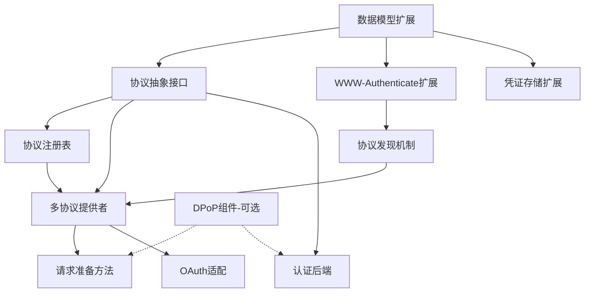

# MCP 多协议授权支持改造计划

> 基于章节12.5（与OAuth的区别）和章节13（现有代码改造点清单），结合DPoP抽象设计，制定的完整改造计划

**相关文档**：`docs/authorization-multiprotocol.md`（多协议设计与用法）、`docs/dpop-nonce-implementation-plan.md`（DPoP nonce 实现方案）、`mcp/client/auth/multi-protocol-design.md`（顶层设计）

## 一、改造目标

### 1.1 核心目标
- 支持多个授权协议（OAuth 2.0、API Key、Mutual TLS等）
- 保持与现有OAuth实现的完全向后兼容
- 提供统一的协议抽象接口
- 支持DPoP作为可选的通用安全增强组件

### 1.2 设计原则
1. **协议抽象**：统一的协议接口，所有授权协议实现相同的基础接口
2. **向后兼容**：现有OAuth 2.0实现无需修改即可工作
3. **协议发现**：服务器声明支持的协议，客户端自动发现和选择
4. **灵活扩展**：开发者可以轻松添加新的授权协议
5. **标准兼容**：基于现有HTTP和MCP规范，最小化扩展

## 二、功能分类（基于章节12.5）

### 2.1 不需要实现的功能（OAuth特定）
以下功能是OAuth 2.0协议特有的，新协议不需要实现：

- ❌ **授权码流程**（OAuth特定）
- ❌ **PKCE**（OAuth特定）
- ❌ **令牌交换**（OAuth特定）
- ❌ **Refresh Token**（OAuth特定）
- ❌ **Scope模型**（OAuth特定，除非新协议也有类似概念）
- ❌ **OAuth客户端认证方法**（client_secret_basic等）

**说明**：Client Credentials 作为 OAuth 2.0 的 **grant type** 在现有 OAuth2 流程中实现（`OAuth2Protocol` + `fixed_client_info`），不单独新增协议；AS 需在 token 端点支持 `grant_type=client_credentials` 并在元数据中声明 `grant_types_supported`。

### 2.2 必须实现的功能（MCP通用）
以下功能是MCP授权规范要求的，所有协议都必须支持：

- ✅ **PRM支持和协议声明**
- ✅ **WWW-Authenticate头解析/构建**
- ✅ **协议发现机制**
- ✅ **自动触发授权流程**（401响应）
- ✅ **凭证管理和验证**
- ✅ **请求认证信息准备**

### 2.3 可选实现的功能（协议特定）
以下功能取决于协议的具体需求：

- ⚠️ **客户端注册**（取决于协议需求）
- ⚠️ **权限模型**（取决于协议需求）
- ⚠️ **凭证刷新**（取决于协议需求）
- ⚠️ **元数据发现**（取决于协议复杂度）

### 2.4 通用安全增强（DPoP）
DPoP作为独立的通用组件，协议可以选择性使用：

- ⚠️ **DPoP支持**（可选，但建议支持以增强安全性）

## 三、改造点详细清单

### 3.1 数据模型层改造

#### 3.1.1 扩展 ProtectedResourceMetadata（PRM）

**文件**: `src/mcp/shared/auth.py`

**优先级**: 🔴 高

**改造内容**:
1. **新增协议元数据模型**
   ```python
   class AuthProtocolMetadata(BaseModel):
       """单个授权协议的元数据（MCP扩展）"""
       protocol_id: str = Field(..., pattern=r"^[a-z0-9_]+$")
       protocol_version: str
       metadata_url: AnyHttpUrl | None = None
       endpoints: dict[str, AnyHttpUrl] = Field(default_factory=dict)
       capabilities: list[str] = Field(default_factory=list)
       client_auth_methods: list[str] | None = None  # OAuth特定
       grant_types: list[str] | None = None  # OAuth特定
       scopes_supported: list[str] | None = None  # OAuth特定
       # DPoP支持（协议无关）
       dpop_signing_alg_values_supported: list[str] | None = None
       dpop_bound_credentials_required: bool | None = None
       additional_params: dict[str, Any] = Field(default_factory=dict)
   ```

2. **扩展 ProtectedResourceMetadata**
   ```python
   class ProtectedResourceMetadata(BaseModel):
       # 保持RFC 9728必需字段不变（向后兼容）
       resource: AnyHttpUrl
       authorization_servers: list[AnyHttpUrl] = Field(..., min_length=1)
       
       # ... 现有字段 ...
       
       # MCP扩展字段（使用mcp_前缀）
       mcp_auth_protocols: list[AuthProtocolMetadata] | None = Field(
           None,
           description="MCP扩展：支持的授权协议列表"
       )
       mcp_default_auth_protocol: str | None = Field(
           None,
           description="MCP扩展：默认推荐的授权协议ID"
       )
       mcp_auth_protocol_preferences: dict[str, int] | None = Field(
           None,
           description="MCP扩展：协议优先级映射"
       )
   ```

3. **向后兼容处理**
   - 如果`mcp_auth_protocols`为空，自动从`authorization_servers`创建OAuth 2.0协议元数据
   - 标准OAuth客户端可以忽略`mcp_*`扩展字段

#### 3.1.2 新增通用凭证模型

**文件**: `src/mcp/shared/auth.py`

**优先级**: 🔴 高

**改造内容**:
1. **定义基础凭证接口**
   ```python
   class AuthCredentials(BaseModel):
       """通用凭证基类"""
       protocol_id: str
       expires_at: int | None = None
       
   class OAuthCredentials(AuthCredentials):
       """OAuth凭证（现有OAuthToken的包装）"""
       protocol_id: str = "oauth2"
       access_token: str
       token_type: Literal["Bearer"] = "Bearer"
       refresh_token: str | None = None
       scope: str | None = None
       cnf: dict[str, Any] | None = None  # DPoP绑定信息
   
   class APIKeyCredentials(AuthCredentials):
       """API Key凭证"""
       protocol_id: str = "api_key"
       api_key: str
       key_id: str | None = None
   ```

2. **扩展TokenStorage协议**
   ```python
   class TokenStorage(Protocol):
       async def get_tokens(self) -> AuthCredentials | None: ...
       async def set_tokens(self, tokens: AuthCredentials) -> None: ...
       # 保持现有方法以支持向后兼容
       async def get_client_info(self) -> OAuthClientInformationFull | None: ...
       async def set_client_info(self, client_info: OAuthClientInformationFull) -> None: ...
   ```

#### 3.1.3 新增协议抽象接口

**文件**: `src/mcp/client/auth/protocol.py`（新建）

**优先级**: 🔴 高

**改造内容**:
1. **定义基础协议抽象接口（必需方法）**
   ```python
   class AuthProtocol(Protocol):
       """授权协议基础接口（所有协议必须实现）"""
       protocol_id: str
       protocol_version: str
       
       async def authenticate(
           self,
           context: AuthContext
       ) -> AuthCredentials:
           """执行协议特定的认证流程（必需）"""
           ...
       
       def prepare_request(
           self,
           request: httpx.Request,
           credentials: AuthCredentials
       ) -> None:
           """为请求添加协议特定的认证信息（必需）"""
           ...
       
       def validate_credentials(
           self,
           credentials: AuthCredentials
       ) -> bool:
           """验证凭证是否有效（客户端，必需）"""
           ...
       
       async def discover_metadata(
           self,
           metadata_url: str | None,
           prm: ProtectedResourceMetadata | None = None
       ) -> AuthProtocolMetadata | None:
           """发现协议特定的元数据（可选，默认返回None）"""
           return None
   ```

2. **定义可选功能扩展接口**
   ```python
   class ClientRegisterableProtocol(AuthProtocol):
       """支持客户端注册的协议扩展接口（可选）"""
       async def register_client(
           self,
           context: AuthContext
       ) -> ClientRegistrationResult | None:
           """协议特定的客户端注册"""
           ...
   
   class DPoPEnabledProtocol(AuthProtocol):
       """支持DPoP的协议扩展接口（可选）"""
       def supports_dpop(self) -> bool:
           """协议是否支持DPoP"""
           ...
       
       def get_dpop_proof_generator(self) -> DPoPProofGenerator | None:
           """获取DPoP证明生成器"""
           ...
       
       async def initialize_dpop(self) -> None:
           """初始化DPoP支持"""
           ...
   ```

2. **定义服务器端验证器接口**
   ```python
   class CredentialVerifier(Protocol):
       """凭证验证器接口"""
       async def verify(
           self,
           request: Request,
           dpop_verifier: DPoPProofVerifier | None = None
       ) -> AuthInfo | None:
           """验证请求中的凭证（可选DPoP验证）"""
           ...
   ```

### 3.2 客户端代码改造

#### 3.2.1 WWW-Authenticate头解析扩展

**文件**: `src/mcp/client/auth/utils.py`

**优先级**: 🔴 高

**改造内容**:
1. **新增协议相关字段提取**
   ```python
   def extract_auth_protocols_from_www_auth(response: Response) -> list[str] | None:
       """提取auth_protocols字段"""
       return extract_field_from_www_auth(response, "auth_protocols")
       
   def extract_default_protocol_from_www_auth(response: Response) -> str | None:
       """提取default_protocol字段"""
       return extract_field_from_www_auth(response, "default_protocol")
       
   def extract_protocol_preferences_from_www_auth(response: Response) -> dict[str, int] | None:
       """提取protocol_preferences字段"""
       prefs_str = extract_field_from_www_auth(response, "protocol_preferences")
       if not prefs_str:
           return None
       # 解析格式: "oauth2:1,api_key:2"
       preferences = {}
       for item in prefs_str.split(","):
           proto, priority = item.split(":")
           preferences[proto] = int(priority)
       return preferences
   ```

2. **扩展解析逻辑**
   - 支持多种认证方式：OAuth 使用标准 `Bearer`；API Key 使用 `X-API-Key` 或可选 `Authorization: Bearer <key>`（标准 scheme，不解析非标准 `ApiKey`）；Mutual TLS（mTLS，客户端证书）在 TLS/HTTPS 连接层（握手时）处理；与 IANA 的 "Mutual" scheme（RFC 8120，密码双向认证）无关
   - 解析协议声明和优先级
   - 支持多个认证方案（如果服务器支持）

#### 3.2.2 协议发现机制

**文件**: `src/mcp/client/auth/utils.py`

**优先级**: 🟡 中

**改造内容**:
1. **新增统一能力发现端点支持**（发现顺序取舍见 **十一、11.4**）
   ```python
   async def discover_authorization_servers(
       resource_url: str,
       http_client: httpx.AsyncClient,
       prm: ProtectedResourceMetadata | None = None,
       resource_path: str = "",
   ) -> list[AuthProtocolMetadata]:
       """统一的授权服务器/协议发现流程（PRM 优先，再统一发现，最后 OAuth 回退）"""
       # 1. 若已有 PRM 且含 mcp_auth_protocols，直接使用
       if prm and getattr(prm, "mcp_auth_protocols", None):
           return _protocol_metadata_list_from_prm(prm)
       # 2. 路径相对统一发现：/.well-known/authorization_servers{path}
       urls = build_authorization_servers_discovery_urls(resource_url, resource_path)
       for url in urls:
           # 尝试请求，200 且含 protocols 则解析并返回
           ...
       # 3. 若仍无协议列表且 PRM 含 authorization_servers，走 OAuth 回退（由调用方处理）
       return []
   ```

2. **新增协议特定的元数据发现**
   ```python
   async def discover_protocol_metadata(
       protocol_id: str,
       metadata_url: str | None,
       prm: ProtectedResourceMetadata | None = None
   ) -> AuthProtocolMetadata | None:
       """协议特定的元数据发现"""
       # 根据协议ID调用相应的发现逻辑
       # OAuth: 使用RFC 8414发现
       # API Key: 使用自定义发现端点
       # 其他协议: 协议特定的发现逻辑
   ```

3. **修改现有发现函数**
   - `build_oauth_authorization_server_metadata_discovery_urls()`改为协议特定的发现函数
   - 支持路径感知的协议元数据发现端点

#### 3.2.3 协议注册和选择机制

**文件**: `src/mcp/client/auth/registry.py`（新建）

**优先级**: 🟡 中

**改造内容**:
1. **实现协议注册表**
   ```python
   class AuthProtocolRegistry:
       """协议注册表"""
       _protocols: dict[str, type[AuthProtocol]] = {}
       
       @classmethod
       def register(cls, protocol_id: str, protocol_class: type[AuthProtocol]):
           """注册协议实现"""
           cls._protocols[protocol_id] = protocol_class
       
       @classmethod
       def get_protocol_class(cls, protocol_id: str) -> type[AuthProtocol] | None:
           """获取协议实现类"""
           return cls._protocols.get(protocol_id)
       
       @classmethod
       def select_protocol(
           cls,
           available_protocols: list[str],
           default_protocol: str | None = None,
           preferences: dict[str, int] | None = None
       ) -> str | None:
           """选择协议"""
           # 1. 过滤客户端支持的协议
           supported = [p for p in available_protocols if p in cls._protocols]
           if not supported:
               return None
           
           # 2. 如果有默认协议且支持，优先选择
           if default_protocol and default_protocol in supported:
               return default_protocol
           
           # 3. 如果有优先级，按优先级排序
           if preferences:
               supported.sort(key=lambda p: preferences.get(p, 999))
           
           # 4. 返回第一个支持的协议
           return supported[0] if supported else None
   ```

2. **协议选择逻辑**
   - 根据优先级、默认协议、客户端支持情况选择协议
   - 支持协议切换（如果第一个协议失败）

#### 3.2.4 OAuthClientProvider重构

**文件**: `src/mcp/client/auth/oauth2.py`

**优先级**: 🟡 中

**改造内容**:
1. **抽象为多协议提供者**
   ```python
   class MultiProtocolAuthProvider(httpx.Auth):
       """多协议认证提供者"""
       requires_response_body = True
       
       def __init__(
           self,
           server_url: str,
           storage: TokenStorage,
           protocols: list[AuthProtocol] | None = None,
           dpop_storage: DPoPStorage | None = None,
           dpop_enabled: bool = False,
           timeout: float = 300.0,
       ):
           self.server_url = server_url
           self.storage = storage
           self.protocols = protocols or []
           self.dpop_storage = dpop_storage or InMemoryDPoPStorage()
           self.dpop_enabled = dpop_enabled
           self.timeout = timeout
           self.registry = AuthProtocolRegistry()
           self._initialized = False
           self._current_protocol: AuthProtocol | None = None
       
       async def async_auth_flow(
           self, 
           request: httpx.Request
       ) -> AsyncGenerator[httpx.Request, httpx.Response]:
           """HTTPX认证流程入口"""
           async with self._lock:
               if not self._initialized:
                   await self._initialize()
               
               # 1. 检查存储的凭证
               credentials = await self.storage.get_tokens()
               
               # 2. 如果凭证无效，触发协议发现和选择
               if not credentials or not self._is_credentials_valid(credentials):
                   await self._discover_and_authenticate(request)
                   credentials = await self.storage.get_tokens()
               
               # 3. 准备请求认证信息
               if credentials:
                   await self._prepare_request(request, credentials)
               
               # 4. 发送请求
               response = yield request
               
               # 5. 处理401/403响应（OAuth 分支通过 oauth_401_flow_generator 驱动，取舍见十一、11.1）
               if response.status_code == 401:
                   await self._handle_401_response(response, request)
               elif response.status_code == 403:
                   await self._handle_403_response(response, request)
   ```

2. **OAuthClientProvider 保持为 OAuth 逻辑唯一实现（最大程度复用）**
   - **不**将 OAuth 逻辑迁出到 OAuth2Protocol；新增 `run_authentication(http_client, ...)` 供多协议路径调用
   - 保持现有 API 不变（向后兼容）；OAuth2Protocol 为薄适配层，内部委托 `OAuthClientProvider.run_authentication`
   - 取舍原因见 **十一、设计取舍与方案说明 11.1**

3. **协议上下文扩展**
   ```python
   @dataclass
   class AuthContext:
       """通用认证上下文"""
       server_url: str
       storage: TokenStorage
       protocol_id: str
       protocol_metadata: AuthProtocolMetadata | None = None
       current_credentials: AuthCredentials | None = None
       # DPoP支持（可选，阶段4实现）
       dpop_storage: DPoPStorage | None = None
       dpop_enabled: bool = False
   ```

#### 3.2.5 请求认证信息准备

**文件**: `src/mcp/client/auth/multi_protocol.py`

**优先级**: 🔴 高

**改造内容**:
1. **在MultiProtocolAuthProvider中实现**
   ```python
   async def _prepare_request(
       self,
       request: httpx.Request,
       credentials: AuthCredentials
   ) -> None:
       """准备请求（包含DPoP，如果协议支持）"""
       # 获取协议实例
       protocol = self._get_protocol(credentials.protocol_id)
       if not protocol:
           raise AuthError(f"Protocol {credentials.protocol_id} not found")
       
       # 协议特定的请求准备（必需）
       protocol.prepare_request(request, credentials)
       
       # DPoP支持（可选，仅在协议实现DPoPEnabledProtocol时）
       if self.dpop_enabled and isinstance(protocol, DPoPEnabledProtocol):
           if protocol.supports_dpop():
               dpop_generator = protocol.get_dpop_proof_generator()
               if not dpop_generator:
                   await protocol.initialize_dpop()
                   dpop_generator = protocol.get_dpop_proof_generator()
               
               if dpop_generator:
                   # 获取凭证字符串（协议特定）
                   credential_str = self._get_credential_string(credentials)
                   dpop_proof = dpop_generator.generate_proof(
                       method=request.method,
                       uri=str(request.url),
                       credential=credential_str
                   )
                   request.headers["DPoP"] = dpop_proof
   ```
   
   **注意**：DPoP集成是可选功能，仅在阶段4实现。在阶段2-3中，可以暂时忽略DPoP相关代码。

2. **协议特定的实现示例**
   - OAuth: `Authorization: Bearer <token>`
   - API Key: 优先 `X-API-Key: <key>`，可选 `Authorization: Bearer <key>`（标准 scheme；不解析非标准 `ApiKey`；服务端通过验证器顺序区分，不在 token 内加前缀）
   - Mutual TLS（mTLS）: 在 TLS 握手时处理（非 HTTP Authorization scheme）

#### 3.2.6 凭证存储扩展

**文件**: `src/mcp/client/auth/oauth2.py`

**优先级**: 🟢 低

**改造内容**:
1. **凭证序列化/反序列化**
   ```python
   def serialize_credentials(credentials: AuthCredentials) -> dict[str, Any]:
       """序列化凭证"""
       data = credentials.model_dump()
       data["_type"] = credentials.__class__.__name__
       return data
   
   def deserialize_credentials(data: dict[str, Any]) -> AuthCredentials:
       """反序列化凭证"""
       type_name = data.pop("_type")
       if type_name == "OAuthCredentials":
           return OAuthCredentials(**data)
       elif type_name == "APIKeyCredentials":
           return APIKeyCredentials(**data)
       # ... 其他类型
   ```

#### 3.2.7 API Key 认证方案约定（方案 A）

**取舍**：采用 X-API-Key + 可选 Bearer，不解析非标准 `ApiKey` scheme。取舍原因见 **十一、11.2**。

**约定**（与前述 3.2.5 协议特定的实现示例一致）：
- **标准兼容**：不解析非标准 `Authorization: ApiKey <key>`（`ApiKey` 非 IANA 注册 scheme）；API Key 使用标准 `Bearer` 或专用 header。
- **服务端**：优先从 `X-API-Key` header 读取；可选从 `Authorization: Bearer <key>` 读取并在 `valid_keys` 中查找；由 `MultiProtocolAuthBackend` 的验证器顺序区分（OAuthTokenVerifier 先尝试 Bearer → TokenVerifier，APIKeyVerifier 再尝试 X-API-Key / Bearer-in-valid_keys）。
- **客户端**：推荐使用 `X-API-Key: <key>`；若需统一走 Bearer，可发送 `Authorization: Bearer <key>`（服务端需配置允许 Bearer 作为 API Key）。
- **不在 token 内加前缀**：不要求 `apikey:xxx` 等格式，符合 RFC 6750 Bearer token 为 opaque string 的语义；区分由验证逻辑与 header 完成。

### 3.3 服务器端代码改造

#### 3.3.1 PRM端点扩展

**文件**: `src/mcp/server/auth/routes.py`

**优先级**: 🟡 中

**改造内容**:
1. **扩展函数签名**
   ```python
   def create_protected_resource_routes(
       resource_url: AnyHttpUrl,
       authorization_servers: list[AnyHttpUrl],
       scopes_supported: list[str] | None = None,
       # 新增参数
       auth_protocols: list[AuthProtocolMetadata] | None = None,
       default_protocol: str | None = None,
       protocol_preferences: dict[str, int] | None = None,
       resource_name: str | None = None,
       resource_documentation: AnyHttpUrl | None = None,
   ) -> list[Route]:
       """创建PRM路由（支持多协议）"""
       metadata = ProtectedResourceMetadata(
           resource=resource_url,
           authorization_servers=authorization_servers,  # 保持向后兼容
           scopes_supported=scopes_supported,
           mcp_auth_protocols=auth_protocols,  # 新增
           mcp_default_auth_protocol=default_protocol,  # 新增
           mcp_auth_protocol_preferences=protocol_preferences,  # 新增
           resource_name=resource_name,
           resource_documentation=resource_documentation,
       )
       
       handler = ProtectedResourceMetadataHandler(metadata)
       # ... 路由创建逻辑
   ```

#### 3.3.2 统一能力发现端点

**文件**: `src/mcp/server/auth/routes.py`（新增函数）

**优先级**: 🟡 中

**改造内容**:
1. **新增统一发现端点**
   ```python
   def create_authorization_servers_discovery_routes(
       resource_url: AnyHttpUrl,
       auth_protocols: list[AuthProtocolMetadata],
       default_protocol: str | None = None,
       protocol_preferences: dict[str, int] | None = None,
   ) -> list[Route]:
       """创建统一的能力发现端点/.well-known/authorization_servers"""
       handler = AuthorizationServersDiscoveryHandler(
           auth_protocols=auth_protocols,
           default_protocol=default_protocol,
           protocol_preferences=protocol_preferences,
       )
       
       return [
           Route(
               "/.well-known/authorization_servers",
               endpoint=cors_middleware(handler.handle, ["GET", "OPTIONS"]),
               methods=["GET", "OPTIONS"],
           )
       ]
   ```

2. **实现端点处理器**
   ```python
   class AuthorizationServersDiscoveryHandler:
       async def handle(self, request: Request) -> Response:
           """返回服务器支持的所有授权协议列表"""
           response_data = {
               "protocols": [
                   protocol.model_dump()
                   for protocol in self.auth_protocols
               ]
           }
           if self.default_protocol:
               response_data["default_protocol"] = self.default_protocol
           if self.protocol_preferences:
               response_data["protocol_preferences"] = self.protocol_preferences
           
           return JSONResponse(response_data)
   ```

#### 3.3.3 WWW-Authenticate头构建扩展

**文件**: `src/mcp/server/auth/middleware/bearer_auth.py`

**优先级**: 🔴 高

**改造内容**:
1. **扩展错误响应构建**
   ```python
   async def _send_auth_error(
       self,
       send: Send,
       status_code: int,
       error: str,
       description: str,
       # 新增参数
       resource_metadata_url: AnyHttpUrl | None = None,
       auth_protocols: list[str] | None = None,
       default_protocol: str | None = None,
       protocol_preferences: dict[str, int] | None = None,
   ) -> None:
       """构建扩展的WWW-Authenticate头"""
       parts = [
           f'error="{error}"',
           f'error_description="{description}"'
       ]
       
       if resource_metadata_url:
           parts.append(f'resource_metadata="{resource_metadata_url}"')
       
       if auth_protocols:
           protocols_str = " ".join(auth_protocols)
           parts.append(f'auth_protocols="{protocols_str}"')
       
       if default_protocol:
           parts.append(f'default_protocol="{default_protocol}"')
       
       if protocol_preferences:
           prefs_str = ",".join(
               f"{proto}:{priority}" 
               for proto, priority in protocol_preferences.items()
           )
           parts.append(f'protocol_preferences="{prefs_str}"')
       
       # 确定认证方案（根据支持的协议）
       scheme = self._determine_auth_scheme(auth_protocols)
       www_auth = f"{scheme} {', '.join(parts)}"
       
       # 发送响应
       await send({
           "type": "http.response.start",
           "status": status_code,
           "headers": [
               [b"www-authenticate", www_auth.encode()],
               [b"content-type", b"application/json"],
           ],
       })
   ```

2. **修改RequireAuthMiddleware**
   - 添加协议信息参数
   - 在401/403响应中包含协议声明

#### 3.3.4 认证后端重构

**文件**: `src/mcp/server/auth/middleware/bearer_auth.py`

**优先级**: 🟡 中

**改造内容**:
1. **新增多协议认证后端**
   ```python
   class MultiProtocolAuthBackend(AuthenticationBackend):
       """多协议认证后端"""
       def __init__(
           self,
           verifiers: dict[str, CredentialVerifier],
           dpop_verifier: DPoPProofVerifier | None = None  # 可选，阶段4实现
       ):
           self.verifiers = verifiers
           self.dpop_verifier = dpop_verifier
       
       async def authenticate(self, conn: HTTPConnection):
           """尝试所有支持的协议"""
           request = Request(conn.scope, conn.receive)
           
           for protocol_id, verifier in self.verifiers.items():
               result = await verifier.verify(
                   request=request,
                   dpop_verifier=self.dpop_verifier  # 可选，阶段4实现
               )
               if result:
                   return result
           return None
   ```
   
   **注意**：DPoP验证器参数是可选的，在阶段2-3中可以为None。

2. **BearerAuthBackend适配**
   - 将`BearerAuthBackend`改为OAuth特定的验证器
   - 在`MultiProtocolAuthBackend`中注册

3. **新增协议特定的验证器**
   ```python
   class OAuthTokenVerifier(CredentialVerifier):
       """OAuth Token验证器"""
       def __init__(
           self,
           token_verifier: TokenVerifier,
           dpop_verifier: DPoPProofVerifier | None = None  # 可选，阶段4实现
       ):
           self.token_verifier = token_verifier
           self.dpop_verifier = dpop_verifier
       
       async def verify(
           self,
           request: Request,
           dpop_verifier: DPoPProofVerifier | None = None  # 可选，阶段4实现
       ) -> AuthInfo | None:
           """验证OAuth token（包含DPoP验证，如果启用）"""
           # 提取Bearer token
           auth_header = request.headers.get("Authorization")
           if not auth_header or not auth_header.lower().startswith("bearer "):
               return None
           
           token = auth_header[7:]
           auth_info = await self.token_verifier.verify_token(token)
           
           if not auth_info:
               return None
           
           # DPoP验证（可选，阶段4实现）
           verifier = dpop_verifier or self.dpop_verifier
           if auth_info.cnf and auth_info.cnf.get("jkt") and verifier:
               dpop_proof = request.headers.get("DPoP")
               if not dpop_proof:
                   return None  # DPoP-bound token必须包含DPoP证明
               
               dpop_info = await verifier.verify_proof(
                   dpop_proof=dpop_proof,
                   method=request.method,
                   uri=str(request.url),
                   credential=token
               )
               
               if dpop_info.jwk_thumbprint != auth_info.cnf["jkt"]:
                   return None  # 公钥不匹配
           
           return auth_info
   
   # API Key 认证方案约定（方案 A）：优先 X-API-Key header；可选 Authorization: Bearer <key>（标准 scheme）；
   # 不解析非标准 ApiKey scheme；不在 token 内加前缀，由验证器顺序与 valid_keys 区分。
   class APIKeyVerifier(CredentialVerifier):
       """API Key验证器"""
       async def verify(
           self,
           request: Request,
           dpop_verifier: DPoPProofVerifier | None = None
       ) -> AuthInfo | None:
           """验证API Key：优先 X-API-Key，回退 Bearer 并在 valid_keys 中查找"""
           api_key = request.headers.get("X-API-Key")  # 或 _get_header_ignore_case(request, "x-api-key")
           if not api_key:
               auth_header = request.headers.get("Authorization")
               if auth_header and auth_header.strip().lower().startswith("bearer "):
                   bearer_token = auth_header[7:].strip()  # len("Bearer ")
                   if bearer_token in self._valid_keys:
                       api_key = bearer_token
           if not api_key or api_key not in self._valid_keys:
               return None
           
           # ... 构造 AuthInfo/AccessToken
           
           # DPoP验证（可选，阶段4实现）
           if dpop_verifier:
               dpop_proof = request.headers.get("DPoP")
               if dpop_proof:
                   await dpop_verifier.verify_proof(...)
           
           return auth_info
   ```

#### 3.3.5 协议特定的元数据端点

**文件**: `src/mcp/server/auth/routes.py`（新增函数）

**优先级**: 🟢 低

**改造内容**:
1. **新增协议元数据端点创建函数**
   ```python
   def create_protocol_metadata_routes(
       protocol_id: str,
       metadata: AuthProtocolMetadata
   ) -> list[Route]:
       """创建协议特定的元数据发现端点"""
       # 例如: /.well-known/api-key-metadata
       path = f"/.well-known/{protocol_id}-metadata"
       handler = ProtocolMetadataHandler(metadata)
       
       return [
           Route(
               path,
               endpoint=cors_middleware(handler.handle, ["GET", "OPTIONS"]),
               methods=["GET", "OPTIONS"],
           )
       ]
   ```

### 3.4 DPoP抽象组件（通用安全增强，可选）

#### 3.4.1 客户端DPoP组件

**文件**: `src/mcp/client/auth/dpop.py`（新建）

**优先级**: 🟢 低（可选安全增强）

**改造内容**:
1. **DPoP证明生成器**
   ```python
   class DPoPProofGenerator(Protocol):
       """DPoP证明生成器接口（协议无关）"""
       def generate_proof(
           self,
           method: str,
           uri: str,
           credential: str | None = None,
           nonce: str | None = None
       ) -> str: ...
       
       def get_public_key_jwk(self) -> dict[str, Any]: ...
   
   class DPoPProofGeneratorImpl:
       """DPoP证明生成器实现"""
       def __init__(self, key_pair: DPoPKeyPair):
           self.key_pair = key_pair
       
       def generate_proof(...) -> str:
           # 实现DPoP JWT生成
   ```

2. **DPoP密钥对模型**
   ```python
   class DPoPKeyPair(BaseModel):
       """DPoP密钥对（协议无关）"""
       private_key_pem: str
       public_key_jwk: dict[str, Any]
       key_id: str | None = None
       algorithm: str = "ES256"
       
       @classmethod
       def generate(cls, algorithm: str = "ES256") -> "DPoPKeyPair":
           # 生成密钥对
   ```

3. **DPoP存储接口**
   ```python
   class DPoPStorage(Protocol):
       """DPoP密钥对存储接口（协议无关）"""
       async def get_key_pair(self, protocol_id: str) -> DPoPKeyPair | None: ...
       async def set_key_pair(self, protocol_id: str, key_pair: DPoPKeyPair) -> None: ...
   ```

#### 3.4.2 服务器端DPoP组件

**文件**: `src/mcp/server/auth/dpop.py`（新建）

**优先级**: 🟢 低（可选安全增强）

**改造内容**:
1. **DPoP证明验证器**
   ```python
   class DPoPProofVerifier(Protocol):
       """DPoP证明验证器接口（协议无关）"""
       async def verify_proof(
           self,
           dpop_proof: str,
           method: str,
           uri: str,
           credential: str | None = None
       ) -> DPoPProofInfo: ...
   
   class DPoPProofVerifierImpl:
       """DPoP证明验证器实现"""
       def __init__(self, allowed_algorithms: list[str] = ["ES256", "RS256"]):
           self.allowed_algorithms = allowed_algorithms
           self.jti_cache: dict[str, int] = {}
       
       async def verify_proof(...) -> DPoPProofInfo:
           # 实现DPoP证明验证
           # 包含重放保护
   ```

### 3.5 新增文件和模块

#### 3.5.1 协议抽象和接口

**新建文件**: `src/mcp/client/auth/protocol.py`
- `AuthProtocol`基础协议接口（必需方法）
- `ClientRegisterableProtocol`扩展接口（可选）
- `DPoPEnabledProtocol`扩展接口（可选，阶段4）
- `AuthProtocolMetadata`模型（或从shared导入）

**新建文件**: `src/mcp/client/auth/registry.py`
- `AuthProtocolRegistry`类
- 协议选择逻辑

#### 3.5.2 多协议提供者

**新建文件**: `src/mcp/client/auth/multi_protocol.py`
- `MultiProtocolAuthProvider`类
- 协议发现和选择逻辑
- 凭证管理

#### 3.5.3 OAuth协议实现

**新建文件**: `src/mcp/client/auth/protocols/oauth2.py`
- `OAuth2Protocol`类（实现`AuthProtocol`），**薄适配层**
- **不**迁移 OAuth 逻辑到此文件；`authenticate(context)` 内构造 `OAuthClientProvider`、填充上下文后调用 `provider.run_authentication(context.http_client)` 复用现有实现
- 可选：实现`DPoPEnabledProtocol`扩展接口（阶段4）

#### 3.5.4 服务器端验证器

**新建文件**: `src/mcp/server/auth/verifiers.py`
- `CredentialVerifier`协议接口
- `OAuthTokenVerifier`（现有TokenVerifier的适配）
- `APIKeyVerifier`
- `MultiProtocolAuthBackend`
- Mutual TLS 验证器（若实现）：从 TLS 连接/握手上下文中读取客户端证书并校验，不解析 HTTP Authorization 头

**新建文件**: `src/mcp/server/auth/handlers/discovery.py`
- `AuthorizationServersDiscoveryHandler`类
- `ProtocolMetadataHandler`类

#### 3.5.5 DPoP组件

**新建文件**: `src/mcp/client/auth/dpop.py`
- `DPoPProofGenerator`接口和实现
- `DPoPKeyPair`模型
- `DPoPStorage`接口

**新建文件**: `src/mcp/server/auth/dpop.py`
- `DPoPProofVerifier`接口和实现
- `DPoPProofInfo`模型
- 重放保护逻辑

## 四、改造优先级和依赖关系

### 4.1 高优先级（必须首先实现）

#### 阶段1：基础设施（1-2周）
1. **数据模型扩展**（3.1）
   - `AuthProtocolMetadata`模型
   - `ProtectedResourceMetadata`扩展
   - `AuthCredentials`基类
   - 依赖：无

2. **协议抽象接口**（3.1.3）
   - `AuthProtocol`接口定义
   - `CredentialVerifier`接口定义
   - 依赖：数据模型

3. **WWW-Authenticate头扩展**（3.2.1, 3.3.3）
   - 客户端解析扩展
   - 服务器端构建扩展
   - 依赖：数据模型

### 4.2 中优先级（核心功能）

#### 阶段2：核心功能（2-3周）
4. **协议发现机制**（3.2.2, 3.3.2）
   - 统一能力发现端点
   - 协议特定的元数据发现
   - 依赖：数据模型、WWW-Authenticate扩展

5. **协议注册和选择**（3.2.3）
   - 协议注册表
   - 协议选择逻辑
   - 依赖：协议抽象接口

6. **多协议提供者**（3.2.4, 3.5.2）
   - `MultiProtocolAuthProvider`
   - 协议切换机制
   - 依赖：协议注册、协议发现

7. **请求准备方法**（3.2.5）
   - 协议特定的认证信息添加
   - 依赖：多协议提供者
   - 注意：DPoP集成是可选功能，在阶段4实现

8. **认证后端重构**（3.3.4）
   - `MultiProtocolAuthBackend`
   - 协议特定的验证器
   - 依赖：协议抽象接口
   - 注意：DPoP验证是可选功能，在阶段4实现

### 4.3 低优先级（向后兼容和优化）

#### 阶段3：适配和优化（1-2周）
9. **OAuth适配**（3.2.4）
   - `OAuth2Protocol`实现
   - `OAuthClientProvider`向后兼容包装
   - 依赖：多协议提供者

10. **PRM端点扩展**（3.3.1）
    - 扩展`create_protected_resource_routes()`
    - 依赖：数据模型

11. **凭证存储扩展**（3.2.6）
    - `TokenStorage`协议扩展
    - 凭证序列化/反序列化
    - 依赖：凭证模型

#### 阶段4：可选安全增强（可选，1-2周）
12. **DPoP组件实现**（3.4，可选）
    - DPoP证明生成和验证
    - DPoP存储
    - DPoP协议扩展接口实现
    - 依赖：协议抽象接口
    - 注意：这是可选功能，可以跳过

**DPoP Nonce**：阶段4 完成后可按 `docs/dpop-nonce-implementation-plan.md` 实现 RS/Client/AS 侧 nonce 支持；与当前 DPoP 基础实现正交。

### 4.4 依赖关系图



## 五、实施步骤

### 5.1 阶段1：基础设施（Week 1-2）

**目标**：建立多协议支持的基础架构

**任务清单**：
- [ ] 实现`AuthProtocolMetadata`模型
- [ ] 扩展`ProtectedResourceMetadata`添加`mcp_*`字段
- [ ] 实现`AuthCredentials`基类和具体凭证类型
- [ ] 定义`AuthProtocol`协议接口
- [ ] 定义`CredentialVerifier`协议接口
- [ ] 扩展WWW-Authenticate头解析（客户端）
- [ ] 扩展WWW-Authenticate头构建（服务器端）
- [ ] 编写单元测试

**验收标准**：
- 数据模型可以序列化/反序列化
- WWW-Authenticate头可以正确解析和构建
- 所有测试通过

**本阶段测试方案**：
- **单元/回归**：数据模型（`ProtectedResourceMetadata` 仅含 `resource`+`authorization_servers` 时校验 `mcp_auth_protocols`/`mcp_default_auth_protocol` 自动填充；`AuthProtocolMetadata`、`AuthCredentials`/`OAuthCredentials`/`APIKeyCredentials` 序列化与必填字段）；客户端 `extract_field_from_www_auth` 不传 `auth_scheme` 时行为与改前一致，`extract_auth_protocols_from_www_auth`、`extract_default_protocol_from_www_auth`、`extract_protocol_preferences_from_www_auth` 解析正确；服务端 `RequireAuthMiddleware` 仅传 `(app, required_scopes, resource_metadata_url)` 时 WWW-Authenticate 仍为 Bearer，且含 `error`/`error_description`/可选 `resource_metadata`。**执行**：`uv run pytest tests/client/test_auth.py tests/server/auth/middleware/test_bearer_auth.py -v`
- **集成/交互**：使用 simple-auth（AS+RS）与 simple-auth-client 跑通 401→PRM/AS 发现→OAuth→Token→MCP 会话→`list`/`call get_time`/`quit`。详细步骤与检查项见 `tests/PHASE1_OAUTH2_REGRESSION_TEST_PLAN.md`。**脚本**：`./scripts/run_phase1_oauth2_integration_test.sh`（启动 AS/RS 并运行客户端，人工完成浏览器 OAuth 与 list/call/quit）。

### 5.2 阶段2：核心功能（Week 3-5）

**目标**：实现多协议发现、选择和认证流程

**任务清单**：
- [ ] 实现统一能力发现端点（服务器端）
- [ ] 实现协议发现逻辑（客户端）
- [ ] 实现协议注册表
- [ ] 实现协议选择逻辑
- [ ] 实现`MultiProtocolAuthProvider`
- [ ] 实现协议特定的请求准备（不含DPoP，DPoP在阶段4）
- [ ] 实现`MultiProtocolAuthBackend`
- [ ] 实现OAuth验证器适配（不含DPoP验证，DPoP在阶段4）
- [ ] 编写集成测试

**验收标准**：
- 可以发现服务器支持的协议
- 可以根据优先级选择协议
- 可以执行多协议认证流程
- 所有测试通过

**本阶段测试方案**：
- **单元**：协议注册表（注册/获取协议类、`select_protocol` 在给定 `available_protocols`/`default_protocol`/`preferences` 下的选择结果）；协议发现（统一发现端点返回的解析、回退到 PRM/协议特定 well-known 的逻辑，若本阶段实现）；`MultiProtocolAuthProvider`（在 mock 协议与存储下 `async_auth_flow` 的初始化、凭证校验、请求准备不含 DPoP 分支）；服务端验证器与 `MultiProtocolAuthBackend`（按协议 ID 选择验证器，401/403 时 WWW-Authenticate 含 `auth_protocols`/`default_protocol`/`protocol_preferences` 当配置了这些参数时）。**集成**：若本阶段暴露统一发现端点，客户端请求 `/.well-known/authorization_servers` 得到协议列表，服务器 401 头含协议扩展字段时客户端能解析；回归：再次运行阶段1的 OAuth2 单元测试及 simple-auth + simple-auth-client 交互。**执行**：新增 `tests/client/auth/test_registry.py`、`tests/client/auth/test_multi_protocol_provider.py`（或等价），服务端 `tests/server/auth/test_verifiers.py` 或扩展现有 middleware 测试，集成可复用 `run_phase1_oauth2_integration_test.sh` 做回归。

#### 5.2.1 阶段2 新协议支持测试（可选协议选择与交互）

阶段2 交付多协议发现、选择与认证流程后，需验证**能够选择非 OAuth 的认证协议并完成 MCP 交互**。使用**基于 simple-auth 与 simple-auth-client 的测试用服务端与客户端**，必要时对二者进行改造。新协议需覆盖 **API Key** 与 **Mutual TLS** 两种方式。

- **目标**：服务器同时或单独支持至少两种非 OAuth 协议（API Key、Mutual TLS），在 PRM 或 401 头中声明 `auth_protocols`/`default_protocol`（或 `protocol_preferences`）；客户端能够发现协议列表、选择上述协议之一、使用对应凭证完成认证并与 MCP 服务交互（list tools、call tool、quit）；API Key 与 Mutual TLS 两种路径均需覆盖。
- **测试用服务端（基于 simple-auth）**：在 `examples/servers/` 下新增项目（如 `simple-auth-multiprotocol`），以 `examples/servers/simple-auth` 为蓝本复制并改造。在 RS 上增加对 API Key 与 Mutual TLS 两种非 OAuth 协议的支持；使用阶段2 的 `MultiProtocolAuthBackend`、API Key 验证器与 Mutual TLS 验证器（或占位实现）；PRM 与 `RequireAuthMiddleware` 传入 `auth_protocols`（含 oauth2、api_key、mutual_tls）、`default_protocol`（及可选 `protocol_preferences`）；统一发现端点若在本阶段实现则返回包含 oauth2、api_key、mutual_tls 的协议列表。保留原有 OAuth（AS+RS）能力。**验收**：RS 的 401 响应 WWW-Authenticate 含 `auth_protocols`（如 `oauth2 api_key mutual_tls`）；合法 API Key 与合法客户端证书（Mutual TLS）的请求均能通过认证并访问 MCP 端点（如 list_tools、get_time）。
- **测试用客户端（基于 simple-auth-client）**：在 `examples/clients/` 下新增项目（如 `simple-auth-multiprotocol-client`），以 `examples/clients/simple-auth-client` 为蓝本复制并改造。使用阶段2 的 `MultiProtocolAuthProvider` 与协议注册表；配置 API Key 与 Mutual TLS 协议实现及凭证（API Key 如环境变量或配置文件，Mutual TLS 如客户端证书/密钥路径）；发现到服务器支持 api_key 或 mutual_tls 时能选择对应协议并完成认证（无需浏览器），建立 MCP 会话并支持 list/call/quit。**验收**：（1）能选择 API Key、携带 API Key 凭证发起请求、成功初始化会话并执行 list、call get_time、quit；（2）能选择 Mutual TLS、使用客户端证书发起请求、成功初始化会话并执行 list、call get_time、quit。
- **测试场景与执行**：**API Key 路径**：启动多协议 RS（及可选 AS），启动多协议客户端并配置使用 API Key，执行 list→call get_time→quit，断言无认证错误且返回正确。**Mutual TLS 路径**：同一多协议 RS 启用 Mutual TLS 验证，启动多协议客户端并配置使用客户端证书，执行 list→call get_time→quit，断言无认证错误且返回正确。可选：编写 `scripts/run_phase2_multiprotocol_integration_test.sh`，支持通过参数或环境变量选择 API Key 或 Mutual TLS。原 simple-auth/simple-auth-client 仍用于 OAuth 回归；新示例仅用于阶段2 及之后的「新协议选择与交互」验证（API Key + Mutual TLS）。

### 5.3 阶段3：OAuth适配和优化（Week 6-7）

**目标**：完成OAuth协议适配和向后兼容优化

**任务清单**：
- [ ] 实现`OAuth2Protocol`类（薄适配层，委托 `OAuthClientProvider.run_authentication`）
- [ ] 在`OAuthClientProvider`中新增`run_authentication(http_client, ...)`，复用现有 401 分支逻辑
- [ ] 保持`OAuthClientProvider`现有 API 与行为不变（向后兼容）
- [ ] 实现PRM端点扩展
- [ ] 实现凭证存储扩展
- [ ] 编写集成测试

**验收标准**：
- 现有OAuth代码无需修改即可工作
- 所有测试通过
- 向后兼容性验证通过

**本阶段测试方案**：
- **单元**：`OAuth2Protocol`（`authenticate` 委托 `OAuthClientProvider.run_authentication`、`prepare_request`、`validate_credentials`、`discover_metadata` 在 mock 上下文下的行为）；`OAuthClientProvider.run_authentication`（与现有 401 分支行为一致）；`OAuthClientProvider` 对外 API 不变，现有 `tests/client/test_auth.py` 中所有 OAuth 相关用例仍通过；TokenStorage 扩展；PRM 端点扩展。**集成**：再次运行 simple-auth + simple-auth-client 全流程，确认 OAuth 仍为默认路径且行为一致；若有条件，同一 RS 同时支持 OAuth 与 API Key，客户端通过协议选择使用 OAuth，验证端到端多协议发现+OAuth 分支。**执行**：扩展现有 `tests/client/test_auth.py`，新增或扩展 `tests/server/auth/` 下 PRM/路由测试，集成继续使用 `scripts/run_phase1_oauth2_integration_test.sh` 及 `tests/PHASE1_OAUTH2_REGRESSION_TEST_PLAN.md` 检查清单。

### 5.4 阶段4：可选安全增强（Week 8，可选）

**目标**：实现DPoP作为可选安全增强组件

**任务清单**（可选，可以跳过）：
- [ ] 实现DPoP证明生成器（`DPoPProofGenerator`）
- [ ] 实现DPoP证明验证器（`DPoPProofVerifier`）
- [ ] 实现DPoP存储接口（`DPoPStorage`）
- [ ] 实现`DPoPEnabledProtocol`扩展接口
- [ ] 在`OAuth2Protocol`中实现`DPoPEnabledProtocol`
- [ ] 更新`MultiProtocolAuthProvider`的`_prepare_request`方法，集成DPoP
- [ ] 更新`OAuthTokenVerifier`和`APIKeyVerifier`，支持DPoP验证
- [ ] 编写DPoP测试

**验收标准**：
- DPoP可以在OAuth和其他协议中使用
- DPoP功能完全可选，不影响核心功能
- 所有测试通过

**本阶段测试方案**：
- **单元**：DPoP 客户端（`DPoPProofGenerator` 生成 proof 的格式与算法，`DPoPStorage` 存取 key pair，`DPoPKeyPair.generate`）；DPoP 服务端（`DPoPProofVerifier` 校验 proof、jti 重放保护、与 `OAuthTokenVerifier`/APIKey 验证器的组合）；`DPoPEnabledProtocol`（`supports_dpop`、`get_dpop_proof_generator`、`initialize_dpop` 及在 `MultiProtocolAuthProvider._prepare_request` 中的调用当协议支持 DPoP 且启用时）。**集成**：OAuth+DPoP（启用 DPoP 的 OAuth 客户端对支持 DPoP 的 RS 发起请求，401 后带 DPoP proof 的 token 请求成功，若本阶段实现完整链路）；回归：关闭 DPoP 时阶段1的 simple-auth+simple-auth-client 流程不变，所有既有 OAuth 单元与集成测试通过。**执行**：新增 `tests/client/auth/test_dpop.py`、`tests/server/auth/test_dpop.py`（或等价），集成可扩展现有示例或新增最小 DPoP 示例与脚本。

### 5.5 阶段5：新协议示例和文档（Week 9）

**目标**：提供新协议实现示例和完整文档

**任务清单**：
- [ ] 实现API Key协议示例
- [ ] 编写协议实现指南
- [ ] 更新API文档
- [ ] 编写迁移指南
- [ ] 编写使用示例
- [ ] 编写DPoP使用文档（如果阶段4完成）

**验收标准**：
- 有完整的API Key协议实现示例
- 文档清晰易懂
- 开发者可以基于示例实现新协议

**本阶段测试方案**：
- **单元**：API Key 协议示例（协议实现满足 `AuthProtocol`，注册到注册表后能被选择并完成 `prepare_request`）；文档与示例以文档评审与示例运行为主。**集成**：使用 API Key 示例客户端对支持 API Key 的示例服务完成一次认证与 MCP 调用（若提供示例）；全回归：再次运行阶段1的 OAuth2 单元测试及 simple-auth+simple-auth-client 交互，确保文档与示例未引入回归。**执行**：示例目录下可增加 `tests/examples/` 或 README 中的「如何运行与验证」；主测试套件仍包含 `tests/client/test_auth.py` 与 `tests/server/auth/middleware/test_bearer_auth.py` 的完整运行。

## 六、向后兼容策略

### 6.1 数据模型兼容

- **保持RFC 9728必需字段不变**：`resource`和`authorization_servers`必须保持为必需字段
- **`mcp_*`扩展字段为可选**：标准OAuth客户端可以忽略这些字段
- **自动兼容处理**：如果`mcp_auth_protocols`为空，自动从`authorization_servers`创建OAuth协议元数据

### 6.2 API兼容

- **`OAuthClientProvider`保持现有API不变**，并新增 `run_authentication(http_client, ...)` 供多协议路径调用
- **OAuth2Protocol 为薄适配层**，内部委托 `OAuthClientProvider.run_authentication`，不重复实现 OAuth 流程
- **现有代码无需修改即可工作**

### 6.3 行为兼容

- **默认行为**：如果没有协议声明，使用OAuth 2.0
- **现有OAuth流程保持不变**
- **新协议作为可选功能添加**

## 七、测试策略

### 7.1 单元测试

各阶段具体单元测试范围、新增用例及执行命令见第五节 5.1～5.5 中各阶段的「本阶段测试方案」。

- 数据模型序列化/反序列化测试
- 协议发现逻辑测试
- 协议选择逻辑测试
- WWW-Authenticate头解析/构建测试
- DPoP证明生成和验证测试

### 7.2 集成测试

阶段1～3 的 OAuth 回归均以 simple-auth + simple-auth-client 交互测试为准，详见 5.1 本阶段测试方案及 `tests/PHASE1_OAUTH2_REGRESSION_TEST_PLAN.md`；阶段2～5 的集成要点见对应小节。阶段2 完成后需增加新协议支持测试：基于 simple-auth 与 simple-auth-client 分别实现多协议测试服务端与客户端（见 5.2.1），验证可选择 **API Key** 与 **Mutual TLS** 两种非 OAuth 协议并完成 MCP 交互。

- 多协议认证流程测试
- 协议切换测试
- DPoP集成测试
- 向后兼容性测试

### 7.3 端到端测试

多协议与 DPoP 端到端场景见 5.2～5.4 本阶段测试方案。

- 完整的多协议认证场景
- OAuth + DPoP场景
- API Key + DPoP场景
- 协议降级场景

## 八、风险评估和缓解

### 8.1 技术风险

**风险1：向后兼容性破坏**
- **缓解**：保持现有API不变，内部使用适配器模式
- **验证**：运行现有测试套件确保无回归

**风险2：性能影响**
- **缓解**：协议发现结果缓存，避免重复发现
- **验证**：性能基准测试

**风险3：复杂度增加**
- **缓解**：清晰的抽象层次，良好的文档
- **验证**：代码审查，架构评审

### 8.2 实施风险

**风险1：改造范围过大**
- **缓解**：分阶段实施，每个阶段都有可交付成果
- **验证**：定期检查进度

**风险2：测试覆盖不足**
- **缓解**：每个阶段都有测试要求
- **验证**：代码覆盖率检查

## 九、成功标准

### 9.1 功能完整性

- ✅ 支持OAuth 2.0协议（向后兼容）
- ✅ 支持至少一种新协议（如API Key）
- ✅ 支持DPoP作为可选安全增强
- ✅ 协议自动发现和选择
- ✅ 协议切换机制

### 9.2 代码质量

- ✅ 所有现有测试通过
- ✅ 新功能测试覆盖率>80%
- ✅ 代码审查通过
- ✅ 文档完整

### 9.3 向后兼容性

- ✅ 现有OAuth代码无需修改
- ✅ 现有API保持不变
- ✅ 现有行为保持一致

### 9.4 代码提交规范

本规范适用于本改造计划中每一项任务（TODO）完成后的提交，执行时须遵循：

- 提交信息使用简洁英文（如 Add ... / Fix ...），仅描述本项改动。
- 不包含 TODO 编号或内部任务引用。
- 每次提交仅包含当前任务相关改动。

## 十、总结

本改造计划基于章节12.5和13的分析，结合DPoP抽象设计，提供了完整的多协议授权支持改造路线图。

**关键要点**：
1. **分阶段实施**：四个主要阶段（阶段4可选），每个阶段都有明确的交付物
2. **向后兼容**：确保现有代码无需修改
3. **协议抽象**：统一的接口，便于扩展
4. **DPoP集成**：作为可选的通用安全增强组件（阶段4，可选）
5. **渐进式迁移**：可以逐步启用新功能
6. **最小化接口**：基础接口只包含必需方法，可选功能通过扩展接口实现

**设计取舍**：OAuth 薄适配层、Generator 驱动 401 流程、API Key 方案 A、协议发现顺序、DPoP nonce 风险化解等详见 **十一、设计取舍与方案说明**。

**预计时间**：
- 核心功能：7周（阶段1-3）
- 完整功能（含DPoP）：9周（阶段1-5，阶段4可选）

**团队要求**：
- 熟悉OAuth 2.0协议
- 熟悉Python异步编程
- 熟悉HTTP协议和RESTful API设计
- 熟悉测试驱动开发

---

## 十一、设计取舍与方案说明

本节汇总历史讨论中的关键设计决策，说明多方案并存时的取舍原因，便于后续实现与评审时对齐。

### 11.1 OAuth 逻辑复用与 401 流程驱动

多协议下的 OAuth 集成涉及两个相关联的取舍：**逻辑归属**（薄适配层 vs 逻辑迁移）与 **401 流程驱动方式**（Generator vs 新建 HTTP 客户端）。

**逻辑归属 — 可选方案**：
- **方案 A**：将 OAuth 逻辑迁出到 `OAuth2Protocol`，`OAuthClientProvider` 仅作为遗留入口
- **方案 B**：`OAuth2Protocol` 为薄适配层，内部委托 `OAuthClientProvider.run_authentication`，OAuth 逻辑保持在 `oauth2.py`

**401 流程驱动 — 可选方案**：
- **方案 A**：在 401 处理分支内新建 `httpx.AsyncClient`，独立发送 OAuth 相关请求
- **方案 B**：使用共享的 `oauth_401_flow_generator`，由 `MultiProtocolAuthProvider` 驱动，所有 OAuth 步骤通过 `yield` 请求交由同一 `http_client` 发送

**取舍**：二者均采用 **方案 B**（薄适配层 + Generator 驱动）。

**原因**：
1. 最大程度复用现有 OAuth 实现，降低迁移风险与回归面；`OAuthClientProvider` 仍为 OAuth 逻辑唯一实现，避免双轨维护
2. 薄适配层通过 `run_authentication(http_client, ...)` 调用，自然要求由调用方传入 `http_client`；Generator 模式使 `MultiProtocolAuthProvider` 作为驱动方，用同一 `http_client` 发送所有 OAuth 请求，二者设计上互锁
3. 避免在 httpx 认证流程中创建新客户端导致的锁死锁风险；请求统一由 `httpx.Client(auth=provider)` 使用的同一 `http_client` 发送，行为可预测
4. OAuth 流程（AS 发现、注册、授权、Token 交换）全部由 generator 产出请求，驱动方负责发送并回传响应；现有 `OAuthClientProvider` 用户无需改动

### 11.2 API Key 认证方案：标准 scheme vs 自定义 scheme

**可选方案**：
- **方案 A**：使用 `X-API-Key` + 可选 `Authorization: Bearer <key>`，不解析非标准 `Authorization: ApiKey <key>`
- **方案 B**：使用自定义 `Authorization: ApiKey <key>` scheme

**取舍**：采用 **方案 A**。

**原因**：
1. `ApiKey` 非 IANA 注册的 HTTP Authentication scheme，方案 B 不符合 HTTP 规范
2. RFC 6750 规定 Bearer token 为 opaque string，使用 `Bearer` 承载 API Key 语义合理
3. 不在 token 内加前缀（如 `apikey:xxx`）；区分由验证器顺序与 `valid_keys` 完成，符合 Bearer 不解析 token 内容的约定

### 11.3 Mutual TLS 与 IANA "Mutual" scheme

**说明**：IANA 注册的 "Mutual" scheme（RFC 8120）表示基于密码的双向认证，与基于客户端证书的 Mutual TLS（mTLS）不同。

**取舍**：mTLS 在 TLS 握手层处理，不解析 HTTP `Authorization` 头；`Mutual TLS` 验证器从 TLS 连接/握手上下文读取客户端证书并校验。

### 11.4 协议发现顺序：PRM 优先 vs 统一发现

**取舍**：客户端协议发现顺序为：（1）PRM 的 `mcp_auth_protocols`（若已取得 PRM）；（2）路径相对统一发现 `/.well-known/authorization_servers{path}`；（3）根路径统一发现 `/.well-known/authorization_servers`；（4）若上述均未得到协议列表且 PRM 含 `authorization_servers`，则 OAuth 回退。

**原因**：PRM 为 RFC 9728 标准且常与 401 的 `resource_metadata` 一起使用，优先使用可减少往返；统一发现作为补充；OAuth 回退保证仅实现 RFC 9728 的 RS 仍可被多协议客户端使用。

**鉴权发现日志**：发现过程在 `mcp.client.auth` 中输出 DEBUG 级别、英文、带 `[Auth discovery]` 前缀的日志（请求 URL、状态码及 200 时的可读响应体）；客户端设置 `LOG_LEVEL=DEBUG` 可查看。

### 11.5 授权端点归属：AS 与 RS 的 URL 树

| 端点 | 归属 | 用途 |
|------|------|------|
| `/.well-known/oauth-authorization-server` | AS | OAuth 元数据（RFC 8414） |
| `/authorize`, `/token`, `/register`, `/introspect` | AS | OAuth 流程 |
| `/.well-known/oauth-protected-resource{path}` | RS | PRM（RFC 9728） |
| `/.well-known/authorization_servers` | RS | 统一协议发现（MCP 扩展） |

**说明**：AS 与 RS 可能部署在不同主机（如 AS 9000、RS 8002）；客户端按 11.4 所述顺序向 RS 获取协议列表（PRM 优先，再统一发现），再根据 `metadata_url` 向 AS 获取 OAuth 元数据。

### 11.6 TokenStorage 双契约：OAuthToken vs AuthCredentials

**取舍**：`TokenStorage` 支持 `get_tokens() → AuthCredentials | OAuthToken | None` 与 `set_tokens(AuthCredentials | OAuthToken)`；`MultiProtocolAuthProvider` 内部负责 OAuthToken 与 OAuthCredentials 的转换。

**原因**：现有 OAuth 存储只处理 `OAuthToken`；多协议存储需处理 `APIKeyCredentials` 等。双契约 + 内部转换使 OAuth 存储无需改造即可工作。

### 11.7 DPoP Nonce 实现：风险与方案

DPoP nonce 详细方案见 `docs/dpop-nonce-implementation-plan.md`。关键取舍如下：

| 风险 | 解决方案 |
|------|----------|
| **Token 请求 DPoP 缺失** | 单独 TODO 6a 实现 Token 请求 DPoP 与 400 `use_dpop_nonce` 重试，作为 AS nonce 前置依赖 |
| **AS 改造范围过大** | 拆分为 TODO 6b（SDK TokenHandler DPoP+nonce）与 TODO 6c（simple-auth 示例 DPoP-bound token），各 ≤300 行 |

**分阶段**：先 RS + Client nonce（TODO 1–5），后 AS nonce（TODO 6a–6c），降低单次改动量。

### 11.8 测试 skipped 说明

全量回归中约有 95 个 skipped：
- **约 90+** 来自 `tests/experimental/tasks/test_spec_compliance.py`：占位测试，内部 `pytest.skip("TODO")`，与多协议改造无关
- **其余**：平台条件（如 Windows 专用、无 `tee` 命令）、显式跳过（如 SSE timeout 相关 bug 测试）

改造过程中不修改上述 skip 逻辑。
